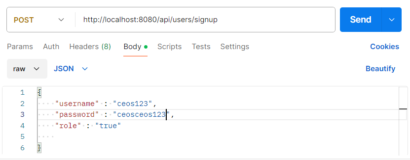
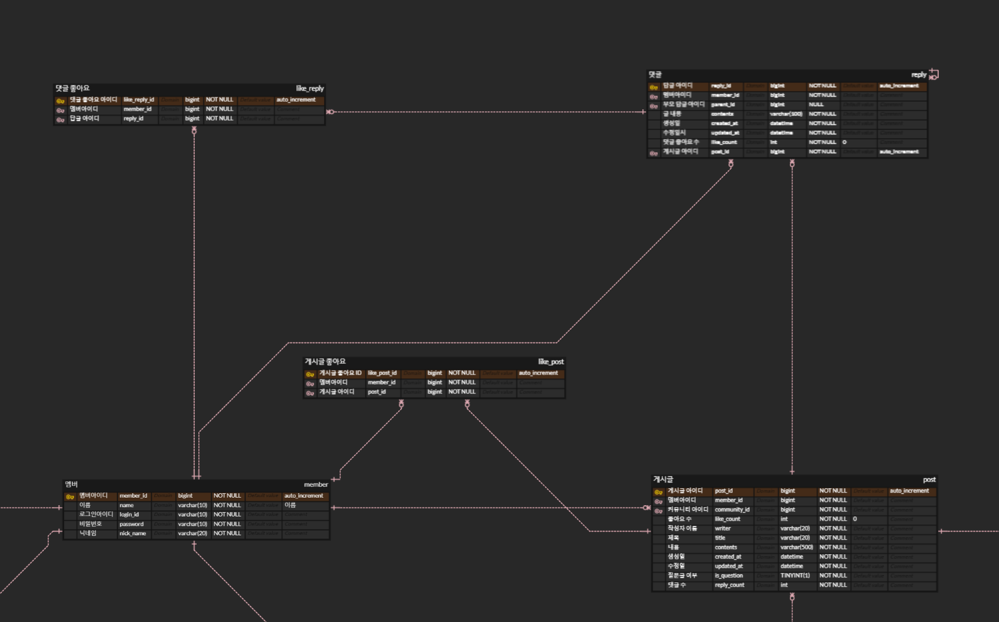

# 2주차 과제


## 에브리타임 

- 편리한 시간표 제작, 대학교 커뮤니티, 대학 관련 정보 공유를 목적으로 제작된 온라인 서비스


## 에브리타임 일부 기능 모델링 

### 전체적인 구조 


- 전체적인 구조를 위와 같이 잡았습니다.
1. 쪽지 기능을 위한 **_쪽지, 쪽지방(room) 엔티티_**
2. 게시판 생성을 위한 **_커뮤니티 엔티티_**
3. 게시글 생성 수정 삭제 조회 를 위한 **_게시글, 게시글 이미지 엔티티_**
4. 게시글에 첨가되는 부가 기능을 위한 **_게시글 좋아요, 댓글, 댓글 좋아요 엔티티_**
5. 회원가입, 다른 위 기능 등과의 상호작용 등을 위한 **_멤버 엔티티_**

---

- CRUD 학습 목적 특성으로 아래와 같은 기능은 임의로 제외했습니다 .ㅎ 
1. 대학교 관련 엔티티
2. 강의 관련 엔티티 
3. 시간표 관련 엔티티 등등 


### 세부 구조 

---

#### 게시판(커뮤니티) + 게시글 


- 멤버는 여러 커뮤니티를 생성 할 수 있습니다(ex: 자유게시판 등) 따라서 멤버와 커뮤니티를 1대 N 관계로 생각하고 커뮤니티 테이블에는 커뮤니티 생성자 아이디를 외래키 값으로 잡아주었습니다.
- 한 커뮤니티에는 여러 게시글이 존재합니다. 또한 한 게시글은 여러 커뮤니티에 속할 수 없기 때문에 커뮤니티와 게시글을 1대 N 관계로 생각하였습니다. 따라서 커뮤니티 아이디 값을 게시글 테이블에 외래키로 추가하였습니다.
- 멤버는 여러 게시글을 작성할 수 있고, 게시글은 여러 멤버를 작성자로 가질 수 없습니다. 따라서 멤버와 게시글을 1대 N 관계로 생각 -> 게시글 테이블에 멤버의 아이디를 외래키 값으로 잡아 주었습니다.


---

#### 멤버 + 게시글 + 게시글 이미지




- 한 멤버는 여러 게시글을 작성할 수 있고 한 게시글은 여러 멤버에 의해 작성될 수 없으므로 멤버와 게시글을 1대 N 관계라고 생각했기에 게시글에 멤버 아이디를 외래키 값으로 두었습니다.
- 또한 게시글에 질문글 여부를 나타내는 자바 입장의 boolean 을 표현할 수 있는 tinyint 를 추가해서 이 값이 설정되어 있으면 지우지 못하도록 합니다. 
- 한 게시글에는 여러 이미지를 가질 수 있고 한 이미지는 여러 게시글에 의해 소유될 수 없으므로 1대 N 관계라고 생각했기에 게시글 이미지에 게시글 아이디 값을 외래키로 추가하였습니다.
- 게시글에 작성자 이름의 필드를 두어 "익명" 으로 표시할지 닉네임으로 표시할지 결정합니다. 

---

#### 게시글 부가 기능 



- 한 멤버는 여러 게시글에 좋아요 를 누를 수 있고 한 게시글은 여러 멤버에 의해 좋아요가 눌러질 수 있습니다. 이에 따라 N:M 다대다 관계라고 생각을 하였기 때문에 그 중간테이블인 게시글 좋아요 테이블에 멤버아이디와 게시글 아이디 값을 외래키로 잡아주었습니다. 
- 게시글 좋아요 테이블을 통해 좋아요 수를 알 수 있지만 이 방법보다 더 성능이 좋은 좋아요 수 필드를 게시글에 잡아 다로 관리합니다. 
- 한 게시글에는 여러 댓글이 달릴 수 있고 한 댓글은 여러 게시글에 의해 사용될 수 없으므로 게시글과 댓글을 1대 N 관계라고 생각 하였기 때문에 댓글 테이블에 게시글 아이디 외래키를 두었습니다.
- 한 댓글에는 여러 대댓글이 달릴 수 있고 한 대댓글은 여러 댓글에 의해 사용될 수 없으므로 댓글과 대댓글을 1대 N 관계라고 생각 하였기 때문에 댓글 테이블에 부모 답글 아이디라는 외래키 값을 두어 따로 관리합니다.
- 한 멤버는 여러 댓글,대댓글을 작성할 수 있고 댓글, 대댓글은 여러 멤버에 의해 작성될 수 없으므로 멤버와 댓글,대댓글을 1대 N 관계라고 생각하였기 때문에 멤버와 댓글 테이블에 멤버 아이디라는 외래키 값을 두었습니다.
- 한 멤버는 여러 댓글에 좋아요 를 누를 수 있고 한 댓글은 여러 멤버에 의해 좋아요가 눌러질 수 있으므로 다대다 관계라고 생각을 하여 댓글 좋아요를 중간테이블로 설정하여 멤버아이디와 답글 아이디를 외래키 값으로 설정하였습니다. 


---

#### 쪽지 기능


가장 헷갈리고 확신 없는 부분입니다. 


- 처음에는 멤버와 쪽지를 1대다 관계로 설정하고, 쪽지에 sender 와 receiver를 받는 것으로 해야 되겠다고 생각했으나, 이렇게 하면 한 상대방과의 채팅 기록을 조회할 떄 where (sender_id=:myId and receiver_id=:yourId) or (sender_id=:yourId and receiver_id=:myId) order by createdAt desc 이런 식으로 조회하는 것보다 방자체를 따로 관리하는게 채팅 기록조회 관점에서 더 효율적일 것이라고 생각했습니다.  
- 한 멤버는 여러 쪽지방을 생성할 수 있습니다. 이로써 1:N 관계는 확정이라고 생각했습니다. 처음 한 쪽지방은 여러 멤버 (2명) 가 들어올 수 있으므로 처음에는 다대다 관계를 생각했으나 그럼 ERD 테이블 상으로는 1대1 쪽지 인지 단체 톡방 같은 느낌인지 확신할 수 없을 것 같았습니다.
따라서 쪽지방에 first_sender_id 와 first_receiver_id 라는 외래키 필드를 둔 이후 각각의 필드의 입장에서 생각했습니다. 한 채팅방에서 first_sender 와 first_receiver 는 각각 한 명 뿐이기 때문에 멤버와 쪽지방을 1대 N 관계로 생각하였습니다. 단 1:N 관계를 두번 
- 한 쪽지방에는 여러 쪽지가 오갈 수 있고 한 쪽지는 여러 쪽지방에서 사용될 수 없으므로 쪽지방 과 쪽지가 1대 N 관계라고 생각하였습니다. 따라서 쪽지에는 쪽지방 아이디라는 외래키를 추가했습니다.
- 한 멤버는 여러개의 쪽지를 보낼 수 있고 한 쪽지는 여러 멤버에 의해 보내질 수 없으므로 멤버와 쪽지가 각각 1대 N 관계 라고 생각하였습니다. 따라서 쪽지에는 멤버 아이디라는 외래키 필드를 추가하였습니다. 


---


## JPA 관련 옵션 과제 

# 프로젝트 세팅

먼저 주의점의 관찰을 위해 프로젝트를 세팅한다.

### Member(다대일의 다쪽 연관관계)

```java
@Entity
@NoArgsConstructor(access = AccessLevel.PROTECTED)
@Getter
public class Member {

    @Id
    @GeneratedValue(strategy = GenerationType.IDENTITY)
    @Column(name = "member_id")
    private Long id;

    @Column(nullable = false)
    private String name;

    @Column(nullable = false)
    private String loginId;

    @Column(nullable = false)
    private String password;

    @Column(nullable = false)
    private String nickName;

    @Builder
    public Member(String name,String loginId,String password,String nickName,Team team){
        this.name=name;
        this.loginId=loginId;
        this.password=password;
        this.nickName=nickName;
        this.team=team;
    }


    @ManyToOne(fetch = FetchType.LAZY)
    @JoinColumn(name = "team_id")
    private Team team;
}
```

### Team(다대일의 일쪽 연관관계)

```java
@Entity
@NoArgsConstructor(access = AccessLevel.PROTECTED)
@Getter
public class Team {
    @Id @GeneratedValue(strategy = GenerationType.IDENTITY)
    private Long id;

    private String name;

    @OneToMany(mappedBy = "team",cascade = CascadeType.ALL,orphanRemoval = true)
    private List<Member> members=new ArrayList<>();

    @OneToMany(mappedBy = "team",cascade = CascadeType.ALL,orphanRemoval = true)
    private List<TeamImage> teamImages=new ArrayList<>();

    @Builder
    public Team(String name){
        this.name=name;
    }

}
```


### TeamImage(다대일의 다쪽 연관관계)

Team 과 TeamImage 의 관계를 세팅한다.

```java
@Entity
@NoArgsConstructor(access = AccessLevel.PROTECTED)
@Getter
public class TeamImage {
    @Id @GeneratedValue(strategy = GenerationType.IDENTITY)
    private Long id;

    private String accessUrl;

    @ManyToOne(fetch = FetchType.LAZY)
    @JoinColumn(name = "team_id")
    private Team team;

    @Builder
    public TeamImage(String accessUrl,Team team){
        this.accessUrl=accessUrl;
        this.team=team;
    }

}
```

---


# 주의점 1: distinct를 사용해야 하는 경우


## Hibernate Version

실험 환경 기준은 하이버네이트 버전 ```5.6.14``` 버전이다.


## 사용 배경

```@ManyToOne``` 에서 다(Member) 쪽에서 일(Team)쪽을 fetch Join 을 사용하여 일(Team) 의 필드 또한 함께 영속화 할 수 있다는 것을 알게된 A는

이제는 일(Team) 을 조회할 때 그 와 연관된 다(Member) 의 필드를 함께 조회하고 싶어 일(Team) 에서 다(Member)에 Fetch Join 을 적용했다.

아래와 같이 말이다.

```java

public interface TeamRepository extends JpaRepository<Team,Long> {
    @Query("select t from Team t join fetch t.members")
    List<Team> findTeamWithFetchMembers();
}
```


## 테스트 코드 결과 예상 및 조회


A는 처음에 위 코드를 짤때 원하는 결과는 각각의 팀을 한번씩 조회하고 그와 연관된 Member 또한 같이 조회하는 결과를 원했다.

즉 아래와 같이 테스트 코드를 통해 결과를 확인하면

```java
@Test
    @DisplayName("팀과 Member 의 1대다 Fetch Join 테스트 Pageable")
    public void SecondTest() {
        Team teamA=Team.builder().name("teamA").build();
        Team teamB=Team.builder().name("teamB").build();


        Member member1=Member.builder().loginId("afdf").password("adfdf").nickName("일진우").name("이진우1").team(teamA).build();
        Member member2=Member.builder().loginId("bfdf").password("bdfdf").nickName("이진우").name("이진우2").team(teamA).build();
        Member member3=Member.builder().loginId("cfdf").password("cdfdf").nickName("삼진우").name("이진우3").team(teamA).build();
        Member member4=Member.builder().loginId("dfdf").password("ddfdf").nickName("사진우").name("이진우4").team(teamB).build();
        Member member5=Member.builder().loginId("efdf").password("edfdf").nickName("오진우").name("이진우5").team(teamB).build();

        teamA.getMembers().add(member1);
        teamA.getMembers().add(member2);
        teamA.getMembers().add(member3);
        teamB.getMembers().add(member4);
        teamB.getMembers().add(member5);

        teamRepository.save(teamA);
        teamRepository.save(teamB);


        em.clear();

        List<Team> teams=teamRepository.findTeamWithFetchMembersWithPageable(PageRequest.of(0,2));

        for(Team t: teams){
            System.out.println("팀의 이름: "+t.getName());
            System.out.println(t.getMembers().size());
        }

    }
```

즉 예상된 출력결과는 팀의 이름 A: 와 팀의 Member 에 대한 각각의 이름 + 팀의 이름 :B 와 팀 B의 Member 에 대한 각각의 이름

이렇게만 나오는 것을 예상했지만 출력결과는 그렇지 않다.

```java
팀의 이름: teamA
멤버의 이름:이진우1
멤버의 이름:이진우2
멤버의 이름:이진우3
팀의 이름: teamA
멤버의 이름:이진우1
멤버의 이름:이진우2
멤버의 이름:이진우3
팀의 이름: teamA
멤버의 이름:이진우1
멤버의 이름:이진우2
멤버의 이름:이진우3
팀의 이름: teamB
멤버의 이름:이진우4
멤버의 이름:이진우5
팀의 이름: teamB
멤버의 이름:이진우4
멤버의 이름:이진우5
```

그 이유는 쿼리 내용을 확인하면 짐작이 가능하다.

```java
select
        team0_.id as id1_1_0_,
        members1_.member_id as member_i1_0_1_,
        team0_.name as name2_1_0_,
        members1_.created_at as created_2_0_1_,
        members1_.updated_at as updated_3_0_1_,
        members1_.login_id as login_id4_0_1_,
        members1_.name as name5_0_1_,
        members1_.nick_name as nick_nam6_0_1_,
        members1_.password as password7_0_1_,
        members1_.team_id as team_id8_0_1_,
        members1_.team_id as team_id8_0_0__,
        members1_.member_id as member_i1_0_0__ 
    from
        team team0_ 
    inner join
        member members1_ 
            on team0_.id=members1_.team_id
```

team의 아이디와 member의 team_id가 같은데에 join이 일어난다.

그럼 위 같은 쿼리의 결과로 나타나는 테이블의 형태는
팀A 와 멤버 1에 대한 레코드 +
팀A 와 멤버 2에 대한 레코드 +
팀A 와 멤버 3에 대한 레코드 +
팀B 와 멤버 4에 대한 레코드 +
팀 B와 멤버 5에 대한 레코드


이런 식으로 나타날 것이다.
따라서 위와 같이 문제의 출력결과가 발생한다.
이를 방지하려면 ```distinct``` 키워드를 통해 방지할 수 있다.
이는 객체의 중복을 방지하게 한다.

## 수정

 ```java
 public interface TeamRepository extends JpaRepository<Team,Long> {
    @Query("select distinct t from Team t join fetch t.members")
    List<Team> findTeamWithFetchMembers();
}
```

## 결과 확인

```java
팀의 이름: teamA
멤버의 이름:이진우1
멤버의 이름:이진우2
멤버의 이름:이진우3
팀의 이름: teamB
멤버의 이름:이진우4
멤버의 이름:이진우5
```

위와 같이 Team 이 중복되어 조회되지 않는 것을 볼 수 있다.

## 스프링 부트 3이상에서는...

HiberName 버젼의 상승과 함께 초기처럼 코드를 작성해도 자동으로 중복은 제거해서 아래와 같은 결과가 나타난다.

```java
팀의 이름: teamA
멤버의 이름:이진우1
멤버의 이름:이진우2
멤버의 이름:이진우3
팀의 이름: teamB
멤버의 이름:이진우4
멤버의 이름:이진우5
```

---

# 주의점 2: 일대다 Fetch Join 에서 페이징 처리

## 사용 배경

A는 주의점 1 과 같은 결과를 학습했으므로

이제 페이징 처리를 일대다 페치조인에 적용하여 제한된 양을 조회하고 싶다고 한다.

따라서 아래와 같이 코드를 작성하였다.

```java
public interface TeamRepository extends JpaRepository<Team,Long> {

    @Query("select t from Team t join fetch t.members")
    List<Team> findTeamWithFetchMembersWithPageable(Pageable pageable);

}

```


## 테스트 코드 및 에러 확인

따라서 아래와 같이 테스트를 진행하여 결과를 확인한다.


```java
@Test
    @DisplayName("팀과 Member 의 1대다 Fetch Join 테스트 Pageable")
    public void SecondTest() {
        Team teamA=Team.builder().name("teamA").build();
        Team teamB=Team.builder().name("teamB").build();


        Member member1=Member.builder().loginId("afdf").password("adfdf").nickName("일진우").name("이진우1").team(teamA).build();
        Member member2=Member.builder().loginId("bfdf").password("bdfdf").nickName("이진우").name("이진우2").team(teamA).build();
        Member member3=Member.builder().loginId("cfdf").password("cdfdf").nickName("삼진우").name("이진우3").team(teamA).build();
        Member member4=Member.builder().loginId("dfdf").password("ddfdf").nickName("사진우").name("이진우4").team(teamB).build();
        Member member5=Member.builder().loginId("efdf").password("edfdf").nickName("오진우").name("이진우5").team(teamB).build();

        teamA.getMembers().add(member1);
        teamA.getMembers().add(member2);
        teamA.getMembers().add(member3);
        teamB.getMembers().add(member4);
        teamB.getMembers().add(member5);

        teamRepository.save(teamA);
        teamRepository.save(teamB);


        em.clear();

        List<Team> teams=teamRepository.findTeamWithFetchMembersWithPageable(PageRequest.of(0,2));

        for(Team t: teams){
            System.out.println("팀의 이름: "+t.getName());
            for(int i=0;i<t.getMembers().size();i++){
                System.out.println("멤버의 이름:"+t.getMembers().get(i).getName());
            }
        }

    }

```


결과를 확인하던 중 아래와 같은 에러가 발생한다.


```
2024-03-16T15:10:47.651+09:00  WARN 14408 --- [    Test worker] org.hibernate.orm.query                  : HHH90003004: firstResult/maxResults specified with collection fetch; applying in memory
```


이는 메모리에서 페이징 처리를 진행한다는 의미로
기존처럼 DB에서 ```limit``` 로 제한된 갯수만큼을 가져오는 것이 아니라 메모리에서 그 작업을 진행하기 때문에 그런 부분에서 위험하다.

실제로 일대다 페치조인+ 페이징 처리에서 발생하는 쿼리를 조회하면

```java
select
        t1_0.id,
        m1_0.team_id,
        m1_0.member_id,
        m1_0.login_id,
        m1_0.name,
        m1_0.nick_name,
        m1_0.password,
        t1_0.name 
    from
        team t1_0 
    join
        member m1_0 
            on t1_0.id=m1_0.team_id
```

위와 같이 ```limit``` 이 보이지 않는다는 것을 알 수 있다.

반면 다대일 페치조인 + 페이징 처리를 진행하면

```java
List<Member> members=memberRepository.findMemberWithTeamFetch(PageRequest.of(0,2));
```

```java
select
        m1_0.member_id,
        m1_0.login_id,
        m1_0.name,
        m1_0.nick_name,
        m1_0.password,
        t1_0.id,
        t1_0.name 
    from
        member m1_0 
    join
        team t1_0 
            on t1_0.id=m1_0.team_id 
    limit
        ?,?

```

위와 같이 ```limit``` 이 존재한다.


---


# 주의점 3: DTO + Fetch JOIN

## 사용 배경


A는 ```Fetch Join``` 을 사용해서 Member 의 데이터의 일부와 Team 의 데이터 일부를 함께 DTO로 반환한다.

```java
@Data
@NoArgsConstructor
public class MemberResponseDto {
    private String memberNickName;
    private String teamName;

    @Builder
    public MemberResponseDto(String memberNickName,String teamName){
        this.memberNickName=memberNickName;
        this.teamName=teamName;
    }
}

```

또한 위 DTO 를 설계하기 위해

```java
 @Query("select m from Member m join fetch m.team t")
    List<Member> findMemberWithTeamFetch(Pageable pageable);
```

위 메서드를 사용하고 있는데 기본적으로 Member 의 내용 전부를 조회하다 보니 아래와 같이

```
select
        m1_0.member_id,
        m1_0.login_id,
        m1_0.name,
        m1_0.nick_name,
        m1_0.password,
        t1_0.id,
        t1_0.name 
    from
        member m1_0 
    join
        team t1_0 
            on t1_0.id=m1_0.team_id 
    limit
        ?,?
``` 

실제 사용하지 않는 ```password```, ```id``` 등 필요없는 부분을 함께 조회하고 있다.

위 과정에서 성능이 걱정되었던 A 는 이를 DTO로 조회하여 해결하려 한다.

## 코드 작성

따라서 아래와 같이 코드를 작성한다.

```java
@Query("select new com.ceos19.everyTime.member.domain.dto.MemberResponseDto(m.nickName,t.name) from Member m join fetch m.team t")
    List<MemberResponseDto> findMemberDTOWithTeamNameWithFetchJoin();
```


## 테스트 코드 및 에러 확인

위에 대해 테스트를 작성하기 위해 아래와 같은 코드를 작성한다.

```java
@Test
    @DisplayName("Member 입장에서 테스트")
    public void MemberTest() {
        Team teamA=Team.builder().name("teamA").build();
        Team teamB=Team.builder().name("teamB").build();


        Member member1=Member.builder().loginId("afdf").password("adfdf").nickName("일진우").name("이진우1").team(teamA).build();
        Member member2=Member.builder().loginId("bfdf").password("bdfdf").nickName("이진우").name("이진우2").team(teamA).build();
        Member member3=Member.builder().loginId("cfdf").password("cdfdf").nickName("삼진우").name("이진우3").team(teamA).build();
        Member member4=Member.builder().loginId("dfdf").password("ddfdf").nickName("사진우").name("이진우4").team(teamB).build();
        Member member5=Member.builder().loginId("efdf").password("edfdf").nickName("오진우").name("이진우5").team(teamB).build();

        teamA.getMembers().add(member1);
        teamA.getMembers().add(member2);
        teamA.getMembers().add(member3);
        teamB.getMembers().add(member4);
        teamB.getMembers().add(member5);

        teamRepository.save(teamA);
        teamRepository.save(teamB);


        em.clear();

        List<MemberResponseDto> memberResponseDtos=memberRepository.findMemberDTOWithTeamNameWithFetchJoin();

        for(MemberResponseDto memberResponseDto : memberResponseDtos){
            System.out.println("팀의 이름: "+memberResponseDto.getTeamName());
            System.out.println("멤버의 이름: "+memberResponseDto.getMemberNickName());
        }

    }
```

하지만 아래와 같은 에러가 발생한다.

```
Caused by: org.hibernate.query.SemanticException: 
query specified join fetching, but the owner of the fetched 
association was not present in the select list [SqmSingularJoin
(com.ceos19.everyTime.member.domain.Member(m).team(t) : team)]
```

페치 연관관계가 select list에 없다고 한다.


## 해결방법

```fetch join``` 을 없애고 ```join```으로만 사용한다.

```
 select
        m1_0.nick_name,
        t1_0.name 
    from
        member m1_0 
    join
        team t1_0 
            on t1_0.id=m1_0.team_id
```

그럼 위와 같은 쿼리로 최적화를 진행할 수 있다.

---

## 주의점 4 : 1쪽에서 여러 연관관계를 fetch join 할 때


## 사용 배경

A는 Team 에서 Team 의 이미지와 Team 의 Member 에 대한 내용 을 함께 영속화해서 가져오고 싶다.


## 코드 작성

따라서 아래와 같은 코드를 작성한다.

```
@Query("select t from Team t join fetch t.members join fetch t.teamImages")
    List<Team> findTeamWithFetchMembersAndImages();
```


## 테스트 코드 + 에러 확인

```
   @Test
    @DisplayName("팀과 Member 의 1대다 Fetch Join 테스트 Pageablefadfa")
    public void ThirdTest() {
        Team teamA=Team.builder().name("teamA").build();
        Team teamB=Team.builder().name("teamB").build();


        Member member1=Member.builder().loginId("afdf").password("adfdf").nickName("일진우").name("이진우1").team(teamA).build();
        Member member2=Member.builder().loginId("bfdf").password("bdfdf").nickName("이진우").name("이진우2").team(teamA).build();
        Member member3=Member.builder().loginId("cfdf").password("cdfdf").nickName("삼진우").name("이진우3").team(teamA).build();
        Member member4=Member.builder().loginId("dfdf").password("ddfdf").nickName("사진우").name("이진우4").team(teamB).build();
        Member member5=Member.builder().loginId("efdf").password("edfdf").nickName("오진우").name("이진우5").team(teamB).build();

        TeamImage teamImage=TeamImage.builder().team(teamA).accessUrl("www").build();
        TeamImage teamImage1=TeamImage.builder().team(teamA).accessUrl("www").build();

        teamA.getMembers().add(member1);
        teamA.getMembers().add(member2);
        teamA.getMembers().add(member3);
        teamB.getMembers().add(member4);
        teamB.getMembers().add(member5);

        teamA.getTeamImages().add(teamImage);
        teamA.getTeamImages().add(teamImage1);

        teamRepository.save(teamA);
        teamRepository.save(teamB);


        em.clear();

        List<Team> teams=teamRepository.findTeamWithFetchMembersAndImages();

        for(Team t: teams){
            System.out.println("팀의 이름: "+t.getName());
            System.out.println(t.getMembers().size());
        }

    }
 ```

위와 같은 테스트 코드를 작성하고 돌리면

그럼 아래와 같은

 ```
 Caused by: java.lang.IllegalArgumentException: org.hibernate.loader.MultipleBagFetchException: cannot simultaneously fetch multiple bags: [com.ceos19.everyTime.member.domain.Team.members, com.ceos19.everyTime.member.domain.Team.teamImages]
	at org.hibernate.internal.ExceptionConverterImpl.convert(ExceptionConverterImpl.java:141)
	at org.hibernate.query.spi.AbstractSelectionQuery.list(AbstractSelectionQuery.java:378)
	at org.hibernate.query.Query.getResultList(Query.java:119)
```

여러 객체에 대해 페치조인을 사용하지 말라는 오류를 발생시킨다. 

 ---
## 코드 작성 중 어려웠던 점

### (알수없음) 및 삭제 된 메시지 

에브리타임에서 댓글을 삭제 시에 대댓글이 존재하지 않을 경우 그냥 삭제가 되나<br>
대댓글이 존재할 경우 작성자가 익명 혹은 닉네임 에서 (알수없음) 으로 바뀌고 <br>
내용은 삭제된 메시지 입니다. 라고 표시되는 것을 본 적이 있다. 

때문에 아래와 같이 코드를 작성했다. 

```java
@Transactional
    public void deleteComment(Long replyId,Member currentMember){
        Reply reply=findReply(replyId);

        if(reply.getMember().getId()!=currentMember.getId()){
            throw new NotFoundException(ErrorCode.MESSAGE_NOT_FOUND);
        }

        Post post= findPost(reply.getPost().getId());
        post.decreaseReplyCount();

        if(reply.getParent()==null&&replyRepository.existsByParentId(reply.getId())){
           ChangeMessageByDelete(reply);
           return;
        }

        replyRepository.delete(reply);
    }
```

- reply.getParent()==null && replyRepository.existsByParentId(reply.getId) 를 통해서 대댓글이 아닌 댓글 이고 이에 대한 대댓글이 달린 경우에 
ChangeMessageByDelete(reply) 라는 코드를 수행하고 ```delete``` 쿼리를 수행하는 대신 changeMessageByDelete(reply) 라는 메서드를 수행했다. 

  <br>
이 메서드는 
```java
private static final String DELETED_CONTENTS="(삭제된 댓글)";
private void ChangeMessageByDelete(Reply reply){
        reply.changeParentByDeleteOnlyHaveChild(DELETED_CONTENTS);
    }
```
다시 이 메서드를 수행하게 하고, 다시 이 메서드는 아래와 같이 

```java
public void changeParentByDeleteOnlyHaveChild(String deletedContents){
        this.member=null;
        this.contents = deletedContents;
    }
```

직접 member 에 대한 연관관계를 끊어주고 답글의 내용을 삭제된 댓글로 바꾸어 준다. 

하지만 이렇게 연관관계를 직접 끊어 주었기 때문에 상당 부분의 코드에 ```reply.getMember``` 의 값이 Null 일 떄를 체크를
해주어야 했다. 

아래와 같이 말이다. 

```java
private String makeNickNameByReply(Reply reply){
        if(reply.getMember()==null){
            return FOR_NULL_NICKNAME;
        }
        return reply.isHideNickName()?POST_DEFAULT_NICK_NAME:reply.getMember().getNickName();
    }
```

이제 위 코드 뿐만 아니라 ```reply.getMember()``` 을 사용하는 부분은 
항상 NPE 방지를 위해 null 인지 여부를 체크해야 한다. 

실제로 이렇게 하는 것이 맞는 방법이 맞는지 확신이 없다. 

## 알게 된점 

### Editor 

평소에 수정을 할때 아래 코드와 같이 하였다. 

```java
@Transactional
    public void updatePost(PostEditDto postEditDto,Long postId,Member currentMember){
        Post post=findPost(postId);

        //질문글일 경우 수정 불가 
        if(post.isQuestion()==true){
            throw new NotFoundException(ErrorCode.MESSAGE_NOT_FOUND);
        }

        // 현재 member 와 post 작성자가 다른 경우는 수정 불가
        if(post.getMember().getId()!=currentMember.getId()){
            throw new NotFoundException(ErrorCode.MESSAGE_NOT_FOUND);
        }

        //post에 대해 title,content,질문글 여부, 익명 여부를 수정. 
        post.changeTitleAndContentAndIsQuestionAndIsHideNickName(postEditDto.getTitle(), postEditDto.getContents(),
             postEditDto.isQuestion(),postEditDto.isHideNickName());
```

```post.change...``` 로 모든 것을 수정했다. 

하지만 https://velog.io/@gundorit/Spring-%EC%A0%9C%EB%8C%80%EB%A1%9C-%EB%90%9C-CRUD-Update
이 블로그는 이를 통한 수정 방식은 필드의 순서에 맞게 값을 넘기니 실수가 발생할 수 있고, 
컴파일에 문제가 없기 때문에 문제 발견이 어렵다는 내용을 담고 있다. 
그렇기 때문에 이전까지 했던 내용을 안좋은 예시라고 소개하고 있다.

그에 따라 대처 방안으로 ```Editor``` 라는 것을 사용하고 소개하고 있는데 
그 필요성이 공감되지 않으므로 한 번 해보고 좋은 것인지 알아보겠다. 

```java
@Getter
public class PostEditor {
    private final String title;
    private final String content;
    private final boolean isQuestion;
    private final boolean hideNickName;
    @Builder
    public PostEditor(String title,String content,boolean isQuestion,boolean hideNickName){
        this.title= title;
        this.content=content;
        this.isQuestion = isQuestion;
        this.hideNickName = hideNickName;
    }

}
```

위와 같이 Editor를 선언하고 
아래와 같이 post 라는 엔티티에 메서드를 선언한다. 
```java
 public PostEditor.PostEditorBuilder toEditor(){
       return PostEditor.builder()
           .title(this.title)
           .content(this.contents)
           .isQuestion(this.isQuestion)
           .hideNickName(this.isHideNickName);
   }

   public void edit(PostEditor postEditor){
       this.title= postEditor.getTitle();
       this.contents = postEditor.getContent();
       this.isQuestion = postEditor.isQuestion();
       this.isHideNickName = postEditor.isHideNickName();
   }
```
또한 PostService 의 수정 메서드에 아래 코드를 추가한다. 
```java
  //post에 대해 title,content,질문글 여부, 익명 여부를 수정.
/*
        post.changeTitleAndContentAndIsQuestionAndIsHideNickName(postEditDto.getTitle(), postEditDto.getContents(),
             postEditDto.isQuestion(),postEditDto.isHideNickName());
        */
         PostEditor.PostEditorBuilder editorBuilder = post.toEditor();


                 PostEditor postEditor = editorBuilder.title(postEditDto.getTitle())
                 .isQuestion(postEditDto.isQuestion())
                 .hideNickName(postEditDto.isHideNickName())
                 .content(postEditDto.getContents())
                 .build();

                 post.edit(postEditor);
```
editor 를 이용하여 수정한다. 

또한 Post 엔티티에 


위와 같이 선언해 준다. 
수정은 잘된다 . 근데 좋은지 잘 모르겠다. 
1) DTO 랑 EDITOR 가 무엇이 다른지 잘 모르겠다.
2) 영한님이 했던 말씀 중에 DTO 는 엔티티를 참조할수있지만 엔티티는 DTO 를 참조하게 하지 말라고 했다. 이 경우는 그런 경우가 아닌지


### 테스트 코드 알게 된 점 

```java
//given
Member member1=Member.builder().loginId("dionisos198").name("이진우").nickName("dionisos198").password("ddd").build();
        Member member2 = Member.builder().loginId("dionisos1982").name("이진우2").nickName("dionisos1982").password("ddd2").build();

    when(jjokjiRoomRepository.findJjokjiRoomByMemberId(anyLong())).thenReturn(List.of(room1,room2));
    ...
    //when
    List<JjokjiLatestResponse> jjokjiLatestResponses = jjokjiService.showJjokjiRoomByLatestJjokji(member2);
```

위와 같은 테스트 코드 작성 중 궁금한 것이 생겼다.


서비스 로직 상 ```jjokjiService.showJJokjiRoom ...``` 내부에서 
member.getId() 를 사용하는 로직이 있었다.

하지만 Member 에서의 ID 는 자동으로 생성되기에 빌더를 사용할 때 굳이 ID에 대한 빌더를 
선언하지 않았다. 

이를 해결하기 위해서 Member 엔티티에 Setter 를 열거나, Member 의 ID 까지 빌더에 포함시키는 
생각밖에 나지 않아서 이에 대해 알아보았다. 

https://dncjf64.tistory.com/314

이 블로그에서 그에 대한 답을 찾을 수 있었다. 

```java
//given
Member member1=Member.builder().loginId("dionisos198").name("이진우").nickName("dionisos198").password("ddd").build();
        Member member2 = Member.builder().loginId("dionisos1982").name("이진우2").nickName("dionisos1982").password("ddd2").build();
    ReflectionTestUtils.setField(member2,"id",3L);
    when(jjokjiRoomRepository.findJjokjiRoomByMemberId(anyLong())).thenReturn(List.of(room1,room2));
    ...
    //when
    List<JjokjiLatestResponse> jjokjiLatestResponses = jjokjiService.showJjokjiRoomByLatestJjokji(member2);
```

이런 식으로 ```ReflectionTestUtils``` 를 선언하면 이에 대해 해결을 할 수 있었다.

### 1대 다 페치 조인 적용하기

평소에 1대 다 페치 조인을 적용할 상황이 오면 
페이징 처리를 해야 할 경우가 많았던 것 같아서 결국 1대 다 페치 조인을 적용하지 않았다. 
이번 기회에 1대다 페치 조인을 적용하는 연습을 기록해 본다. 


```java
public PostResponseDto showDetailsPost(Long postId){
        Post post = findPost(postId);
        List<Reply> parentReply = replyRepository.findParentReplyByPostId(postId);

        List<ReplyDto> replyDtoList = new ArrayList<>();


        for(Reply parent: parentReply){
            replyDtoList.add(new ReplyDto(parent,makeNickNameByReply(parent)));
            
            List<Reply> childList = replyRepository.findChildByParentId(parent.getId());
            childList.stream().forEach(r->{
                replyDtoList.add(new ReplyDto(r,makeNickNameByReply(r)));
            });

        }

        List<String> accessUrlList = post.getPostImageList().stream().map(postImage -> {
            return postImage.getAccessUrl();
        }).collect(Collectors.toList());

        return new PostResponseDto(post,makeNickNameByPost(post),accessUrlList,replyDtoList);
    }
```

처음에는 이렇게 쿼리를 작성했었다. 
fetch join 을 하나도 안한 코드이다 보니까 쿼리양이 많았다. 

```java
Hibernate: 
        //처음 findpost 에서 post 찾는 쿼리 
    select
        p1_0.post_id,
        p1_0.community_id,
        p1_0.contents,
        p1_0.created_at,
        p1_0.is_hide_nick_name,
        p1_0.is_question,
        p1_0.like_count,
        p1_0.member_id,
        p1_0.reply_count,
        p1_0.title,
        p1_0.updated_at 
    from
        post p1_0 
    where
        p1_0.post_id=?
Hibernate: 
        //대댓글이 아닌 댓글을 찾는 쿼리
    select
        r1_0.reply_id,
        r1_0.contents,
        r1_0.created_at,
        r1_0.is_hide_nick_name,
        r1_0.like_count,
        r1_0.member_id,
        r1_0.parent_id,
        r1_0.post_id,
        r1_0.updated_at 
    from
        reply r1_0 
    where
        r1_0.post_id=? 
        and r1_0.parent_id is null
Hibernate: 
        // 댓글을 단 사람이 익명으로 표시하지 않았을 경우 member 의 닉네임을 가져오기 위해 발생되는 쿼리 
    select
        m1_0.member_id,
        m1_0.login_id,
        m1_0.name,
        m1_0.nick_name,
        m1_0.password 
    from
        member m1_0 
    where
        m1_0.member_id=?
Hibernate: 
        //첫 번째 부모 댓글에 대해 대댓글 찾는 쿼리 
    select
        r1_0.reply_id,
        r1_0.contents,
        r1_0.created_at,
        r1_0.is_hide_nick_name,
        r1_0.like_count,
        r1_0.member_id,
        r1_0.parent_id,
        r1_0.post_id,
        r1_0.updated_at 
    from
        reply r1_0 
    where
        r1_0.parent_id=?
Hibernate:
//대댓글이 익명이 아닐 경우 발생되는 쿼리
    select
        m1_0.member_id,
        m1_0.login_id,
        m1_0.name,
        m1_0.nick_name,
        m1_0.password 
    from
        member m1_0 
    where
        m1_0.member_id=?
Hibernate: 
        
    select
        m1_0.member_id,
        m1_0.login_id,
        m1_0.name,
        m1_0.nick_name,
        m1_0.password 
    from
        member m1_0 
    where
        m1_0.member_id=?
Hibernate: 
    select
        r1_0.reply_id,
        r1_0.contents,
        r1_0.created_at,
        r1_0.is_hide_nick_name,
        r1_0.like_count,
        r1_0.member_id,
        r1_0.parent_id,
        r1_0.post_id,
        r1_0.updated_at 
    from
        reply r1_0 
    where
        r1_0.parent_id=?
Hibernate: 
    select
        m1_0.member_id,
        m1_0.login_id,
        m1_0.name,
        m1_0.nick_name,
        m1_0.password 
    from
        member m1_0 
    where
        m1_0.member_id=?
Hibernate: 
    select
        r1_0.reply_id,
        r1_0.contents,
        r1_0.created_at,
        r1_0.is_hide_nick_name,
        r1_0.like_count,
        r1_0.member_id,
        r1_0.parent_id,
        r1_0.post_id,
        r1_0.updated_at 
    from
        reply r1_0 
    where
        r1_0.parent_id=?
Hibernate: 
    select
        r1_0.reply_id,
        r1_0.contents,
        r1_0.created_at,
        r1_0.is_hide_nick_name,
        r1_0.like_count,
        r1_0.member_id,
        r1_0.parent_id,
        r1_0.post_id,
        r1_0.updated_at 
    from
        reply r1_0 
    where
        r1_0.parent_id=?
Hibernate: 
    select
        p1_0.post_id,
        p1_0.post_image_id,
        p1_0.access_url,
        p1_0.original_name 
    from
        post_image p1_0 
    where
        p1_0.post_id=?  :post 에 대한 post_image 쿼리 

```

등등등 이렇게 많은 양의 쿼리를 줄이기 위해<br>
Post 를 찾아올 때 PostImage를 1대다 Fetch Join 으로 함께 가져오고 <br>
Post 를 찾아올 때 작성자의 Member 에 대해 다대1 Fetch Join 으로 함께 가져온다.

```java
@Query("select distinct p from Post p left join fetch p.postImageList join fetch p.member where p.id=:postId")
    Optional<Post>  findPostByPostIdWithFetchMemberAndPostImageList(@Param("postId") Long postId);
```

또한 부모 댓글을 가져올 때 자식 댓글을 1대다 Fetch Join 으로 함께 가져오고 <br>
부모 댓글을 찾아올때 작성자 Member 에 대해 다대 1 페치 조인으로 함께 가지고 온다.<br>
```java
 @Query("select distinct r from Reply r  left join fetch r.childList join fetch r.member where r.post.id=:postId and r.parent=null")
    List<Reply> findParentReplyByPostIdWithFetchMember(@Param("postId")Long postId);
```

결과적으로 아래와 같이 쿼리의 개수가 매우 적게 나간다. 

```java
select
        distinct p1_0.post_id,
        p1_0.community_id,
        p1_0.contents,
        p1_0.created_at,
        p1_0.is_hide_nick_name,
        p1_0.is_question,
        p1_0.like_count,
        m1_0.member_id,
        m1_0.login_id,
        m1_0.name,
        m1_0.nick_name,
        m1_0.password,
        p2_0.post_id,
        p2_0.post_image_id,
        p2_0.access_url,
        p2_0.original_name,
        p1_0.reply_count,
        p1_0.title,
        p1_0.updated_at
        from
        post p1_0
        left join
        post_image p2_0
        on p1_0.post_id=p2_0.post_id
        join
        member m1_0
        on m1_0.member_id=p1_0.member_id
        where
        p1_0.post_id=?
        
        
        Hibernate:
        select
        distinct r1_0.reply_id,
        c1_0.parent_id,
        c1_0.reply_id,
        c1_0.contents,
        c1_0.created_at,
        c1_0.is_hide_nick_name,
        c1_0.like_count,
        c1_0.member_id,
        c1_0.post_id,
        c1_0.updated_at,
        r1_0.contents,
        r1_0.created_at,
        r1_0.is_hide_nick_name,
        r1_0.like_count,
        m1_0.member_id,
        m1_0.login_id,
        m1_0.name,
        m1_0.nick_name,
        m1_0.password,
        r1_0.parent_id,
        r1_0.post_id,
        r1_0.updated_at
        from
        reply r1_0
        left join
        reply c1_0
        on r1_0.reply_id=c1_0.parent_id
        join
        member m1_0
        on m1_0.member_id=r1_0.member_id
        where
        r1_0.post_id=?
        and r1_0.parent_id is null
        
        
        Hibernate:
        select
        m1_0.member_id,
        m1_0.login_id,
        m1_0.name,
        m1_0.nick_name,
        m1_0.password
        from
        member m1_0
        where
        m1_0.member_id=?


```

## 알아봐야 할 점

```java

@Transactional
public void savePost(PostSaveDto postSaveDto, Long communityId, Member currentMember){
        Community community = communityRepository.findById(communityId).orElseThrow(()->new NotFoundException(
        ErrorCode.MESSAGE_NOT_FOUND));

        //post 내용 저장
        Post post = Post.builder()
        .member(currentMember)
        .community(community)
        .title(postSaveDto.getTitle())
        .contents(postSaveDto.getContents())
        .isQuestion(postSaveDto.isQuestion())
        .isHideNickName(postSaveDto.isHideNickName())
        .build();


        //post 사진 저장.
        postSaveDto.getMultipartFileList().forEach(multipartFile -> {
        String accessUrl = postImageService.saveImage(multipartFile,POST_IMAGE,
        multipartFile.getOriginalFilename());

        post.saveImage(multipartFile.getOriginalFilename(),accessUrl);
        });

         postRepository.save(post);
        }


```

Service 에서 post 를 저장할 때 위와 같이 void 형을 선언하여서 지금까지 저장하였었다.

하지만 이번에 저장이 잘 되었는지 테스트 코드를 짜려면 아래와 같이 코드를 짜야만 했던 것 같다. 

```java
    //when
        Post findPost = postService.savePost(postSaveDto,1L,member);

        //then
        Assertions.assertThat(findPost.getContents()).isEqualTo("사실 안갔다옴 ㅋ");
        Assertions.assertThat(findPost.getCommunity().getName()).isEqualTo("자유게시판");
```

따래서` void `를 사용하고 싶은데 강제로 Service 의 반환형을 선언하는 수 밖에 생각이 나지 않았다.

어떻게 해야 할 지 알아봐야 되겠다. 

