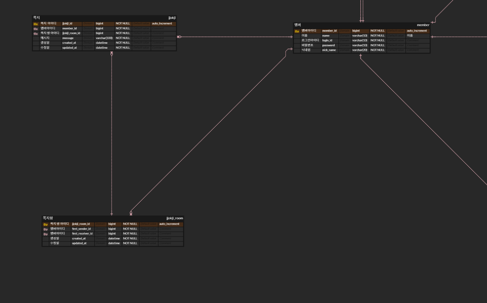
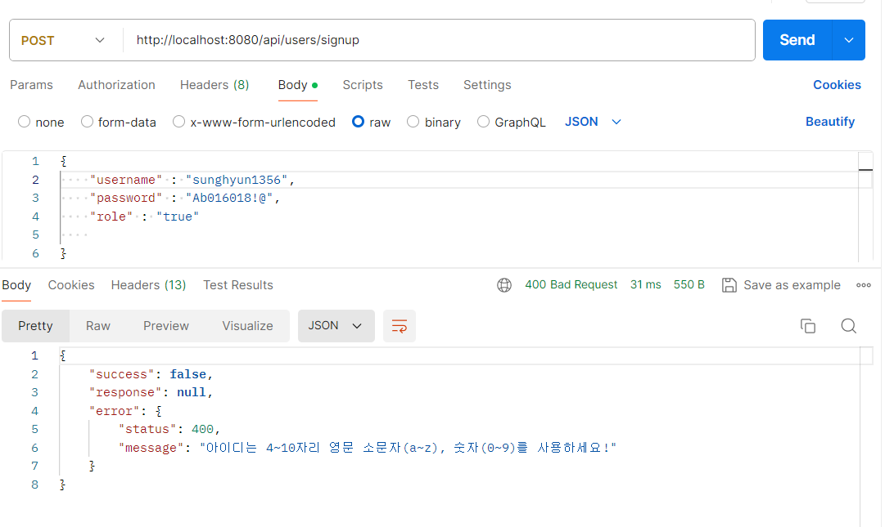

# 연관관계 매핑 
이번에 게시판 서비스를 만들면서 설계한 엔티티간의 연관관계 구조는 다음과 같다.

# 개발 중 문제점 및 고민점
1. 이번에 User와 Post 사이에 좋아요 기능을 추가하기 위해서 Like 엔티티를 설계했었다. 하지만 like 키워드는 DB에서 이미 사용중인 예약어로 테이블 명으로 사용할 수 없었다. 따라서 Heart로 테이블명을 교체하였다.
2. 매핑시 필연적으로 중간 테이블들이 존재하게 되는데  중간테이블의 생성에 대해서 고민했었다. 일반적으로 중간테이블에 해당하는 엔티티의 관리를 외부에 노출하게 된다면 조인 정보가 잘못될 수 있기 때문에 최대한 노출을 하지 않도록  설계하고자 하였다.
~~~java
@Getter  
@NoArgsConstructor(access = PROTECTED)  // 기본생성자 protected
@Entity  
@ToString(exclude = {"user", "post"})  
public class Heart { // 좋아요  
	@Id  
	@GeneratedValue(strategy = IDENTITY)  
	@Column(name = "heart_id")  
    private Long id;  
  
    @ManyToOne(fetch = LAZY, cascade = PERSIST)  
	@JoinColumn(name = "user_id")  
	@Setter(value = PROTECTED)  
	private User user;  
  
    @ManyToOne(fetch = LAZY)  
	@JoinColumn(name = "post_id")  
	@Setter(value = PROTECTED)  
	private Post post;  
  
    protected static Heart createHeart(User user) {  // 생성 메서드
		Heart heart = new Heart();  
        user.addHearts(heart);  
  
        return heart;  
    }  
}
~~~

결과적으로 중간테이블에 해당하는 엔티티(예: Heart)들의 생성자는 외부에서 따로 생성할 수 없도록 하였고, 별도의 create 메소드를 선언하였다. 해당 엔티티와 연관된 다른 테이블에서 create 메소드를 호출하여 객체를 생성 후 연관관계를 매핑하도록 설계하였다.
 ~~~java
@Getter  
@NoArgsConstructor(access = PROTECTED)  
@Entity  
@ToString(exclude = {"user", "hearts", "comments", "images"})  
public class Post extends BaseTimeEntity {  //게시물  
    @Id  
    @GeneratedValue(strategy = IDENTITY)  
    @Column(name = "post_id")  
    private Long id;  
  
    @Column(nullable = false)  
    private String title;  
  
    @Column(nullable = false)  
    private String content;  
  
    public Post(String title, String content) {  
        this.title = title;  
        this.content = content;  
    }  
  
    @ManyToOne(fetch = LAZY)  
    @JoinColumn(name = "user_id")  //select * from post p join user u on p.user_id = u.id;  
    @Setter(value = PROTECTED)  
    private User user;  
  
    @OneToMany(mappedBy = "post", cascade = ALL, orphanRemoval = true)  
    private List<Heart> hearts = new ArrayList<>();  
    
  
		 /**  
		  * 연관관계 편의 메서드  
		  */
     
     // User, Heart, Post의 연관관계는 Post에서 관리함  
    public void addHeartFromUser(User user) {  
       Heart heart = Heart.createHeart(user);  
       heart.setPost(this);  
       hearts.add(heart);  
    }  
	
	// 생략 ...
}
~~~
3. 중간테이블의 엔티티를 연결된 양 엔티티들 중 어느쪽에서 라이프 사이클 관리를 할지 고민이 많았다. 
예를 들어 User - Comment - Post 세개의 엔티티가 있을 때, Comment의 라이프 사이클 관리을 User에서 할지 Post에서 할지가 문제였다. 코드를 작성하기에는 User에서 Comment의 관리를 하는 것이 편리했을 것 같긴 한데, 그래도 댓글(Comment)는 게시물(Post)에 작성을 하는 것이니 일단 Post에서 Comment의 라이프 사이클을 관리하는 방향으로 설계하였다. 이 점은 잘한건지 아직은 잘 모르겟다...  
4. 중간 테이블에 해당하는 엔티티들은 외부에 노출을 최대한 피하는 방향으로 설계하였기에 해당 엔티티들에 대한 리포지토리 계층은 구현하지 않았다. 대신 더티체킹 기능을 이용해 연결된 테이블이 저장될 때 함께 저장되는 방식으로 구성했다.
5. 유저간의 쪽지 기능을 구현하기 위해서 Message 엔티티에는 sender, receiver 두개의 User 필드를 두었다. 처음에는 sendMessage, receiveMessage라는 중간테이블을 두어 기능을 구현하여 보려 했지만 데이터를 저장하는 과정에서 문제가 발생하여 구조를 변경하였다.
~~~java
package com.ceos19.everytime.domain;  
  
import jakarta.persistence.*;  
import lombok.*;  
import org.springframework.context.annotation.Bean;  
  
import java.time.LocalDateTime;  
  
import static jakarta.persistence.CascadeType.ALL;  
import static jakarta.persistence.FetchType.*;  
import static jakarta.persistence.GenerationType.*;  
import static lombok.AccessLevel.PROTECTED;  
  
@NoArgsConstructor(access = PROTECTED)  
@Getter  
@Entity  
@ToString(exclude = {"sender", "receiver"})  
public class Message { // 쪽지, message는 user의 비즈니스 연관관계 편의 메서드로 저장함. 별도의 리포지토리 없다.  
	 @Id  
	 @GeneratedValue(strategy = IDENTITY)  
	 @Column(name = "message_id")  
	 private Long id;  
  
	 @Column(nullable = false)  
	 private String title;  
	 private String content;  
  
	 @Column(nullable = false)  
	 private LocalDateTime sentAt;  
  
	 @ManyToOne(fetch = LAZY)  
	 @Setter(value = PROTECTED)
	 @JoinColumn(name = "sender_id")  
	 private User sender;  
  
	 @ManyToOne(fetch = LAZY)  
	 @Setter(value = PROTECTED)
	 @JoinColumn(name = "receiver_id")  
	 private User receiver;  
  
  
	 public Message(String title, String content) {  
	 this.title = title;  
		 this.content = content;  
         this.sentAt = LocalDateTime.now();  
     }  
  
	public void setSenderAndReceiver(User sender, User receiver) {  
		sender.addSendMessage(this);  
        receiver.addReceiveMessage(this);  
    }  
}
~~~
6. 유지 보수간의 문제를 최소화하기 위해서 setter의 사용은 최대한 배제하였다.

# fetch join 할 때 distinct를 안하면 생길 수 있는 문제
일대다 관계에서 다에 속한 테이블을 fetch join으로 조회시에 각각의 컬렉션 엔티티에 속한 엔티티가 중복 조회되는 문제 발생
Team : Member = 일대다
query = "select t from Team t join fetch t.members"라는 쿼리로 조회를 하는 경우 만일 해당 team에 3개의 member가 조인된 경우
team이 세번 조회되는 문제가 발생함.
따라서 이 경우 query = "select t from Team t distinct join fetch t.members"와 같이 distinct 키워드를 통해서 중복 조회가 되는 문제를 해결한다.

### 서비스 계층 구현
총 10개의 엔티티에 대해 서비스를 구현했다.

- UserService
 유저 가입, 조회 로직을 구현했다.
~~~java
public Long join(User user) {
    if (userRepository.findByUsername(user.getUsername()).isPresent()) {
        log.error("에러 내용: 유저 가입 실패 " +
                "발생 원인: 이미 존재하는 아이디로 가입 시도");
        throw new AppException(DATA_ALREADY_EXISTED, "이미 존재하는 아이디입니다");
    }
    if (userRepository.findByEmail(user.getEmail()).isPresent()) {
        log.error("에러 내용: 유저 가입 실패 " +
                "발생 원인: 이미 존재하는 이메일로 가입 시도");
        throw new AppException(DATA_ALREADY_EXISTED, "이미 사용중인 이메일입니다");
    }
    if (userRepository.findBySchoolIdAndStudentNo(user.getSchool().getId(), user.getStudentNo()).isPresent()) {
        log.error("에러 내용: 유저 가입 실패 " +
                "발생 원인: 이미 존재하는 학번으로 가입 시도");
        throw new AppException(DATA_ALREADY_EXISTED, "이미 사용중인 학번입니다");
    }

    userRepository.save(user);
    return user.getId();
}
~~~
가입시에 이미 존재하는 아이디이거나, 이메일 혹은 가입하려는 학교에 동일 학번이 존재하는 경우 가입이 불가하도록 구현했다.

find 로직은 아래와 같은 식이다.
~~~java
@Transactional(readOnly = true)
public User findById(Long userId) {
    Optional<User> optionalUser = userRepository.findById(userId);
    if (optionalUser.isEmpty()) {
        log.error("에러 내용: 유저 조회 실패 " +
                "발생 원인: 존재하지 않는 PK 값으로 조회");
        throw new AppException(NO_DATA_EXISTED, "존재하지 않는 유저입니다");
    }
    return optionalUser.get();
}
~~~

유저 서비스 코드를 보면 AppException이라는 예외를 던지는 것을 볼 수 있는데, 이는 사용자 정의 예외로 따로 정의하여 이번 어플리케이션에서 사용할 계획이다.
~~~java
@AllArgsConstructor
@Getter
public class AppException extends RuntimeException{
    private ErrorCode errorCode;
    private String message;
}
~~~
~~~java
@AllArgsConstructor
@Getter
public enum ErrorCode {
    DATA_ALREADY_EXISTED(CONFLICT, ""),
    NO_DATA_EXISTED(NOT_FOUND, ""),
    NOT_NULL(NO_CONTENT,""),

    ID_DUPLICATED(CONFLICT, ""),
    INVALID_PASSWORD(UNAUTHORIZED, ""),

    NO_DATA_ALLOCATED(FAILED_DEPENDENCY, ""),

    KEYWORD_TOO_SHORT(BAD_REQUEST, ""),
    INVALID_VALUE_ASSIGNMENT(BAD_REQUEST, ""),
    INVALID_URI_ACCESS(NOT_FOUND,"");

    private final HttpStatus httpStatus;
    private final String message;
}
~~~
AppException은 예외가 발생시 ErrorCode enum을 통해서 그에 맞는 HttpStatus와 메시지를 반환해주도록 설정하였다.

UserService를 구현하는데 사용한 UserRepository에는 @EntityGraph 어노테이션을 통해서 fetch join을 적용하였다. 
이를 통해 User를 조회하는 동시에 연관된 school 필드또한 함께 가져와서 N+1 문제를 해결하였다.
~~~java
public interface UserRepository extends JpaRepository<User, Long> {
    @EntityGraph(attributePaths = {"school"})
    Optional<User> findById(long userId);

    @EntityGraph(attributePaths = {"school"})
    Optional<User> findByUsername(String username);

    @EntityGraph(attributePaths = {"school"})
    Optional<User> findByUsernameAndPassword(String username, String password);

    @EntityGraph(attributePaths = {"school"})
    Optional<User> findBySchoolIdAndStudentNo(long schoolId, String studentNo);

    @EntityGraph(attributePaths = {"school"})
    Optional<User> findByEmail(String email);

    List<User> findBySchoolId(Long schoolId);

    @EntityGraph(attributePaths = {"school"})
    List<User> findByName(String name);
}
~~~
하지만 모든 메서드에 fetch join을 적용하지는 않았는데 
~~~java
List<User> findBySchoolId(Long schoolId);
~~~
와 같이 연관된 필드로 조회하는 경우, 해당 필드를 User에서 다시 get을 할 일은 없을 것 같아서 이 경우 조인을 적용하지 않았다.

- PostService 게시물 등록, 조회, 제거 기능을 구현했다.
~~~java
@Service
@Transactional
@RequiredArgsConstructor
@Slf4j
public class PostService {
    private final CommentRepository commentRepository;
    private final UserRepository userRepository;
    private final PostRepository postRepository;
    private final PostLikeRepository postLikeRepository;

    public Long save(Post post, Attachment... attachments) {
        postRepository.save(post);
        for (Attachment attachment : attachments) {
            if (attachment.getId() != null) {
                log.error("에러 내용: 게시물 등록 실패 " +
                    "발생 원인: 이미 다른 곳에 등록된 파일을 해당 게시물에 재 등록함");
                throw new AppException(DATA_ALREADY_EXISTED, "이미 등록된 파일입니다");
            }
            post.addAttachment(attachment);
        }
        return post.getId();
    }

    public Post findById(Long postId) {
        Optional<Post> optionalPost = postRepository.findById(postId);
        if (optionalPost.isEmpty()) {
            log.error("에러 내용: 게시물 조회 실패 " +
                    "발생 원인: 존재하지 않는 PK 값으로 조회");
            throw new AppException(NO_DATA_EXISTED, "존재하지 않는 게시물입니다");
        }
        return optionalPost.get();
    }

    public List<Post> findByAuthorId(Long authorId) {
        return postRepository.findByAuthorId(authorId);
    }

    public void deletePost(Long postId) {
        Optional<Post> optionalPost = postRepository.findById(postId);
        if (optionalPost.isEmpty()) {
            log.error("에러 내용: 게시물 조회 실패 " +
                    "발생 원인: 존재하지 않는 PK 값으로 조회");
            throw new AppException(NO_DATA_EXISTED, "존재하지 않는 게시물입니다");
        }

        // 연관관계 제거
        List<Comment> comments = commentRepository.findByPostId(postId);
        for (Comment comment : comments) {
            comment.removeParentComment();
        }
        commentRepository.deleteAll(comments);

        // 연관관계 제거
        postLikeRepository.deleteAllByPostId(postId);

        postRepository.deleteById(postId);
    }
}
~~~
postService에는 deletePost()라는 제거 메서드가 존재한다. 게시물에는 연관된 유저, 댓글, 게시판, 첨부파일이 존재한다.

올바른 제거를 위해서 deletePost() 내부에는 먼저 해당 게시물의 외래키를 갖고있는 다른 엔티티들을 먼저 제거하였다.
그리고 첨부파일(Attachement) 엔티티는 Post에 cascade 설정을 통해서 Post를 제거시 자동으로 같이 제거가 되도록 하였다.

### N+1 문제 테스트 코드
N+1 문제는 조인을 사용하지 않는 경우에 발생할 수 있는 문제로, 연관된 엔티티를 조회 시 별도의 쿼리가 나가는 문제를 말한다.  
EAGER 로딩이든 LAZY 로딩이든 연관된 엔티티를 조회시 별도의 쿼리가 나가는 것은 동일하므로, 조인을 사용하지 않는다면 로딩 전략에는 관계 없이 해당 문제가 발생한다.
다만 LAZY 로딩의 경우 연관된 엔티티를 사용하는 경우에 쿼리가 나가서 즉시 별도의 쿼리가 발생하는 EAGER와는 쿼리 발생 시점이 다르다는 차이점이 존재한다.

~~~java
@Test
public void nPlus1() throws Exception {
    //given
    Attachment attachment1 = Attachment.builder()
            .originFileName("file1")
            .storePath("~/storage")
            .attachmentType(AttachmentType.GENERAL)
            .build();

    Attachment attachment2 = Attachment.builder()
            .originFileName("file1")
            .storePath("~/storage")
            .attachmentType(AttachmentType.GENERAL)
            .build();

    Post post1 = Post.builder()
            .board(board).author(user)
            .title("게시물1").content("내용...")
            .isAnonymous(false).isQuestion(true)
            .build();

    // post1 저장시 attachment1도 해당 게시물에 저장함
    post1.addAttachment(attachment1);
    postRepository.save(post1);

    em.flush();
    em.clear();

    //when
    Post post = postRepository.findById(post1.getId()).get();
    for (Attachment attachment : post.getAttachments()) {
        attachment.getId();
    }
}
~~~
위의 예시에서는 하나의 Post에 두개의 Attachment를 넣어서 저장한다. 따라서 만일 @EntityGraph나 join fetch를 사용하지 않는다면 
두개의 Attachment 조회 쿼리가 발생할 것임을 예상할 수 있다.

- @EntityGraph나 join fetch 전략을 사용하지 않은 경우
~~~
2024-03-24T19:29:18.771+09:00 DEBUG 9712 --- [           main] org.hibernate.SQL                        : 
    select
        p1_0.post_id,  
        p1_0.user_id,
        p1_0.board_id,
        p1_0.content,
        p1_0.created_date,
        p1_0.is_anonymous,
        p1_0.is_question,
        p1_0.modified_date,
        p1_0.title 
    from
        post p1_0    // Post 조회
    where
        p1_0.post_id=?   
        
2024-03-24T19:29:18.790+09:00 DEBUG 9712 --- [           main] org.hibernate.SQL                        : 
    select
        a1_0.post_id,
        a1_0.attachment_id,
        a1_0.attachment_type,
        a1_0.original_file_name,
        a1_0.stored_path 
    from
        attachment a1_0   // Attachments 조회
    where
        a1_0.post_id=?
~~~
그러나 실제로는 한개의 Attachment 쿼리가 나간 것을 알 수 있는데 이는 jpa의 컬렉션 관리 메커니즘에 의해서라고 한다.
hibernate에서는 @OneToMany 또는 @ManyToOne과 같은 연관 관계 매핑에 대해 컬렉션의 모든 항목을 한 번의 쿼리로 조회할 수 있도록 최적화하고 있어 하나의 쿼리만 나간다고 한다.
즉, 위의 예시에서는 총 두개의 Attachment 모두가 조회되었으나 두개의 Attachment를 하나의 쿼리만을 사용하여 가져온 것이다.

- @EntityGraph, join fetch 전략을 사용한 경우
만일 위의 경우와 달리 @EntityGraph를 적용한 경우 발생하는 쿼리는 다음과 같다.
~~~
2024-03-24T19:39:09.329+09:00 DEBUG 13048 --- [           main] org.hibernate.SQL                        : 
    select
        p1_0.post_id,
        a1_0.user_id,
        a1_0.email,
        a1_0.name,
        a1_0.password,
        a1_0.school_id,
        a1_0.student_no,
        a1_0.username,
        p1_0.board_id,
        p1_0.content,
        p1_0.created_date,
        p1_0.is_anonymous,
        p1_0.is_question,
        p1_0.modified_date,
        p1_0.title,
        a2_0.post_id,
        a2_0.attachment_id,
        a2_0.attachment_type,
        a2_0.original_file_name,
        a2_0.stored_path 
    from
        post p1_0 
    left join                // attachment1 조인
        user a1_0 
            on a1_0.user_id=p1_0.user_id 
    left join
        attachment a2_0      // attachment2 조인
            on p1_0.post_id=a2_0.post_id 
    where
        p1_0.post_id=?
~~~
하나의 쿼리만으로 조인을 통해 연관된 모든 Attachment를 조회해 옴을 볼 수 있다.