# week2: spring-everytime-19th
CEOS 19th BE study - everytime clone coding

## ERD Overview
<div align="center">
  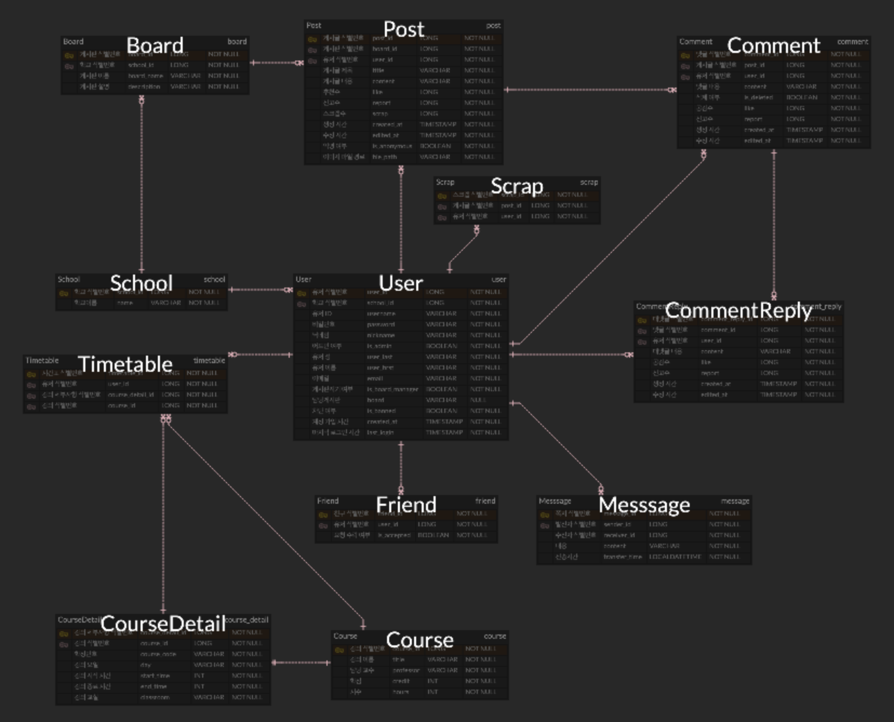
</div>

<div align="center">
  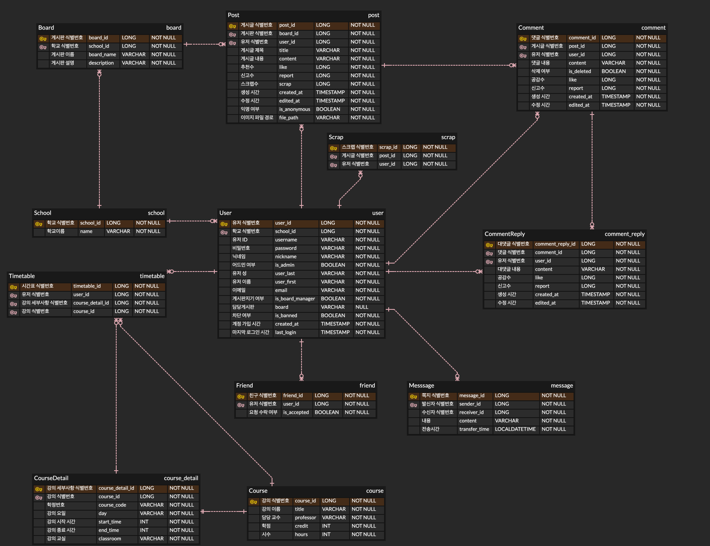
</div>

### User
```java
@Entity
@Table(name = "user")
public class User {
    @Id
    @GeneratedValue(strategy = GenerationType.IDENTITY)
    @Column(name = "user_id", nullable = false)
    private Long id;

    // skip...

    @Column(nullable = false)
    private Boolean isBoardManager = False;

    @ManyToOne(fetch = FetchType.LAZY, cascade = CascadeType.ALL)
    @JoinColumn(name = "school_id")
    private School school;

    @Builder
    public User(final String username,
                
                // skip...

                final LocalDateTime createdAt,
                final LocalDateTime lastLogin) {
        this.username = username;
        
        // skip...

        this.lastLogin = lastLogin;
        this.school = school;
    }
}
```

# 6주차 - Docker
Docker : 컨테이너 기반의 가상화 도구
- 가상화 : 서버의 성능을 나눠서 사용하자.
  분산된 서버가 각기 다른 서비스 수행.

### 서버 가상화 - Hypervisor
**완벽한 OS**
하나의 host OS에서 여러 개의 guest OS를 생성하여 사용 가능.
guest OS : hypervisor에 의해 생성되고 관리되는 운영체제.
- Virtual Box, VMware 등이 있다.
- 시스템 자원 가상화, 독립 공간 생성은 Hypervisor를 반드시 거침
  -> 성능 손실 크다
- Guest OS 위한 라이브러리, 커널 등 포함하기 때문에, 성능 느리고 용량 부담.

### 컨테이너 기반 가상화
**프로세스 단위의 격리 환경**
컨테이너 : 가상화된 공간을 생성하기 위해 리눅스 자체 기능만 담은 격리 환경
- 라이브러리 및 실행파일만 있음.
- 이미지로 만들었을 때, 가상머신에 비해 용량이 작고 빠르다.
  -> 배포에 유리하다
 
컨테이너는 컨테이너에 담긴 것들의 Life Cycle을 관리한다!
- 프로세스의 생성, 운영, 제거까지 생명주기 관리.
### Container != Docker
도커는 컨테이너에 여러 기능을 더한 오픈소스 프로젝트.


<div align="center">
  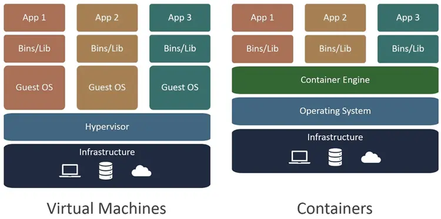
</div>

# 5주차 - Spring Security & JWT
 
### Before JWT - Cookie
- 클라이언트가 웹사이트에 접속할 때 그 사이트가 사용하게 되는 일련의 작은 기록 파일.
- 서버가 클라이언트에 정보를 전달할 때 저장하고자하는 정보를 응답 헤더(Cookie)에 저장하여 전달.
- Key Value 형식의 문자열 형태로 저장.

**단점**
- <U>쿠키는 노출이 되었을 때 id, pw에 대한 민감 정보까지 다 노출이 되어 보안이 좋지 않다.</U>
- 조작당해서 들어올 가능성이 있다.
- 웹 브라우저마다 쿠키에 대한 지원 형태가 다르기 때문에 다른 브라우저간의 공유가 불가능하다.
- 쿠키의 사이즈가 제한(4KB)되어있어 원하는만큼의 충분한 데이터를 담을 수 없을 경우가 있다.
- 서버는 매번 id pw를 받아서 인증을 해야하는 불편함이 있으며 조작된 데이터가 넘어오는 경우를 방지할 수 없다.

### Before JWT - Session
<div align="center">
  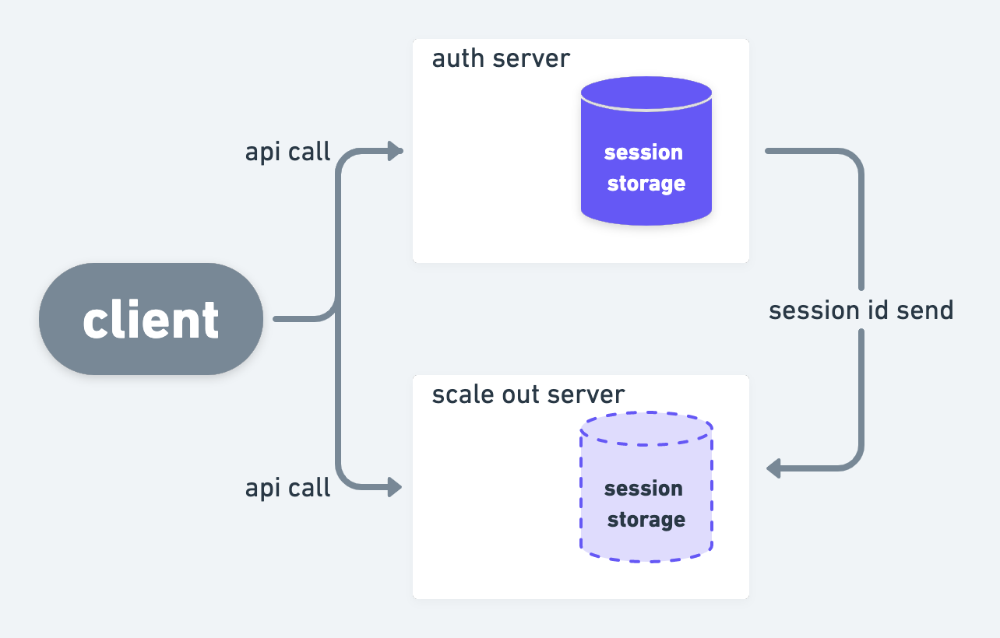
</div>

- 무언가에 대한 특정 인증 정보를 서버가 가지고 있고 그 값을 클라이언트에게 전달하여 마치 키를 주고 자물쇠를 여는 방식으로 인증.
- 세션 ID를 특정 저장소에 저장하여 사용.

**단점**
- 세션 저장소의 문제가 발생하면 인증 체계가 무너져 이전에 다른 인증된 유저 또한 인증이 불가해진다.
- <U>stateful하기 때문에 http의 장점(stateless)을 발휘하지 못하고 scale out에 걸림돌이 생긴다.</U>
  - 로그인 정보를 저장해야하는 세션 저장소가 scale out하기 이전의 서버에 있기 때문에. 따로 또 세션 ID를 저장해야 하는 번거로움.
- 세션 저장소가 필수적으로 존재하기 때문에 이를 사용하기위한 비용이 든다.
- 세션 ID가 탈취되었을 경우 대처는 가능하지만 클라이언트인척 위장하는 보안의 약점이 있을 수 있다.
- 사용자가 많아질수록 메모리를 많이 차지하게 된다.
- <U>"매번" 요청 시 세션 저장소를 조회해야하는 단점이 있다.</U>

## JWT(Json Web Token)
- 사실 기본적인 인증을 진행하는 구조는 Cookie때와 크게 다르지는 않다.
- JWT는 **서명된 토큰**이다.
- 공개/개인 키를 쌍으로 사용하여 토큰에 서명할 경우, 서명된 토큰은 개인 키를 보유한 서버가 이 서명된 토큰이 정상적인 토큰인지 인증할 수 있다.

### 구조
- Header
  - 토큰의 타입
  - 서명 생성 알고리즘
- Payload
  - iss (Issuer) : 토큰 발급자
  - sub (Subject) : 토큰 제목 - 토큰에서 사용자에 대한 식별값이 됨
  - aud (Audience) : 토큰 대상자
  - exp (Expiration Time) : 토큰 만료 시간
  - nbf (Not Before) : 토큰 활성 날짜 (이 날짜 이전의 토큰은 활성화 되지 않음을 보장)
  - iat (Issued At) : 토큰 발급 시간
  - jti (JWT Id) : JWT 토큰 식별자 (issuer가 여러명일 때 이를 구분하기 위한 값)
- Signature

### 중요한 점
**payload에 민감한 정보를 담지않는 것!**
- 위에 header와 payload는 json이 디코딩되어있을 뿐이지 특별한 암호화가 걸려있는 것이 아니다.
- 때문에 누구나 jwt를 가지고 디코딩을 한다면 header나 payload에 담긴 값을 알 수 있다.
- HMAC 알고리즘을 통해 위변조 감지.

<div align="center">
  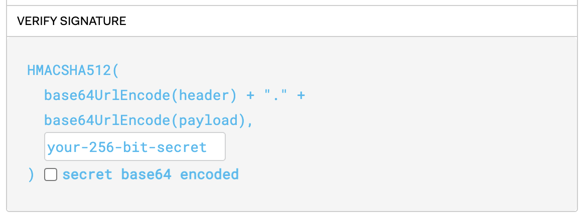
</div>

<div align="center">
  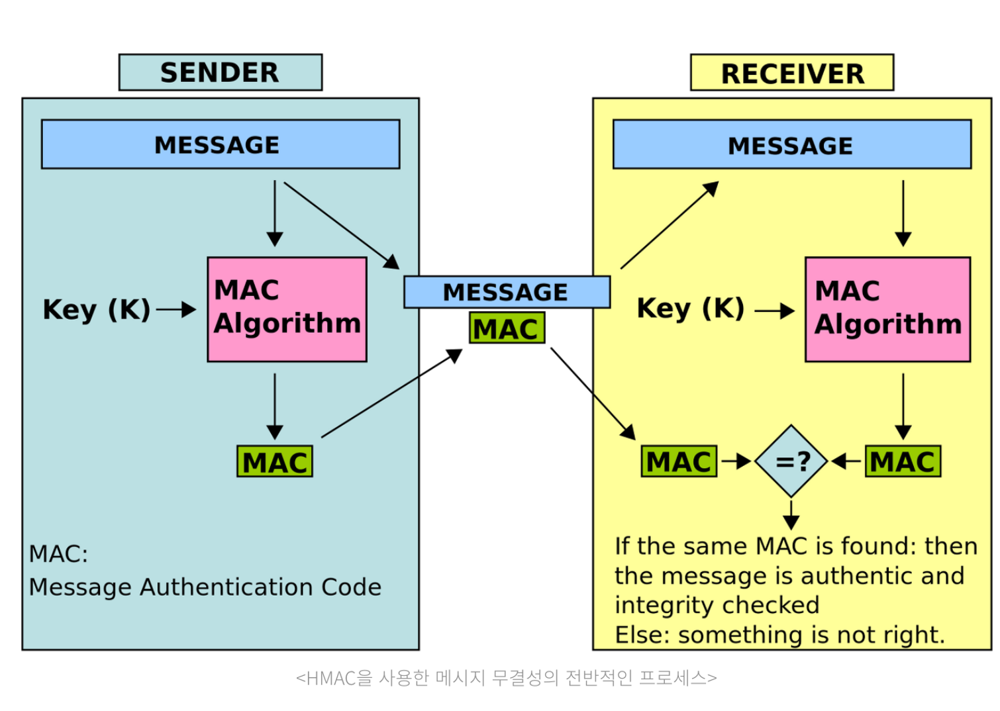
</div>

### 장점
- 이미 토큰 자체가 인증된 정보이기 때문에 세션 저장소와 같은 별도의 인증 저장소가 "필수적"으로 필요하지 않음.
- 세션과는 다르게 클라이언트의 상태를 서버가 저장해두지 않아도 된다.
- signature를 공통키 개인키 암호화를 통해 막아두었기 때문에 데이터에 대한 보안성이 늘어난다.
- 다른 서비스에 이용할 수 있는 공통적인 스펙으로써 사용할 수 있다.


## 실습

1. /authenticate rest로 해당 계정 jwt token 발급

<div align="center">
  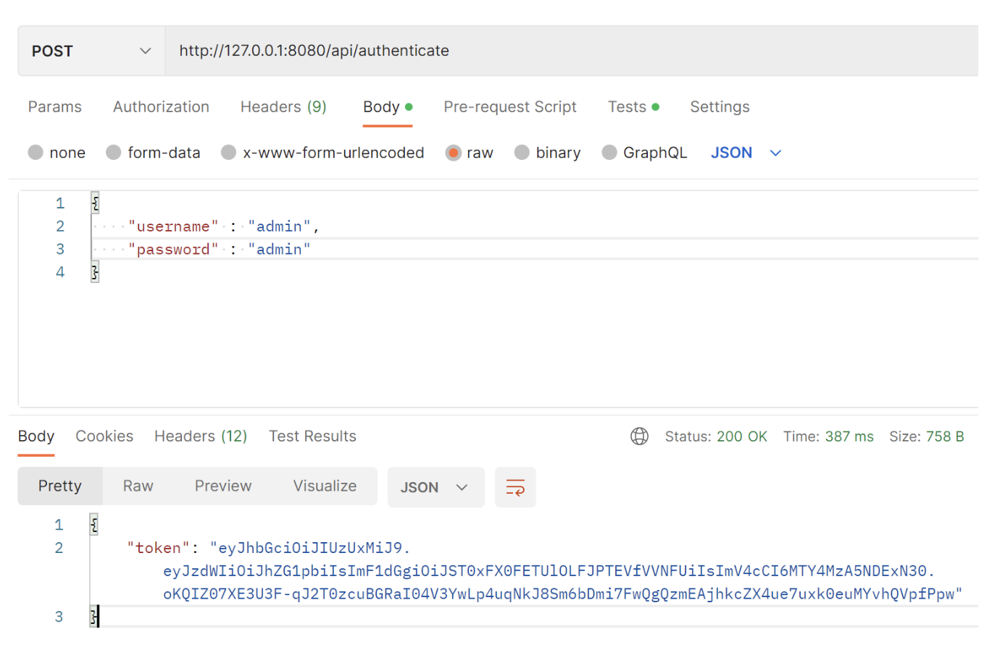
</div>

2. 위에 발급 받은 jwt와 함께 hasAnyRole 권한이 부여된 /user rest 요청
<div align="center">
  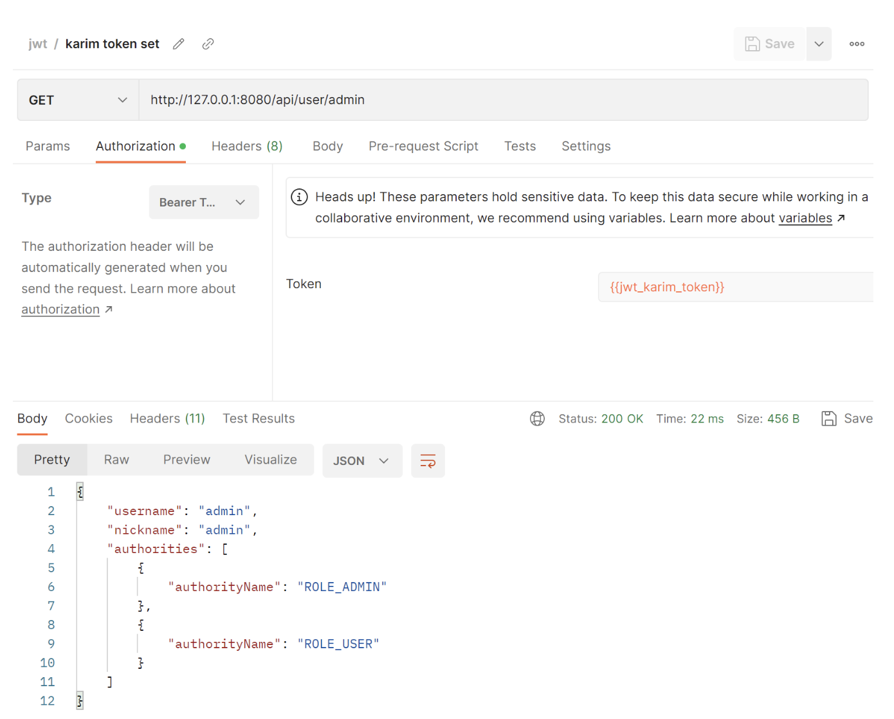
</div>

3. 권한이 없는 karim의 경우 forbidden
<div align="center">
  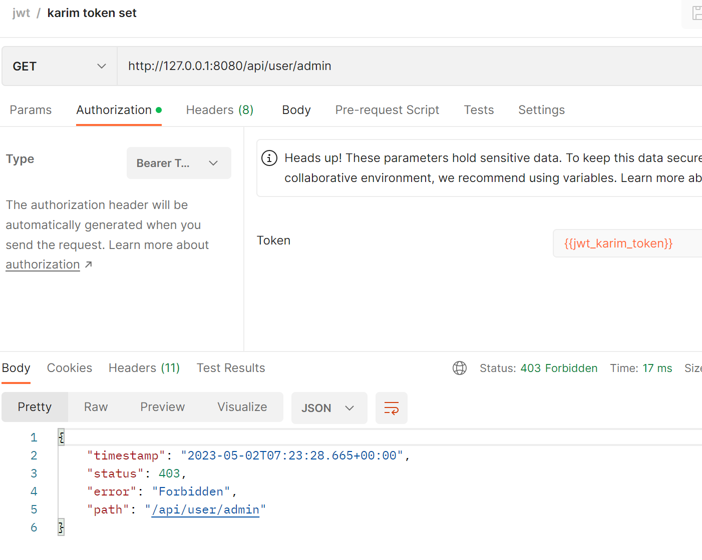
</div>


### 이슈 - 순환참조
<div align="center">
  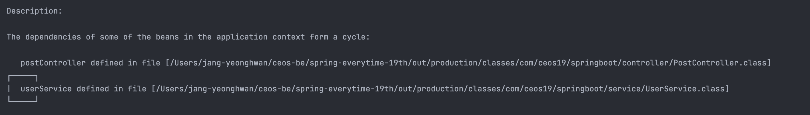
</div>

- SecurityConfig는 UserService를 참조하고 있다.
- UserService는 PasswordEncoder를 참조하고 있다.
- PasswordEncoder의 Bean은 SecurityConfig 내부에서 등록된다.
- 결국 UserService는 SecurityConfig를 참조하게 되면서 순환 참조가 발생한다.

**SecurityConfig**
```java
@Bean
public static PasswordEncoder passwordEncoder() {
    return PasswordEncoderFactories.createDelegatingPasswordEncoder();
}
```
- PasswordEncoder 메서드를 정적(static)으로 선언하는 방식으로 해결.
- 정적 메서드는 표준 인스턴스화된 개체에서 벗아나 정적 메서드를 직접 호출하기 때문에 인스턴스화를 하지 않아 순환참조에서 벗어날 수 있었다.

[Reference](https://zhfvkq.tistory.com/29)


### 이슈 - Postman 401 에러
SecurityConfig 에 등록하지 않은 api 는 jwt 토큰 인증을 필수적으로 거치도록 설정했기 때문에 이외의 api들은 별도로 명시해 등록해줘야 함
-> auth 가 필요 없는 api는 SecurityConfig 에 따로 등록해주기

**SecurityConfig**
```java
.and()
.authorizeHttpRequests() // HttpServletRequest를 사용하는 요청들에 대한 접근제한을 설정하겠다.
.requestMatchers("/api/authenticate").permitAll() // 로그인 api
.requestMatchers("/api/signup").permitAll() // 회원가입 api
.requestMatchers(PathRequest.toH2Console()).permitAll()// h2-console, favicon.ico 요청 인증 무시
.requestMatchers("/favicon.ico").permitAll()
.anyRequest().authenticated() // 그 외 인증 없이 접근X
```

# 4주차 - CRUD API

## About DTO(Data Transfer Object)?

<div align="center">
  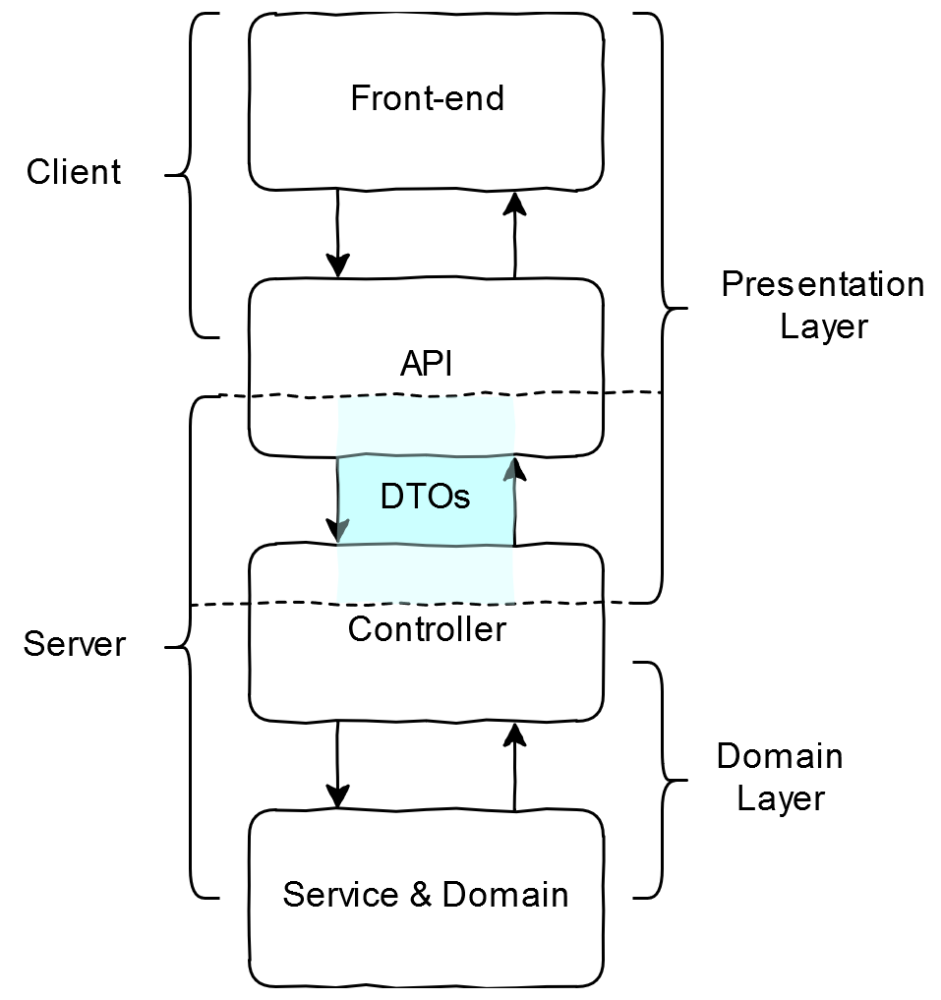
</div>

- 프로세스 간에 데이터를 전달하는 객체를 의미
- 비즈니스 로직 등의 복잡한 코드 없이, 순수하게 전달하고 싶은 데이터만 담겨있다.

### Why use DTO?
- Controller는 View로부터 들어온 사용자 요청을 해석하여 Model을 업데이트하거나 Model로부터 데이터를 받아 View로 전달하는 작업 등을 수행한다.
- 도메인 객체를 View에 직접 전달할 수 있지만, 민감한 도메인 비즈니스 기능이 노출될 수 있으며 Model과 View사이에 의존성이 생기게 된다.
- DTO는 Model과 View를 분리함으로써 서로의 의존성을 낮추고 독립적인 개발을 가능하게 한다.
- Spring에서는 주로 Controller Layer - Service Layer 사이를 매개한다.


### DTO Annotation

```java
@Data
@Getter
@NoArgsConstructor(access = AccessLevel.PROTECTED)
public class PostRequestDTO {
    @NotNull
    private Long userId;

    private String title;
    private String content;

    private Long likeCount;
    private Long reportCount;
    private Long scrap;

    private Boolean isAnonymous;
    private String filePath;
}
```

**@NoArgsConstructor 주의사항**

- 이 어노테이션을 클래스에 붙이면, 기본 생성자가 public 으로 생성된다.
- 굳이 외부에서 생성을 열어둘 필요가 없다면 막는 것이 좋다.
- 무분별한 객체 생성을 막을 수 있도록 접근 권한을 최소화하는 것을 권장한다.  
`@NoArgsConstructor(access = AccessLevel.PROTECTED)`
- 수동으로 기본 생성자 사용할 일이 없는데, 이를 미연에 방지해준다.

**@Getter**
- DTO
  - JSON → DTO 로 데이터를 파싱할 때, ObjectMapper의 getter 또는 setter를 이용해서 DTO 필드를 가져온다.
  - 그런데 값을 주입할 때는 reflection 기능을 통해 주입하므로, setter를 굳이 쓸 필요는 없다.

- RequestDto
  - 서비스에서 requestDto 의 값을 사용하는 일이 빈번하다.
  - Service 클래스에서 requestDto getter 메서드를 사용할 때, DTO 클래스에 @Getter가 없으면 컴파일러가 에러를 체크한다.

- ResponseDto
  - 값을 반환하는 DTO이기 때문에 사실 getter 메서드를 쓸 일이 없다. 실제로 쓰지 않아도 컴파일러 에러 체크도 발생하지 않고, 실제 서버도 작동한다.
  - 하지만, @Getter가 없는 DTO를 사용하는 로직을 수행하면 예외가 발생한다.
  - Spring이 Jackson 라이브러리를 사용해서 DTO → Json 으로 데이터를 변환해주는데, 이 때 ResponseDto의 데이터를 호출하게 되고, getter 메서드를 사용하게 된다.

### Result

- RequestDTO : @NoArgsConstructor, @Getter 필요
- ResponseDTO : @Getter 필요

[Lombok DTO Reference](https://velog.io/@kimdy0915/NoArgsConstructor-Getter-%EC%96%B8%EC%A0%9C-%EC%99%9C-%EC%82%AC%EC%9A%A9%ED%95%A0%EA%B9%8C)


## Service - DTO - Controller
1. Service에서 Response Dto 생성 후 Controller에서 반환
2. Service에서 도메인 자체를 반환하여 Controller에서 Response Dto로 변환 후 사용

컨트롤러에 Domain이 노출되므로, 1번 방법 선택

**Trade-off**
Service에서 Response Dto를 생성하여 Controller에 전달하면
- Service가 View에 종속적이게 되어 응답의 Format 변경 시 Service도 변경되어 유지보수성이 좋지 않다.
- 또한, Service 계층의 책임 관점에서도 올바르지 않은 것 같다.

유지보수성과 책임 관점을 따라서 Service에서 도메인을 Controller에 반환한다면
- 컨트롤러에서 도메인 로직이 실행되는 치명적인 위험이 발생할 수 있다.

<!-- ### 추후 적용

- Response
  1. Service에서 Response Dto 생성 후 Controller에서 반환
  2. Service에서 도메인 자체를 반환하여 Controller에서 Response Dto로 변환 후 사용

- Request
  1. Controller에서 Request Dto를 그대로 Service에 전달하여 사용
  2. Service Dto를 따로 만들고, Controller에서 Request Dto를 Service Dto로 변환 후 전달하여 사용 -->

### Result
- Response : Service에서 Response Dto 생성 후 Controller에서 반환
- Request : Controller에서 Request Dto를 그대로 Service에 전달하여 사용  

서비스의 도메인이 노출되지 않도록.

### Response Code Example

**Service**

```java
public PostResponseDTO addPost(Post post) {
    if (postRepository.findById(post.getId()).isPresent()) {
        log.error("post failed : already exist post");
        throw new ErrorException(ErrorCode.DATA_ALREADY_EXIST, "post already exist");
    }

    postRepository.save(post);
    return PostResponseDTO.entityToDto(post);
}
```

**Controller**

```java
@PostMapping("/{pid}/post")
public ResponseEntity<Long> addPost(@PathVariable("pid") Long postId, Post post) {
    // 추후 form 구현 필요
    PostResponseDTO responseDto = postService.addPost(post);
    return new ResponseEntity<>(responseDto.getId(), HttpStatus.OK);
    // error exception 방법
}
```


[Reference](https://ksh-coding.tistory.com/102)

### UC?


## Global Exception

ErrorException 클래스를 구현하여 예외 상황에 맞는 HttptStatus 메세지를 리턴

**@Slf4j**

```java
@Getter
@AllArgsConstructor
public enum ErrorCode {
    DATA_ALREADY_EXIST(CONFLICT, ""),
    NO_DATA_EXIST(NOT_FOUND, ""),
    NOT_NULL(NO_CONTENT, ""),

    ID_DUPLICATED(CONFLICT, ""),
    INVALID_PASSWORD(UNAUTHORIZED, ""),

    NO_DATA_ALLOCATED(FAILED_DEPENDENCY, ""),

    KEYWORD_TOO_SHORT(BAD_REQUEST, ""),
    INVALID_VALUE_ASSIGNMENT(BAD_REQUEST, ""),
    INVALID_URI_ACCESS(NOT_FOUND, "");


    private final HttpStatus httpStatus;
    private  final String  message;
}
```

### 로깅 vs System.out.println()
- 출력 형식을 지정할 수 있음
- 로그 레벨에 따라 남기고 싶은 로그를 별도로 지정할 수 있음
- 콘솔뿐만 아니라 파일이나, 네트워크 등 로그를 별도에 위치에 남길 수 있다.
- log 성능이 System.out 보다도 좋다고 한다.

### Logging Example

```java
public Long addUser(User user) {
    if (userRepository.findByUsername(user.getUsername()).isPresent()) {
        log.error("user sign in failed : already exist username");
        throw new ErrorException(DATA_ALREADY_EXIST, "username already exist");
    }

    userRepository.save(user);
    return user.getId();
}
```

## Swagger 적용

<div align="center">
  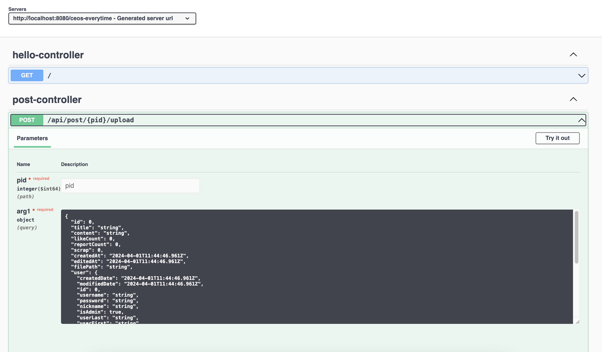
</div>


## Controller 통합 테스트


# 3주차 - JPA 심화

## Service Business Logic 목록
**User**
- 유저 회원가입
- 유저 회원탈퇴
- 유저 로그인 (ToDo)
- 유저 로그아웃 (ToDo) 
- 대학교 인증 (ToDo)

**Board**
- 게시판 생성
- 게시판 관리자 변경
- 게시판 삭제
  - 하위 테이블(Post, Comment) 삭제

**Post**
- 게시글 작성
- 게시글 조회
- 게시글 수정
- 게시글 삭제
- 게시글 좋아요 및 취소

**Comment**
- 댓글 작성
- 댓글 수정
- 댓글 삭제
- 대댓글 기능
- 댓글 좋아요 및 취소

**Message**
- 쪽지 전송 (최초 방 생성 및 전송)
- 쪽지 조회
- 쪽지방 나가기 (방 삭제)

**Image**
- 이미지 업로드 (DB 저장)
- 이미지 삭제 (DB 삭제)

## Spring naming convention

서비스 클래스 안에서 메서드 명을 작성 할 때는 아래와 같은 접두사를 붙인다.

- findOrder() - 조회 유형의 service 메서드
- addOrder() - 등록 유형의 service 메서드
- modifyOrder() - 변경 유형의 service 메서드
- removeOrder() - 삭제 유형의 service 메서드
- saveOrder() – 등록/수정/삭제 가 동시에 일어나는 유형의 service 메서드

[Reference](https://cocobi.tistory.com/27)


## Service 생성자 주입 (DI)

```java
@Service
public class UserService {

    final UserRepository userRepository;

    private UserService(UserRepository userRepository) {
        this.userRepository = userRepository;
    }
}
```

**@Autowired** 대신 생성자 주입으로 Repository를 연결한다.


생성자 주입 장점 요약
1. 객체의 불변성을 확보할 수 있다.
  - 실제로 개발을 하다 보면 의존 관계의 변경이 필요한 상황은 거의 없다.
  - 하지만 수정자 주입이나 일반 메소드 주입을 이용하면 불필요하게 수정의 가능성을 열어두어 유지보수성을 떨어뜨린다.

2. 테스트 코드의 작성이 용이해진다.
  - 테스트가 특정 프레임워크에 의존하는 것은 침투적이므로 좋지 못하다.
  - 그러므로 가능한 순수 자바로 테스트를 작성하는 것이 가장 좋은데, 생성자 주입이 아닌 다른 주입으로 작성된 코드는 순수한 자바 코드로 단위 테스트를 작성하는 것이 어렵다.

3. final 키워드를 사용할 수 있고, Lombok과의 결합을 통해 코드를 간결하게 작성할 수 있다.
  - 생성자 주입을 사용하면 필드 객체에 final 키워드를 사용할 수 있으며, 컴파일 시점에 누락된 의존성을 확인할 수 있다. 
  - 반면 다른 주입 방법들은 객체의 생성(생성자 호출) 이후에 호출되므로 final 키워드를 사용할 수 없다.

4. 스프링에 침투적이지 않은 코드를 작성할 수 있다.
  - @Autowired으로 필드 주입하게 되면, UserService에 스프링 의존성이 침투하게 된다. 
  - 혹시 모르는 차세대 프레임 워크에 대비.

5. 순환 참조 에러를 애플리케이션 구동(객체의 생성) 시점에 파악하여 방지할 수 있다.
  - UserSerivce가 이미 MemberService에 의존하고 있는데, MemberService 역시 UserService에 의존하는 경우를 생각해보자.
  - 위의 두 메소드는 서로를 계속 호출할 것이고, 메모리에 함수의 CallStack이 계속 쌓여 StackOverflow 에러가 발생하게 된다.
  - 서버에 올리기 전, 애플리케이션 구동 시점(객체의 생성 시점)에 에러가 발생하기 때문에, 배포 전에 에러를 방지할 수 있다.
  - Bean에 등록하기 위해 객체를 생성하는 과정에서 다음과 같이 순환 참조가 발생하기 때문이다.  
  `new UserService(new MemberService(new UserService(new MemberService()...)))`


## 1+N Problem
When? 언제 발생하는건가요?
- JPA Repository를 활용해 인터페이스 메소드를 호출 할 때(Read 시) 

Who? 누가 발생시키나요?
- 1:N 또는 N:1 관계를 가진 엔티티를 조회할 때 발생 

How? 어떻게 하면 발생되나요?
- JPA Fetch 전략(Fetch Type)이 EAGER 전략으로 데이터를 조회하는 경우
- JPA Fetch 전략(Fetch Type)이 LAZY 전략으로, 전체 데이터를 가져온 이후 연관 관계인 하위 엔티티를 사용할 때 다시 조회하는 경우

Why? 왜 발생하나요?
- JPA Repository로 find 시 실행하는 첫 쿼리에서 하위 엔티티까지 한 번에 가져오지 않고, 하위 엔티티를 사용할 때 추가로 조회하기 때문에.
- JPQL은 기본적으로 글로벌 Fetch 전략을 무시하고 JPQL만 가지고 SQL을 생성하기 때문에.

## Test Example
<div align="center">
  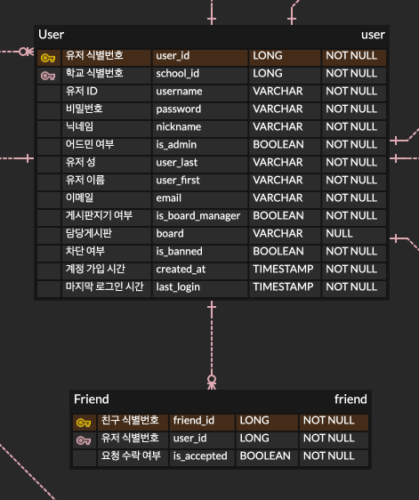
</div>

Friend와 User 는 다대일 관계


### EAGER vs LAZY
- EAGER(즉시 로딩)인 경우
  1) JPQL에서 만든 SQL을 통해 데이터를 조회
  2) 이후 JPA에서 Fetch 전략을 가지고(여기서는 즉시 로딩) 해당 데이터의 연관 관계인 하위 엔티티들을 추가 조회(LAZY - 지연 로딩 발생)
  3) 앞의 과정으로 N+1 문제 발생함

- LAZY(지연 로딩)인 경우
  1) JPQL에서 만든 SQL을 통해 데이터를 조회
  2) JPA에서 Fetch 전략을 가지지만, 여기서는 지연 로딩이기 때문에 추가 조회는 하지 않음
  3) 하지만, 하위 엔티티를 가지고 작업하게 되면 추가 조회하기 때문에 결국 N+1 문제가 발생함


## Test Code

```java
class UserRepositoryTest {
    User insertUser1;
    User insertUser2;
    User insertUser3;

    Friend friend1;
    Friend friend2;
    Friend friend3;

    friend2 = friendRepository.save(Friend.builder()
        .isAccepted(true)
        .myId(insertUser1.getUserId())
        .friendUser(insertUser2)
        .build()
    );

    friend3 = friendRepository.save(Friend.builder()
            .isAccepted(true)
            .myId(insertUser1.getUserId())
            .friendUser(insertUser3)
            .build()
    );

    @Test
    @Transactional
    @DisplayName("N+1 문제 테스트")
    void n1IssueTracking() {
        List<Friend> friendList = friendRepository.findAll();
        System.out.println("total friend data size:" + friendList.size());
    }
}
```
FetchType.EAGER로 설정하고 테스트를 실행하면, select문이 List 조회 한 번, user2, user3에 대한 조회 2번 총 3번이 나와야 하는데..?

<div align="center">
  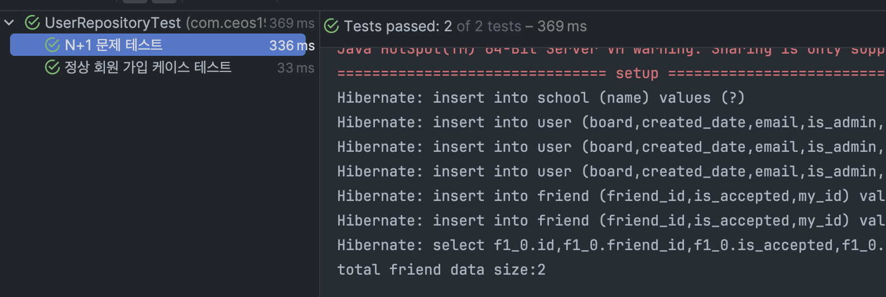
</div>
spring.jpa.properties.hibrnate.format_sql = false여서 쿼리가 한 줄로 보여진다.

select 문이 왜 하나만 호출되죠?
결국 해결 못 했습니다..  


### 해결법
1. JPA : JPQL 에서 지원하는 fetch join 을 사용
2. 스프링데이터JPA : @EntityGraph 로 fetch join 사용

[Reference](https://maivve.tistory.com/340)

# 스터디 이후 개선점들!

## UUID(Universally Unique Identifier : 범용 고유 식별자)

- 중복이 되지 않는 유일한 값을 구성하고자 할때 주로 사용이 되는 고유 식별자
- 주로 세션 식별자, 쿠키 값, 무작위 데이터베이스 키 등에 사용
- 100년 동안 생성했을 때 최소 1개가 중복 및 충돌 될 확률
- 버전 5까지 있지만, 버전 5의 보안 취약점으로 인해 버전4가 대중적으로 사용됨

<div align="center">
  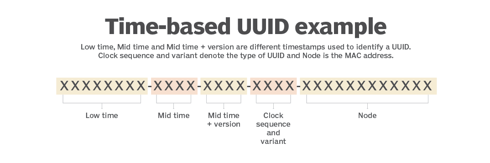
</div>

16바이트(128비트) 형태의 구조를 가지며 하나의 <U>**UUID 길이는 36자리이며 “4개의 하이픈(-)”과 “32개의 16진수 문자열”로 구성**</U>

**Pros and Cons**
- Pros
  - 보안성
  - 정렬했을 때 서비스 사이즈 규모 추정이 힘듬
- Cons
  - increment PK보다 더 많은 storage를 필요로 한다. (UUID: 128 bits)
    -> DB와 메모리를 많이 사용한다.

> Result: 애플리케이션 내부용 키로는 자동증가 pk, 외부에 공개할 키로는 uuid를 사용하는 것을 권장
- 애플리케이션 내부에서 자동증가 pk를 사용하면 성능과 저장 장소 측면에서 이점이 있다.
- 만약 식별 값이 외부로 노출될 수도 있는 서비스라면 UUID로 데이터를 식별하는 것이 좋다.
- 어떤 이유로든(외부 노출 등) UUID가 손상된다면 UUID를 변경해야 한다.
    - PK를 변경하는 작업은 매우 값비싼데, UUID가 PK와 별개로 사용되는 경우 UUID를 변경하는 작업은 훨씬 저렴하다.


## Refactoring: SQL 예약어 유의
<div align="center">
  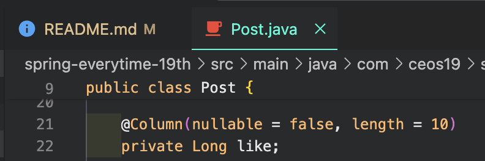
</div>

<div align="center">
  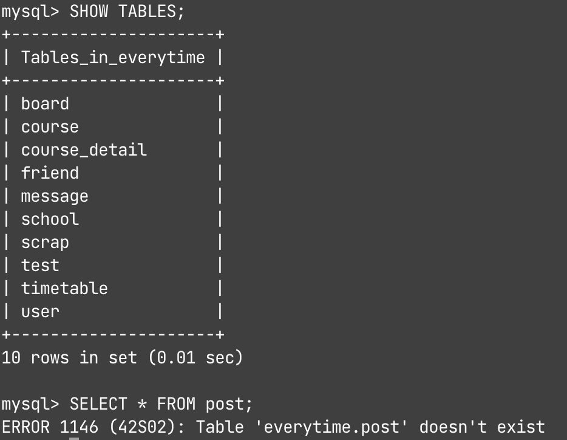
</div>

`like`와 같은 SQL 예약어를 사용하게 되면 table이 정상적으로 만들어지지 않는다.

-> Post, Comment, CommentReply 테이블의 '좋아요' 변수명을 like가 아닌 likeCount 등으로 변경


## BaseEntity
대부분 엔티티에 필요할 경우, BaseEntity로 관리할 수 있다.
everytime 프로젝트의 경우, TimeEntity가 중복되어, 이를 BaseTimeEntity로 분리해주었다.

```java
@Getter
@MappedSuperclass
@EntityListeners(AuditingEntityListener.class)  // Auditing 기능 포함
public abstract class BaseTimeEntity {

    @CreatedDate
    @Column(updatable = false)
    private LocalDateTime createdDate;

    @LastModifiedDate
    private LocalDateTime modifiedDate;
}

```

아래와 같이 extends 하여 BaseEntity의 속성을 가져올 수 있다.

```java
@Entity
public class User extends BaseTimeEntity{
  // skip... 
}
```

## Fetch 전략
- 한 사람이 여러 개의 메세지를 보낼 수 있다.
- FetchType이란 JPA가 하나의 Entity를 조회할 때, 연관관계에 있는 객체들을 어떻게 가져올지에 대한 설정값이다.
- 이 경우 Message 클래스는 @ManyToOne으로 User와 연관되며, @ManyToOne의 default FetchType 은 EAGER 이다.

```java
@Entity
public class Message {
    @Id
    @GeneratedValue(strategy = GenerationType.IDENTITY)
    @Column(name = "message_id", nullable = false)
    private Long id;

    @Column(nullable = false, length = 1000)
    private String content;

    @ManyToOne(fetch = FetchType.LAZY)
    @JoinColumn(name = "user_id")
    private User user;
}
```

대부분의 FetchType은 LAZY가 권장된다.

하지만 xToOne의 경우, LAZY FetchType은 N+1 문제를 야기할 수 있다.
- ex. Message를 불러온 뒤, 각 User에 대해 무언가를 하는 for Loop가 있을 경우

### How to prevent N+1 problem?
N+1 이 발생하는 Entity 연관관계를 발견하였다면, 한 Entity 가 Managed 상태로 올라올 때 N+1 문제를 일으키는 Entity Collections 들도 동시에 Managed 상태로 올라오게 하면 된다.

**Detail Suggestions**
1. JPQL 의 Fetch Join 을 이용한다. (QueryDSL 과 같은 쿼리빌더의 도움을 받을 수도 있다.)
2. ManyToOne, OneToOne 의 FetchType = LAZY → EAGER 로 변경한다.
3. @EntityGraph 를 이용해, 한 쿼리에 대해서만 EAGER load 를 지정한다.


## Hibernate: ddl-auto

ddl-auto 옵션은 DB 테이블 관리 옵션

- create: 기존테이블 삭제 후 다시 생성 (DROP + CREATE)
- create-drop: create와 같으나 종료시점에 테이블 DROP
- update: 변경분만 반영(운영DB에서는 사용하면 안됨)
- validate: 엔티티와 테이블이 정상 매핑되었는지만 확인
- none: 사용하지 않음(사실상 없는 값이지만 관례상 none이라고 한다.)

**주의할 점**

- 운영 장비에서는 절대 crate, create-drop, update 사용하면 안된다.
- 개발 초기 단계는 create 또는 update
- 테스트 서버는 update 또는 validate
- 스테이징과 운영 서버는 validate 또는 none

[ ! ] 로컬 환경을 제외한 나머지 서버에서는 최대한 직접 쿼리를 날려서 적용하는 것이 가장 좋다.

-> 가능하면 update로 개발할 것!


## ignore가 필요한 파일이 remote에 업로드 됐을 때
  - .gitignore에 yml 파일 추가
  - `git rm -r --cached .` 명령어로 캐시 제거

```zsh
git rm -r --cached .
git add .
git commit -m 'clear git cache'
git push
```

<div align="center">
  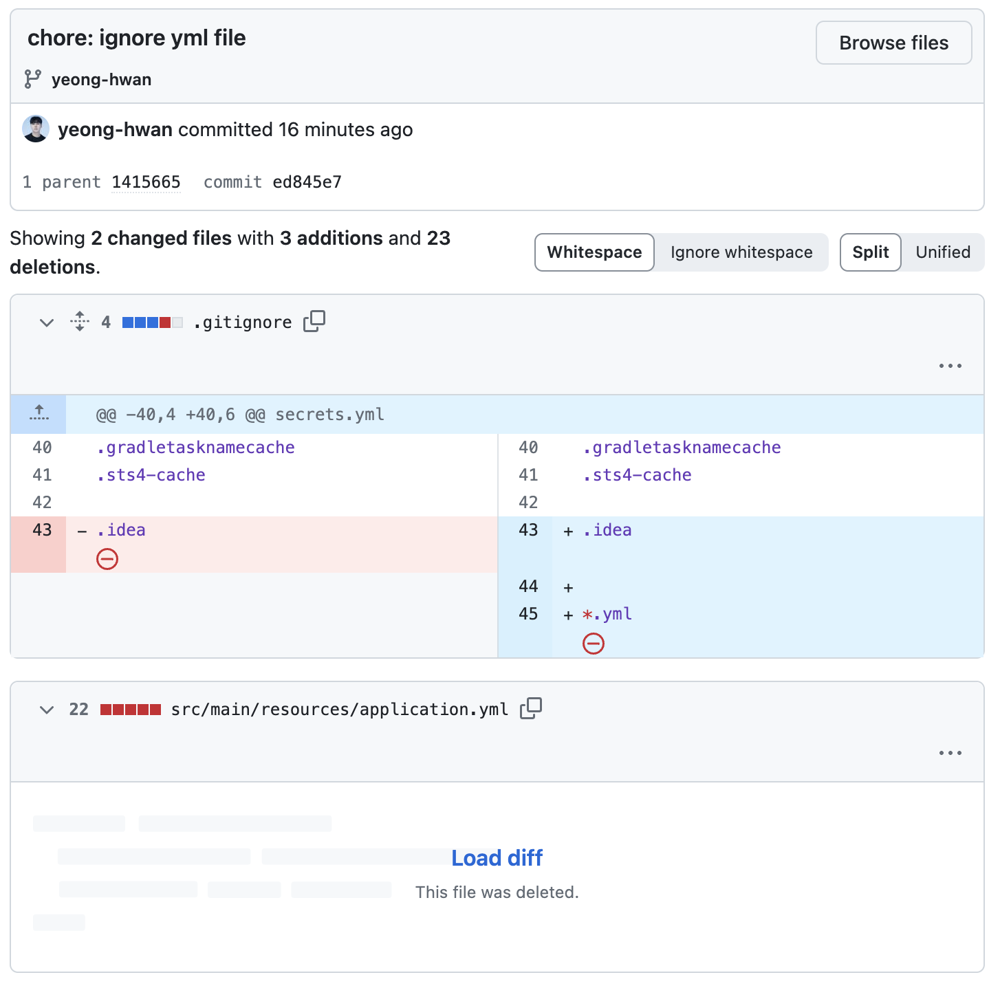
</div>

하지만 Load diff로 커밋 내용으로는 확인할 수 있어, 기록 전부를 삭제하고 싶으면 rebase 해주어야 함.

## Unit Test

```java
@DataJpaTest
@TestMethodOrder(MethodOrderer.OrderAnnotation.class)
@AutoConfigureTestDatabase(replace = AutoConfigureTestDatabase.Replace.NONE)
class UserRepositryTest {
    @Autowired
    private UserRepository userRepository;

    @BeforeEach
    void setup() {
        System.err.println("=============================== setup ==============================");
    }

    @Test
    @DisplayName("정상 회원 가입 케이스 테스트")
    @Transactional
    void joinUser() {
        // given
        LocalDateTime currentDateTime = LocalDateTime.now();

        School univ = new School("Yonsei");

        User insertUser = userRepository.save(User.builder()
                .username("yeonghwan")
                .password("testpw")
                .nickname("yeonghwan")
                .isAdmin(true)
                .userLast("Jang")
                .userFirst("Yeonghwan")
                .email("jghff700@naver.com")
                .isBoardManager(false)
                .board(null)
                .isBanned(false)
                .createdAt(currentDateTime)
                .lastLogin(currentDateTime)
                .school(univ).build()
        );

        // when
        User saveUser = userRepository.findByUsername("yeonghwan").get();

        // then
        assertThat(insertUser).isEqualTo(saveUser);
    }
}

```
<div align="center">
  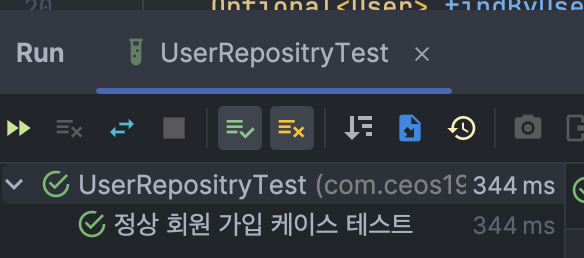
</div>


## References
- [UUID 이해 및 사용방법](https://adjh54.tistory.com/142)
- [UUID 장단점](https://mr-popo.tistory.com/199)
- [빌더 패턴을 사용해보자](https://velog.io/@haerong22/Java-%EB%B9%8C%EB%8D%94-%ED%8C%A8%ED%84%B4%EC%9D%84-%EC%8D%A8%EB%B3%B4%EC%9E%90)
- [BaseTimeEntity](https://europani.github.io/spring/2021/10/05/027-baseTimeEntity.html)
- [N+1 problem with LAZY FetchType](https://jaynewho.com/post/39)
- [ddl-auto 옵션 관련 주의할 점](https://smpark1020.tistory.com/140)
- [이미 commit 이후에 gitignore 적용이 안될 때](https://junlab.tistory.com/237)