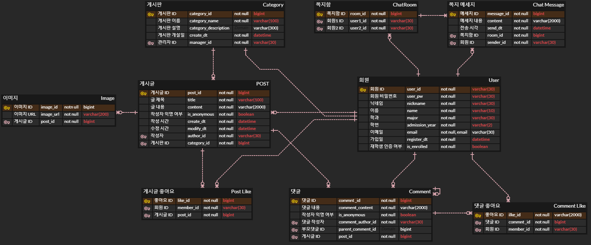
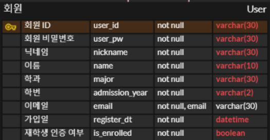
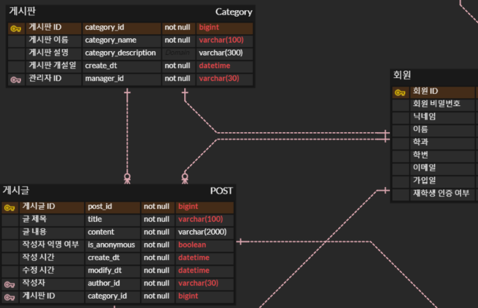
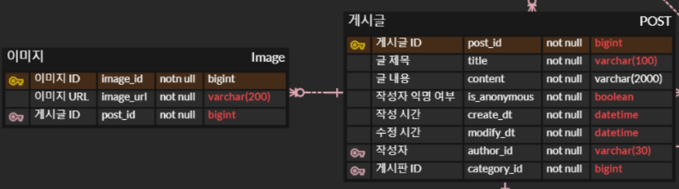
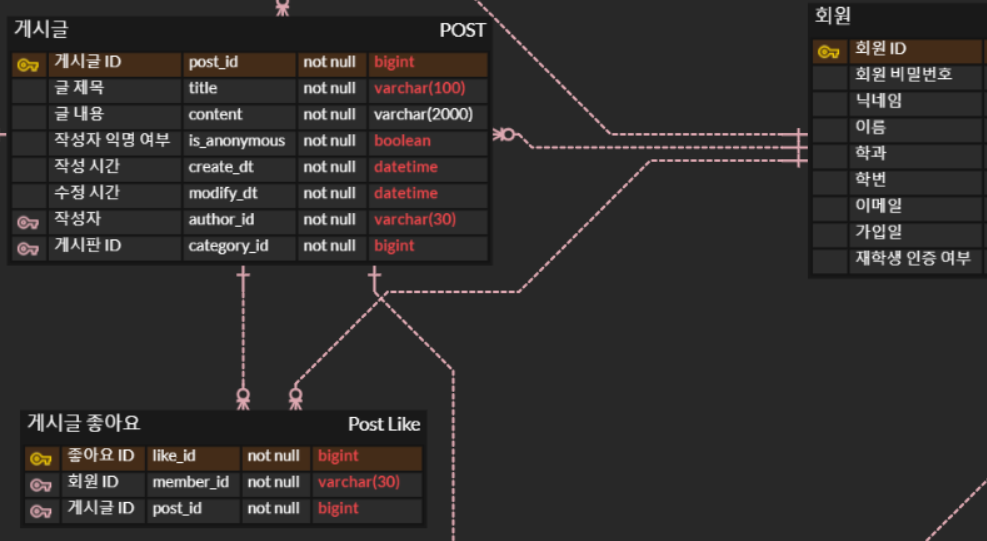
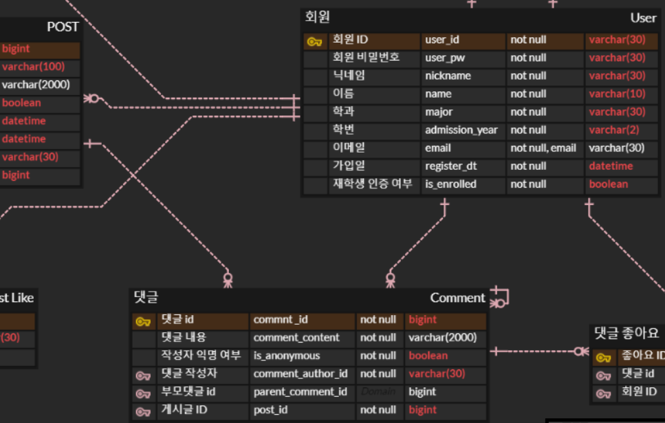
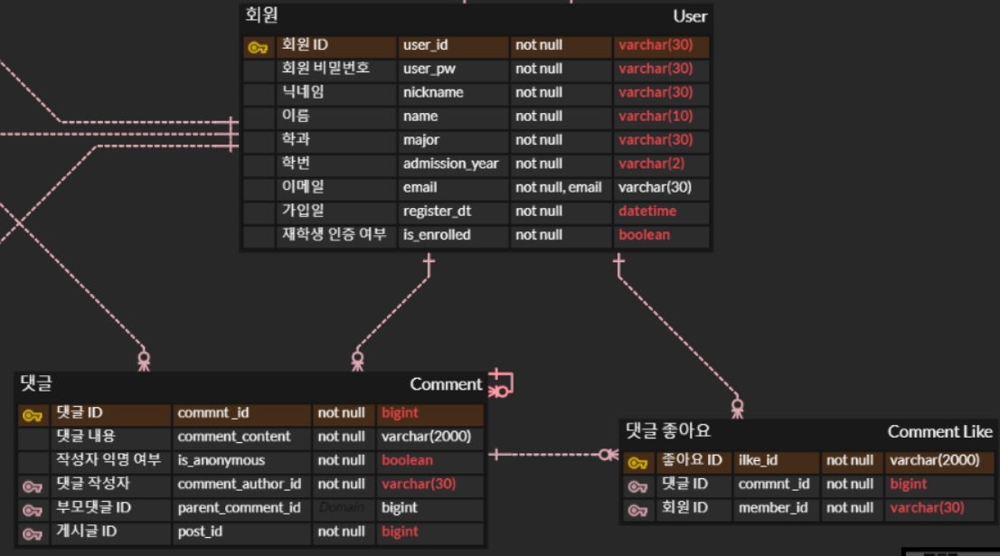
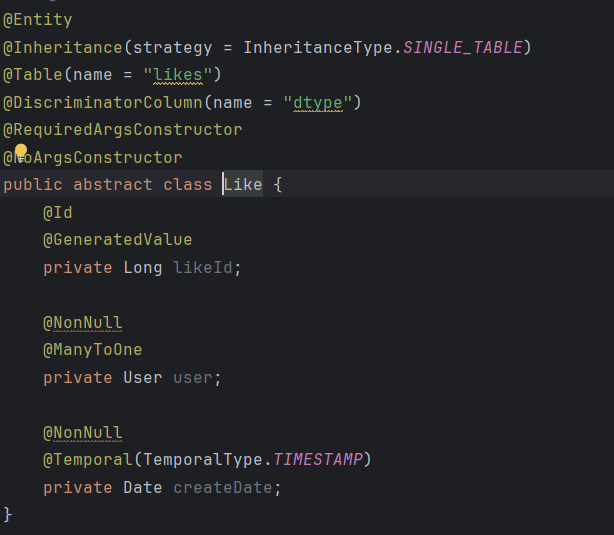
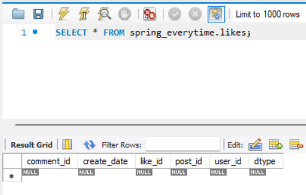
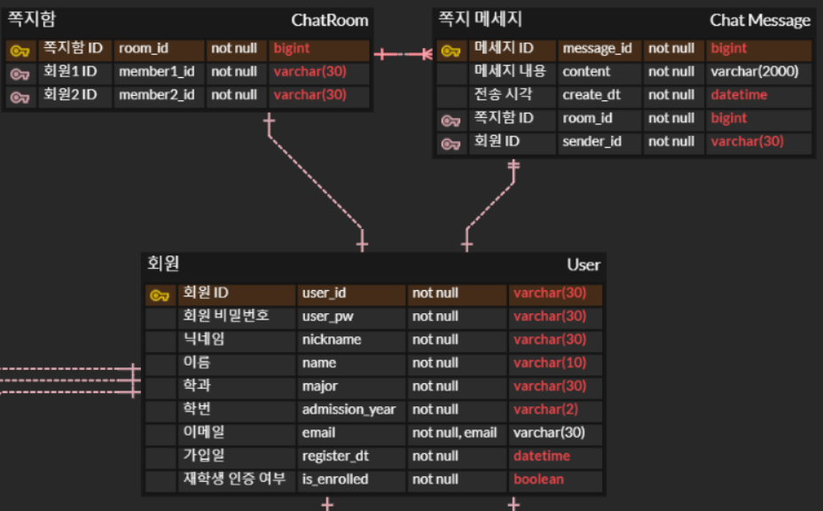

# spring-everytime-19th
CEOS 19th BE study - everytime clone coding

## 에브리타임 서비스 설명 & ERD 의도 설명

에브리타임은 대학생 익명 커뮤니티 사이트이다.

### 회원
먼저 서비스를 이용할 회원 엔티티를 정의하였다.   




에브리타임 마이페이지를 참고하여 회원 ID, PW, 닉네임, 이름, 이메일, 가입일과 같은 기본 유저 정보에 학과, 학번, 재학생 인증 여부 정보를 추가적으로 입력받도록 설계하였다.

### 게시판 / 게시글

다음은 유저가 작성하는 게시글과 게시글이 올라가는 게시판에 대한 ERD이다.   

#### 게시판 - 유저
게시판은 관리하는 유저가 한명만 존재할 수 있으므로 유저와 1:1 관계이다.   
관리자는 변경될 수 있기 때문에 one and only one 대신 one and one 으로 설정하였다.   

#### 게시글 - 유저
게시글은 한명의 유저가 여러 게시글을 작성할 수 있지만, 하나의 게시글에는 한명의 작성자만 존재한다.
따라서 유저와 게시글의 관계는 1:N 관계이다.

에브리타임은 익명 커뮤니티이므로, 작성자의 익명 설정 여부를 저장하는 필드도 추가하였다.   
에브리타임에는 질문글 옵션이 있으나, 해당 옵션은 클론하지 않았다.

#### 게시판 - 게시글
하나의 게시판에는 게시글이 없을 수도 있고, 여러개 있을 수도 있다.   
하나의 게시글은 오직 하나의 게시판에만 속하므로 1:N 관계이다.

#### 게시글 - 첨부 사진

게시글을 작성할 때는 사진을 첨부할 수 있다.   
이때 하나의 게시글에는 사진이 없을 수도 있고, 여러개 있을 수도 있는 1:N 관계이다.   
사진을 직접 저장하는 것은 데이터베이스의 용량을 많이 차지하므로 서버에 있는 사진의 경로를 대신 저장하도록 하였다.   

#### 게시글 - 좋아요

게시글 하나에는 여러개의 좋아요가 달릴 수 있지만, 하나의 좋아요는 하나의 게시글에 대한 좋아요를 나타낸다.   
따라서 게시글과 좋아요의 관계는 1:N 관계이다.

#### 유저 - 좋아요
한명의 유저는 하나의 게시글에 좋아요를 한번만 누를 수 있다.     
이를 파악하려면 좋아요를 누른 유저의 정보도 같이 저장해야 한다.     
한명의 유저는 여러 게시글에 좋아요를 누를 수 있지만, 좋아요 하나는 한명의 유저가 생성한 좋아요이므로 1:N 관계이다.   

### 댓글

댓글 역시 익명으로 작성이 가능하므로, 댓글의 익명성 여부를 같이 저장하도록 설계하였다.

#### 게시글 - 댓글
게시글 하나에는 댓글이 없거나 여러개 달릴 수 있다.   
하나의 댓글은 하나의 게시글에 대한 댓글이다.   
따라서 게시글과 댓글 사이의 관계는 1:N 관계이다.

#### 유저 - 댓글
한명의 유저는 여러개의 댓글을 작성할 수 있다.   
하나의 댓글은 한명의 유저가 작성하였다.   
따라서 유저와 댓글 사이의 관계는 1:N 관계이다.

#### 댓글 - 대댓글
하나의 댓글에는 대댓글이 없거나 여러개의 대댓글이 달릴 수 있다.
하나의 대댓글은 대상으로 하는 댓글이 하나이다.   
따라서 댓글과 대댓글 사이의 관계는 1:N 이다.   

게시글에 작성한 댓글은 대상으로 하는 댓글이 없으므로 부모댓글 ID는 NULL 값을 허용하였다.

#### 댓글 - 좋아요

하나의 댓글에는 어러개의 좋아요가 달릴 수 있다.   
하나의 좋아요는 하나의 댓글에 대한 좋아요이다.   
따라서 댓글과 좋아요 사이의 관계는 1:N 이다.

#### 유저 - 좋아요
한명의 유저는 여러 댓글에 대해 좋아요를 누를 수 있다.   
좋아요 하나는 한명의 유저에 의해서 생성된다.   
따라서 유저와 좋아요 사이의 관계는 1:N 이다.

#### 좋아요 모델링 특이사항
좋아요는 댓글 좋아요와 게시글 좋아요가 좋아요의 대상만 다르고 나머지 기능이 동일하다.    
   
따라서 Like 라는 추상클래스를 상속받아서 PostLike, CommentLike 를 구현하도록 하였다.   
   
실제 DB에는 likes 라는 테이블 하나만 존재하고, 이 테이블에 댓글 좋아요와 게시글 좋아요 데이터가 모두 저장된다. 

### 쪽지

쪽지는 유저와 유저 사이 1:1로 진행되며, 쪽지를 주고받는 공간을 '쪽지함'으로 부른다.

#### 유저 - 쪽지함
에브리타임의 쪽지는 항상 1:1로 진행되는 점을 고려하여 설계하였다.   
쪽지함에는 해당 쪽지함에서 어떤 유저와 쪽지를 주고 받는지 참여한 2명의 유저를 기록하도록 하였다.   
이때 회원1은 처음으로 쪽지를 보내는 유저, 회원2는 처음으로 쪽지를 받는 유저로 정의하였고, 각각 1:1 관계로 설정하였다.

#### 쪽지함 - 쪽지
하나의 쪽지함에서는 여러개의 쪽지를 주고받을 수 있다.   
하나의 쪽지는 반드시 하나의 쪽지함에 속해있다.   
따라서 쪽지함과 쪽지의 관계는 1:N 관계이다.

#### 유저 - 쪽지
한명의 유저는 여러개의 쪽지를 보낼 수 있지만, 하나의 쪽지는 한명의 유저가 보낸 것이므로, 1:N 관계이다.

## 3주차 - JPA 심화
### 필요한 비즈니스 로직 리스트
#### 유저
- [x] 유저 회원 가입
- [x] 유저 회원 탈퇴
- [x] 유저 대학교 인증
- [ ] ~~유저 로그인~~ (TODO)
- [ ] ~~유저 로그아웃~~ (TODO)
#### 게시판
- [x] 게시판 생성
- [x] 게시판 관리자 변경
- [x] 게시판 삭제 (소속 게시글, 댓글 모두 삭제)
#### 게시글
- [x] 게시글 조회
- [x] 게시글 작성 (사진 여러장 첨부)
- [x] 게시글 삭제
- [x] 게시글 수정
- [x] 게시글 좋아요 누르기
- [x] 게시글 좋아요 취소
#### 댓글
- [x] 게시글 댓글 작성
- [x] 게시글 댓글 삭제
- [x] 대댓글 작성
- [x] 대댓글 삭제
- [x] 댓글 좋아요 누르기
- [x] 댓글 좋아요 취소
#### 쪽지
- [x] 최초 쪽지 전송 (쪽지방 생성 + 쪽지 전송)
- [x] 쪽지 전송
- [x] 쪽지방 삭제 (전체 쪽지 삭제)
- [x] 쪽지함 (전체 쪽지방) 조회
- [x] 특정 유저와의 쪽지함 조회
#### 이미지
- [x] 이미지 업로드 (서버에 저장)
- [x] 이미지 DB에서 삭제

### 레포지토리 테스트
@SpringBootTest 사용    
- **ChatRoom 삭제 테스트 (N+1 테스트)**    
  이번 스터디를 통해 공부한 fetch를 연관관계 매핑에 적용해보았다.
     
  채팅 메세지를 전송할 때, 채팅 메세지 객체를 직접 생성하면서 채팅방을 직접 매핑하는 것보다, 채팅방 객체에서 채팅 전송 메서드를 호출하는 것이 더 객체지향적인 설계라고 생각하여 `CascaseType.ALL`로 설정하였다.
  
  ```java
    @Test
    @DisplayName("채팅방 삭제시 채팅 데이터 삭제 테스트")
    void 채팅방_삭제시_채팅_데이터_삭제_테스트() {
        // given
        ChatRoom chatRoom = chatRoomRepository.save(new ChatRoom(user1, user2));
        chatRoom.send(user1, "hello");
        chatRoom.send(user2, "hello!");
    
        System.out.println("--------------------");
        System.out.println("create Chat Message Data");
        System.out.println("--------------------");

        em.flush();
        em.clear();
    
        // when
        System.out.println("--------------------");
        System.out.println("Delete Chat Message Data");
        System.out.println("--------------------");
        chatRoomRepository.delete(chatRoom);
        
        // then
        Assertions.assertThat(chatRoomRepository.findChatRoomByUser1AndUser2(user1, user2).isEmpty()).isTrue();
        Assertions.assertThat(chatRoomRepository.findChatRoomByUser1AndUser2(user2, user1).isEmpty()).isTrue();
        Assertions.assertThat(chatMessageRepository.findAllByChatRoom(chatRoom).isEmpty()).isTrue();
    }
  ```
  N+1을 테스트하기 위해 위와 같은 테스트 코드를 작성하였다.   
  영속성 전이를 설정해 둔 ChatRoom 객체를 삭제하면, 해당 ChatRoom과 연관관계가 있는 모든 ChatMessage에 대해 아래와 같은 쿼리가 함께 나간다.
  ```mysql
  Hibernate:
      delete
      from
          chat_message
      where
          message_id=?
  Hibernate:
      delete
      from
          chat_message
      where
          message_id=?
  Hibernate:
      delete
      from
          chat_room
      where
          room_id=?
  ```
  chat_message 들이 먼저 삭제된 이후, chat_room 을 삭제하는 것을 알 수 있었다.

- **새로 공부한 부분**   
     
  에브리타임에서 대댓글이 달린 댓글(이하 '부모 댓글')을 삭제해도, 대댓글(이하 '자식 댓글')은 모두 남아있는 것을 볼 수 있다.   
  이 부분을 구현하는 방법을 공부하고, 적용하는 과정에서 문제를 만났다.

  <br/>
  처음에는 부모 댓글만 삭제하면 자식 댓글들의 FK값이 Null이 아니더라도 더 이상 존재하지 않는 부모 댓글 PK를 가리키므로 그냥 부모 댓글만 지우면 될 거라고 생각했다.<br/>
  하지만 이렇게 구현하면 DB의 Constraint 제약 조건에 따라 에러가 발생하였다.<br><br>    
  
  그래서 FK값이 일단 Null이 되어야 하니 부모댓글을 지우면 자동으로 자식 댓글들의 FK를 NULL로 설정하도록 하는 방법을 찾고 싶었다.     
  하지만 같은 고민을 했던 사람의 질문에 대해 김영한님이 남겨주신 답변은 for 문을 돌면서 연관된 자식 댓글들의 FK를 수동으로 Null로 설정하는 것이 맞다고 한다.      
  
  [관련 글 링크](https://www.inflearn.com/questions/39769/%EB%B6%80%EB%AA%A8-%EC%9E%90%EC%8B%9D%EA%B4%80%EA%B3%84%EC%97%90%EC%84%9C-%EB%B6%80%EB%AA%A8-%EC%82%AD%EC%A0%9C%EC%8B%9C-set-null%EB%B0%A9%EB%B2%95%EC%97%90-%EB%8C%80%ED%95%B4%EA%B6%81%EA%B8%88%ED%95%A9%EB%8B%88%EB%8B%A4)   
  
  그래서 해당 내용을 아래와 같이 구현하였다.
  ```java
      @Test
      @DisplayName("부모 댓글 삭제 테스트")
      void 부모댓글_삭제_테스트() {
          // given
          Comment parent = post1.addComment(user2, "댓글1", true);
          parent.addReply(user1, "댓글2", true);
          parent.addReply(user1, "댓글3", true);
          em.flush();
  
          // when
          for (int i = 0; i < 2; i++) {
              parent.getChildComments().get(i).setParentComment(null);
          }
          em.flush();
    
          System.out.println("--------------------------");
          commentRepository.delete(commentRepository.findById(parent.getCommentId()).get());
          em.flush();
          em.clear();
          System.out.println("--------------------------");
  
          // then
          Assertions.assertThat(commentRepository.findAllByPost(post1).size()).isEqualTo(2);
      }
  ```
  그러나 이렇게 구현했을 때 Delete 쿼리가 나가지 않는 문제가 있었다.   
      
  이에 대해 찾아본 결과, 위와 같이 자식 댓글을 조회해서 1차 캐시에 남아있는 상태에서 그에 대한 부모 댓글을 delete하면 이미 조회했던 자식 댓글들에는 해당 부모 댓글 정보가 남아있지만 실제 DB에서는 남아있지 않는 동기화 문제가 발생하므로 delete 쿼리를 실행시키지 않는다고 한다.   
  그래서 이를 해결하기 위해 1차 캐시를 깔끔하게 비운 뒤, 다시 조회하도록 `em.clear()` 를 해주었다.
  
  ```java
  // when
  for (int i = 0; i < 2; i++) {
  parent.getChildComments().get(i).setParentComment(null);
  }
  em.flush();
  em.clear();
  // 연관관계가 있는 child 가 1차 캐시에 있는 상태에서는 parent를 지워도 쿼리가 안나감.
  // https://velog.io/@jkijki12/JPA-Entity%EA%B0%80-delete%EA%B0%80-%EC%95%88%EB%90%9C%EB%8B%A4 참고
  
  System.out.println("--------------------------");
  commentRepository.delete(commentRepository.findById(parent.getCommentId()).get());
  em.flush();
  em.clear();
  System.out.println("--------------------------");
  ```
  실행결과는 아래와 같다.
  ```mysql
  --------------------------
  Hibernate:
    select
        c1_0.comment_id,
        c1_0.user_id,
        c1_0.content,
        c1_0.create_date,
        c1_0.is_anonymous,
        c1_0.modify_date,
        c1_0.parent_comment_id,
        c1_0.post_id
    from
        comment c1_0
    where
        c1_0.comment_id=?
  Hibernate:
    delete
    from
        comment
    where
        comment_id=?
  --------------------------
  ```
### 서비스 단위 테스트
서비스 단위 테스트는 Mockito를 이용해 레포지토리를 mocking 하여 진행하였다.   
과제 PR 리뷰를 통해 `@SpringBootTest` 는 단위테스트를 위한 어노테이션인지 통합테스트를 위한 어노테이션인지 공부를 다시 하게 되었다.   
그리고 2주차 과제에서 Repository 테스트를 `@SpringBootTest` 를 통해 진행한 것은 단위 테스트가 아니라 통합테스트였다는 것을 새로 공부하게 되었다.      
그래서 이번 과제에서는 단위 테스트 / 통합 테스트를 모두 작성해야 하는 만큼 확실하게 분리해서 테스트를 해보고자 했다.   

#### @Mock, @InjectMock
    
서비스 계층 단위테스트를 진행할 때는 Repository 계층과 연결을 끊고 서비스 계층의 로직만을 테스트 해야한다.   
따라서 레포지토리를 `@Mock` 어노테이션을 사용해 Mocking하고 service는 이 Mock을 대신 주입받도록 하였다.

```java
void 게시판_생성_테스트() {
    // given
    Category category = EntityGenerator.generateCategory(user1);
    given(categoryRepository.save(any(Category.class))).willReturn(category);

    // when
    Category newCategory = categoryService.create(category);

    // then
    assertThat(newCategory).isEqualTo(category);
}
```
Mocking한 레포지토리의 동작을 정상적으로 작동하는 것처럼 보이게 하기 위해 `given()` 을 사용하여 return 값을 정해주었다.   
이렇게 repository 의 메서드 방식을 정해주면, service 계층의 코드를 실행할 때, mocking한 레포지토리의 코드가 대신 실행된다.

```java
    @Test
    @DisplayName("14일 이후 게시판 삭제 테스트")
    void 게시판_생성_후_14일_이후_삭제_테스트() {
        // given
        Category category = EntityGenerator.generateCategory(user1);
        category.setDateForTest(LocalDateTime.of(2024, 3, 1, 0, 0));

        // when
        categoryService.delete(category);

        // then
        verify(categoryRepository, times(1)).delete(category);
    }
```
게시판 삭제와 같은 로직을 테스트할 때는 특정 데이터를 return 하는 로직이 없으므로 `given()` 함수를 사용할 일이 없다.   
이런 경우에는 `verify()` 를 사용하여 함수 호출 여부 및 횟수를 검증하여 테스트할 수 있다.

## 4주차
### API 명세 [ **/api/v1** ]
<table style="text-align: center">
  <tr>
    <th>Domain</th>
    <th>Method</th>
    <th>Base URL</th>
    <th>URL</th>
    <th>Request</th>
    <th>Response</th>
    <th>Description</th>
  </tr>
  <tr>
    <td rowspan="4">Category</td>
    <td>GET</td>
    <td rowspan="4"><code>/category</code></td>
    <td><code>/{category_id}/page/{page_number}</code></td>
    <td></td>
    <td></td>
    <td>게시판 게시글 조회(페이징)</td>
  </tr>
  <tr>
    <td>POST</td>
    <td><code>/</code></td>
    <td><code>{"category_name": string, "category_description": string}</code></td>
    <td></td>
    <td>게시판 생성</td>
  </tr>
  <tr>
    <td>PUT</td>
    <td><code>/{category_id}/description</code></td>
    <td><code>{"category_description": string}</code></td>
    <td></td>
    <td>게시판 설명 수정</td>
  </tr>
  <tr>
    <td>DELETE</td>
    <td><code>/{category_id}</code></td>
    <td></td>
    <td></td>
    <td>게시판 삭제</td>
  </tr>

  <tr>
    <td rowspan="5">Post</td>
    <td>POST</td>
    <td rowspan="4"><code>/category/{category_id}/post</code></td>
    <td><code>/</code></td>
    <td></td>
    <td></td>
    <td>글 작성</td>
  </tr>
  <tr>
    <td>GET</td>
    <td><code>/{post_id}</code></td>
    <td></td>
    <td></td>
    <td>글 조회</td>
  </tr>
  <tr>
    <td>PUT</td>
    <td><code>/{post_id}</code></td>
    <td></td>
    <td></td>
    <td>글 수정</td>
  </tr>
  <tr>
    <td>DELETE</td>
    <td><code>/{post_id}</code></td>
    <td></td>
    <td></td>
    <td>글 삭제</td>
  </tr>
  <tr>
    <td>POST</td>
    <td></td>
    <td><code>/post/{post_id}/like</code></td>
    <td></td>
    <td></td>
    <td>게시글 좋아요 업데이트(생성/삭제)</td>
  </tr>

  <tr>
    <td rowspan="4">Comment</td>
    <td>POST</td>
    <td rowspan="4"><code>/comments</code></td>
    <td><code>/</code></td>
    <td><code>{"content": String, "isAnonymous": boolean}</code></td>
    <td></td>
    <td>댓글 생성</td>
  </tr>
  <tr>
    <td>POST</td>
    <td><code>/{comment_id}</code></td>
    <td><code>{"content": String, "isAnonymous": boolean}</code></td>
    <td></td>
    <td>대댓글 생성</td>
  </tr>
  <tr>
    <td>DELETE</td>
    <td><code>/{comment_id}</code></td>
    <td></td>
    <td></td>
    <td>댓글 삭제</td>
  </tr>
  <tr>
    <td>POST</td>
    <td><code>/{comment_id}/like</code></td>
    <td></td>
    <td></td>
    <td>댓글 좋아요 업데이트 (생성/삭제)</td>
  </tr>

  <tr>
    <td rowspan="4">ChatRoom</td>
    <td>GET</td>
    <td rowspan="4"><code>/chat/room</code></td>
    <td><code>/list</code></td>
    <td></td>
    <td></td>
    <td>쪽지함 내 쪽지방 조회</td>
  </tr>
  <tr>
    <td>GET</td>
    <td><code>/{room_id}</code></td>
    <td></td>
    <td></td>
    <td>쪽지방 단건 조회</td>
  </tr>
  <tr>
    <td>DELETE</td>
    <td><code>/{room_id}</code></td>
    <td></td>
    <td></td>
    <td>쪽지방 삭제</td>
  </tr>
  <tr>
    <td>POST</td>
    <td><code>/</code></td>
    <td></td>
    <td></td>
    <td>쪽지방 생성</td>
  </tr>

  <tr>
    <td rowspan="4">ChatMessage</td>
    <td>POST</td>
    <td rowspan="4"><code>/chat/rooms/{room_id}/message</code></td>
    <td><code>/</code></td>
    <td></td>
    <td></td>
    <td>기존 채팅방에 채팅 전송</td>
  </tr>
</table>

### Controller Test

### Swagger 연동 확인
1. 의존성을 추가한다. spring-doc, spring-fox 가 있는데, spring-fox는 4년전 이후로 업데이트가 없어 spring-doc를 사용하였다. 


2. 앱을 실행한 후 아래 주소로 접속하면 된다.    
    http://localhost:8080/swagger-ui/index.html/

3. 아래는 접속한 이미지이다.
  

### 3주차에서 리펙토링한 부분

- `Optional` 객체의 존재 여부를 체크하여 에러를 발생시킬 때 `orElseThrow`를 사용하도록 변경
- DTO 파일이 많아져 관리의 용이성을 위해 디렉토리 구조를 계층형에서 도메인형으로 변경
- 테스트 결과 두 객체를 비교할 때 usingRecursiveComparison 사용 
- 좋아요를 생성/삭제할 때, post, comment 에서 like 메서드를 호출하는 방식대신   
  likeService.updatePostLike(), updateCommentLike() 메서드로 처리하도록 수정