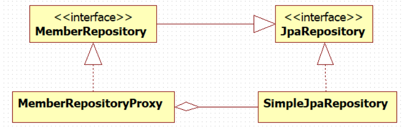

# 연관관계 매핑 
이번에 게시판 서비스를 만들면서 설계한 엔티티간의 연관관계 구조는 다음과 같다.

- School - User: 일대다
- User - Post(게시물): 일대다
- User - Message(쪽지): 일대다
- User - Heart(좋아요), Heart - Post: 일대다, 다대일
- Post - Attachment(첨부파일): 일대다
- User - Comment(댓글), Comment - Post: 일대다, 다대일
- User - Reply(대댓글), Reply - Comment: 일대다, 다대일

# 개발 중 문제점 및 고민점
1. 이번에 User와 Post 사이에 좋아요 기능을 추가하기 위해서 Like 엔티티를 설계했었다. 하지만 like 키워드는 DB에서 이미 사용중인 예약어로 테이블 명으로 사용할 수 없었다. 따라서 Heart로 테이블명을 교체하였다.
2. 매핑시 필연적으로 중간 테이블들이 존재하게 되는데  중간테이블의 생성에 대해서 고민했었다. 일반적으로 중간테이블에 해당하는 엔티티의 관리를 외부에 노출하게 된다면 조인 정보가 잘못될 수 있기 때문에 최대한 노출을 하지 않도록  설계하고자 하였다.
~~~java
@Getter  
@NoArgsConstructor(access = PROTECTED)  // 기본생성자 protected
@Entity  
@ToString(exclude = {"user", "post"})  
public class Heart { // 좋아요  
	@Id  
	@GeneratedValue(strategy = IDENTITY)  
	@Column(name = "heart_id")  
    private Long id;  
  
    @ManyToOne(fetch = LAZY, cascade = PERSIST)  
	@JoinColumn(name = "user_id")  
	@Setter(value = PROTECTED)  
	private User user;  
  
    @ManyToOne(fetch = LAZY)  
	@JoinColumn(name = "post_id")  
	@Setter(value = PROTECTED)  
	private Post post;  
  
    protected static Heart createHeart(User user) {  // 생성 메서드
		Heart heart = new Heart();  
        user.addHearts(heart);  
  
        return heart;  
    }  
}
~~~

결과적으로 중간테이블에 해당하는 엔티티(예: Heart)들의 생성자는 외부에서 따로 생성할 수 없도록 하였고, 별도의 create 메소드를 선언하였다. 해당 엔티티와 연관된 다른 테이블에서 create 메소드를 호출하여 객체를 생성 후 연관관계를 매핑하도록 설계하였다.
 ~~~java
@Getter  
@NoArgsConstructor(access = PROTECTED)  
@Entity  
@ToString(exclude = {"user", "hearts", "comments", "images"})  
public class Post extends BaseTimeEntity {  //게시물  
    @Id  
    @GeneratedValue(strategy = IDENTITY)  
    @Column(name = "post_id")  
    private Long id;  
  
    @Column(nullable = false)  
    private String title;  
  
    @Column(nullable = false)  
    private String content;  
  
    public Post(String title, String content) {  
        this.title = title;  
        this.content = content;  
    }  
  
    @ManyToOne(fetch = LAZY)  
    @JoinColumn(name = "user_id")  //select * from post p join user u on p.user_id = u.id;  
    @Setter(value = PROTECTED)  
    private User user;  
  
    @OneToMany(mappedBy = "post", cascade = ALL, orphanRemoval = true)  
    private List<Heart> hearts = new ArrayList<>();  
    
  
		 /**  
		  * 연관관계 편의 메서드  
		  */
     
     // User, Heart, Post의 연관관계는 Post에서 관리함  
    public void addHeartFromUser(User user) {  
       Heart heart = Heart.createHeart(user);  
       heart.setPost(this);  
       hearts.add(heart);  
    }  
	
	// 생략 ...
}
~~~
3. 중간테이블의 엔티티를 연결된 양 엔티티들 중 어느쪽에서 라이프 사이클 관리를 할지 고민이 많았다. 
예를 들어 User - Comment - Post 세개의 엔티티가 있을 때, Comment의 라이프 사이클 관리을 User에서 할지 Post에서 할지가 문제였다. 코드를 작성하기에는 User에서 Comment의 관리를 하는 것이 편리했을 것 같긴 한데, 그래도 댓글(Comment)는 게시물(Post)에 작성을 하는 것이니 일단 Post에서 Comment의 라이프 사이클을 관리하는 방향으로 설계하였다. 이 점은 잘한건지 아직은 잘 모르겟다...  
4. 중간 테이블에 해당하는 엔티티들은 외부에 노출을 최대한 피하는 방향으로 설계하였기에 해당 엔티티들에 대한 리포지토리 계층은 구현하지 않았다. 대신 더티체킹 기능을 이용해 연결된 테이블이 저장될 때 함께 저장되는 방식으로 구성했다.
5. 유저간의 쪽지 기능을 구현하기 위해서 Message 엔티티에는 sender, receiver 두개의 User 필드를 두었다. 처음에는 sendMessage, receiveMessage라는 중간테이블을 두어 기능을 구현하여 보려 했지만 데이터를 저장하는 과정에서 문제가 발생하여 구조를 변경하였다.
~~~java
package com.ceos19.everytime.domain;  
  
import jakarta.persistence.*;  
import lombok.*;  
import org.springframework.context.annotation.Bean;  
  
import java.time.LocalDateTime;  
  
import static jakarta.persistence.CascadeType.ALL;  
import static jakarta.persistence.FetchType.*;  
import static jakarta.persistence.GenerationType.*;  
import static lombok.AccessLevel.PROTECTED;  
  
@NoArgsConstructor(access = PROTECTED)  
@Getter  
@Entity  
@ToString(exclude = {"sender", "receiver"})  
public class Message { // 쪽지, message는 user의 비즈니스 연관관계 편의 메서드로 저장함. 별도의 리포지토리 없다.  
	 @Id  
	 @GeneratedValue(strategy = IDENTITY)  
	 @Column(name = "message_id")  
	 private Long id;  
  
	 @Column(nullable = false)  
	 private String title;  
	 private String content;  
  
	 @Column(nullable = false)  
	 private LocalDateTime sentAt;  
  
	 @ManyToOne(fetch = LAZY)  
	 @Setter(value = PROTECTED)
	 @JoinColumn(name = "sender_id")  
	 private User sender;  
  
	 @ManyToOne(fetch = LAZY)  
	 @Setter(value = PROTECTED)
	 @JoinColumn(name = "receiver_id")  
	 private User receiver;  
  
  
	 public Message(String title, String content) {  
	 this.title = title;  
		 this.content = content;  
         this.sentAt = LocalDateTime.now();  
     }  
  
	public void setSenderAndReceiver(User sender, User receiver) {  
		sender.addSendMessage(this);  
        receiver.addReceiveMessage(this);  
    }  
}
~~~
6. 유지 보수간의 문제를 최소화하기 위해서 setter의 사용은 최대한 배제하였다.