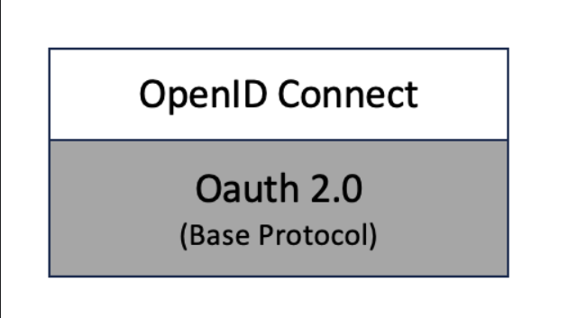
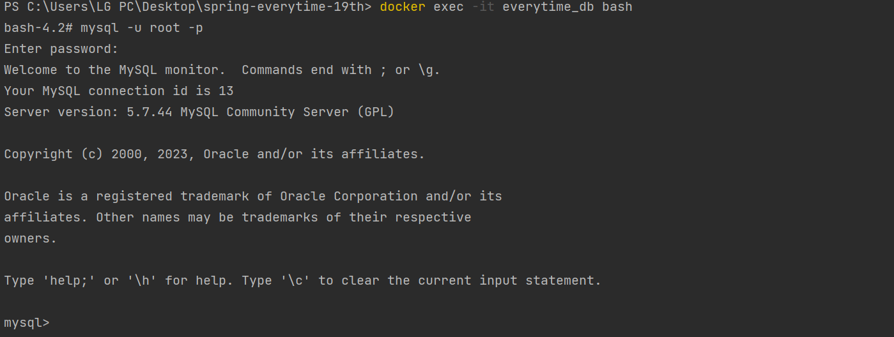
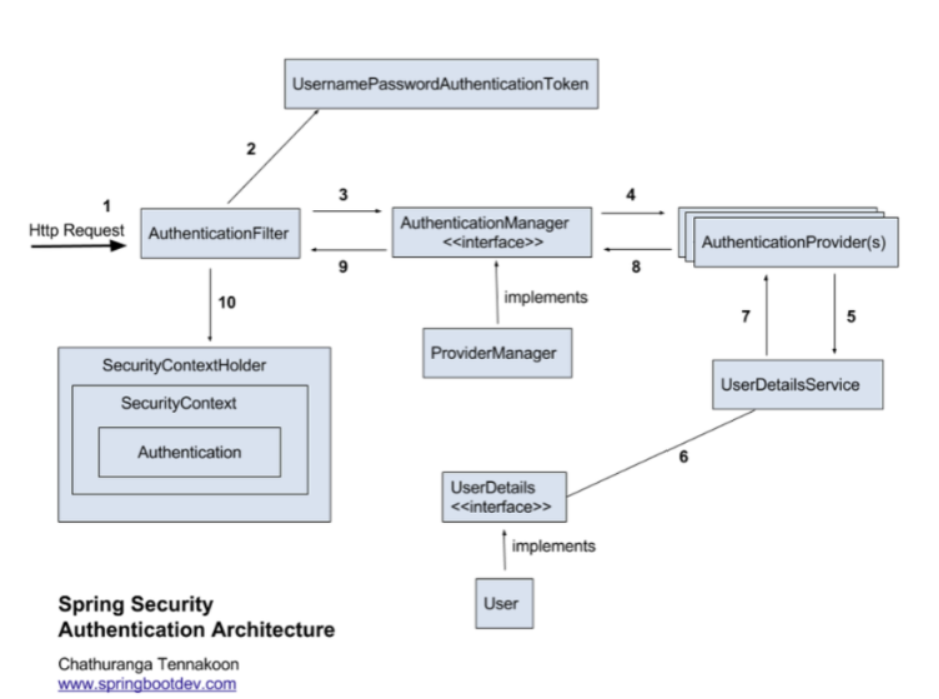
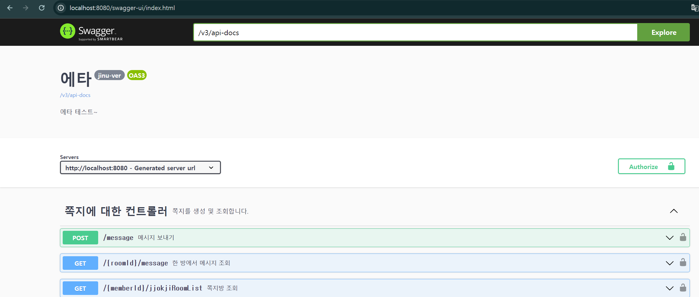

# spring-everytime-19th
CEOS 19th BE study - everytime clone coding

## Everytime 파악!
...한 5년만에 들어가본듯 

주요 기능은 게시판 / 시간표 / 강의실 / 학점계산기 / 친구 등등....

주요 Domain : 유저 / 게시판 / 시간표

위의 3개를 세분화하기 위해서 총 15개의 table로 구성

### Board
-> 게시판들의 종류를 나타냄
- 게시판 종류 이름
- 게시판 세팅
### Post
-> 하나의 게시판에 속한 게시물
- 게시물 이름
- 게시물 내용
- 익명
- 조회수
- 좋아요 수
### PostLike
-> 게시물에 좋아요를 누를 때 저장
### Comment
-> 하나의 게시물 안에 있는 댓글들
- 내용
- 좋아요 수
### CommentLike
-> 댓글에 좋아요를 누를때 저장
### Reply
-> 댓글에 대한 좋아요를 누를 때 저장
- 내용
### User
-> 사용자
- 유저이름
- 아이디
- 비밀번호
- 닉네임
### Friend
-> 사용자들간의 친구 관계를 저장
### School
-> 학교에 대한 정보
- 학교 이름
### Lecture
-> 강의에 대한 정보
- 이름
- 코드
- 시작시간
- 끝나는 시간
- 요일
- 학점 수
### CourseLecture
-> 강의에 대한 정보 + 학점을 시간표에 넣기 위한 중간 매체
- 강의 당 학점
### TableCourse
-> 각각의 학기에 따른 시간표 + 평균 학점
- 평균 학점
### TimeTable
-> 종합적인 시간표
- 총 학점
- 시간표 이름
### Message
-> 유저들끼리의 메시지
- 보낸 내용
- 내용
- 삭제 유무(보낸사람)
- 삭제 유무(받은 사람)
### Common
-> enum 셋등에 대한 정의


<연관관계는 발표 시에 설명... 위의 다이어 그램을 확인해 주세요>
-> 자동으로 만들어주는 건 DBeaver라는 것을 참고 해주세요

## 어떻게 data jpa는 interface만으로도 함수가 구현되는가?
- Repository의 실제 객체에는 Proxy가 주입되어 있다
- 그렇다면 Proxy가 뭘까???
- 대략적으로 누군가를 **대신하여**  뭔가를 수행하는 권한 자체 또는 그 권한을 받은 주체

- 프록시 패턴
  - 원래 객체를 감싸고 있는 같은 타입의 객체 -> 프록시 객체가 원래 객체를 감싸서 client의 요청을 처리하기 하는 패턴
    - 접근을 제어하고 싶거나, 부가 기능을 추가하고 싶을 때 주로 사용
      - ex)
      - DisplayImage()

        ```java
        public interface Image {
                  void displayImage();
                  }
        ```
      - RealImage
      ```java
      public class RealImage implements Image {

            private String fileName;
    
            public RealImage(String fileName) {
            this.fileName = fileName;
            loadFromDisk(fileName);
            }
    
            private void loadFromDisk(String fileName) {
            System.out.println("Loading " + fileName);
            }
    
            @Override
            public void displayImage() {
            System.out.println("Displaying " + fileName);
    
            }
            }
    - 
    - ProxyImage
```java
          
    
      public class ProxyImage implements Image {
      private RealImage realImage;
      private String fileName;

      public ProxyImage(String fileName) {
      this.fileName = fileName;
      }

      @Override
      public void displayImage() {
      if (realImage == null) {
      realImage = new Real_Image(fileName);
      }
      realImage.displayImage();
      }
      }
  ```
  - Main
  ```java
  public class Main {
  public static void main(String[] args) {
    Image image1 = new Proxy_Image("test1.png");
    Image image2 = new Proxy_Image("test2.png");

    image1.displayImage();
    System.out.println();
    image2.displayImage();
  }
}
```
  - 상대적으로 오래걸리는 이미지 로딩 전에 로딩 텍스트를 먼저 출력할 수 있도록 프록시 객체가 흐름을 제어

  - 프록시 : 어떠한 클래스(빈)가 AOP 대상이면 원본 클래스 대신 프록시가 감싸진 클래스가 자동으로 만들어져 프록시 클래스가 빈에 등록이 된다
  - 이렇게 빈에 등록된 프록시 클래스는 원본 클래스가 호출되면 자동으로 바꿔서 사용!! -> OCP(계방 폐쇄의 원칙 : 확장에는 개방 / 변경에는 폐쇄)만족
    - RealImage 클래스가 원본 / ProxyImage 클래스가 프록시 역할을 한다.
    - ProxyImage 클래스가 RelaImage 인스턴스를 감싸고 있으며 displayImage()메소드 호출 시 부가기능을 수행한 뒤 RelaIamge의 displayImage()를 호출!!


고로 Spring Data JPA를 사용할 때, Repository도 스프링이 적절한 프록시를 생성해준다

How??? 동적으로 프록시를 생성할까??
- 리플렉션
- 클래스나 메서드의 메타 정보를 동적으로 획득 / 코드도 동적으로 호출가능 / private 접근 제어자가 붙어있는 메서드에도 접근 가능
- 내부의 ProxyGenerator 클래스 내부에서 프록시 클래스를 바이트코드(.class file)로 직접 만든다
  - 즉 리플렉션을 이용해서 **동적으로** 메소드와 클래스를 .class 바이트 파일로 만들어준다
    
      - ex) RepositoryFactorySupport
        ```java
        public <T> T getRepository(Class<T> repositoryInterface, RepositoryFragments fragments) {
    
        // Create proxy
        StartupStep repositoryProxyStep = onEvent(applicationStartup, "spring.data.repository.proxy", repositoryInterface);
        ProxyFactory result = new ProxyFactory();
        result.setTarget(target);
        result.setInterfaces(repositoryInterface, Repository.class, TransactionalProxy.class);**
    
        T repository = (T) result.getProxy(classLoader);
    
        return repository;
        }```
      - 'Create Proxy' 부분에서 ProxyFactory()를 통해 ProxyFactory를 만들고 target설정, interface 설정을 하고 있다
      - getProxy()를 통해서 repository를 생성한다

- Fetch Join의 조건 : ToOne은 몇개든 사용 / ToMany는 1 개만 가능

- fetch join 할 때 distinct를 안하면 생길 수 있는 문제
  - fetch join은 주로 연관된 엔티티를 함께 로딩하기 위해서 사용된다
  - What if ? 연관된 엔티티들이 중복 -> ex) 하나의 주문에 대해 여러개의 주문 상품이 중복되어 반환되므로 distinct가 필요하다

- fetch join 을 할 때 생기는 에러가 생기는 3가지 에러 메시지
  - `HHH000104: firstResult/maxResults specified with collection fetch; applying in memory!`
    - 원인 : 컬렉션 fetch에서 firstResult나 maxResults를 사용하려고 할 때 발생
    - 해결 : 컬렉션 fetch에 firstResult나 maxResults를 사용하지 않도록 하거나, 쿼리를 변경하여 데이터베이스에서 이러한 제한을 적용
    - ex)
  
    ```java
      List<Order> orders = entityManager.createQuery(
      "SELECT o FROM Order o JOIN FETCH o.orderItems",
      Order.class)
      .setFirstResult(0)
      .setMaxResults(10)
      .getResultList();```
    
  - `query specified join fetching, but the owner of the fetched association was not present in the select list`
    - 원인 : fetch join을 사용하여 연관된 엔티티를 함께 가져오려고 했지만, 기본 엔티티가 select 목록에 포함되지 않은 경우 발생
    - fetch join에 사용된 모든 엔티티를 select 목록에 포함하도록 쿼리를 수정
    - ex)

    ```
    List<OrderItem> orderItems = entityManager.createQuery(
    "SELECT oi FROM OrderItem oi JOIN FETCH oi.order",
    OrderItem.class)
    .getResultList();`
  
  - `org.hibernate.loader.MultipleBagFetchException: cannot simultaneously fetch multiple bags`
    - 원인 : 하이버네이트는 한 번에 여러 개의 컬렉션을 fetch join하는 것을 허용하지 않는다 - 2개 이상의 OneToMany 자식 테이블에 Fetch Join을 선언했을 때
    - 주로 N+1(조회된 부모의 수만큼 자식 테이블의 쿼리가 추가 발생) 문제에 대한 해결책으로 Fetch Join을 사용하다보면 나온다
      - 부모 엔티티와 연관 관계가 있는 자식 엔티티들의 조회 쿼리가 문제
      - 부모 엔티티 key하나하나를 자식 엔티티 조회로 사용한다 -> How about 1개씩 사용되는 조건문을 in절로 묶어서 조회?
      - 엔티티에서 여러 개의 컬렉션을 fetch join하려고 시도

    ```java
        @Entity
        public class Order {
        @Id
        @GeneratedValue(strategy = GenerationType.IDENTITY)
        private Long id;
    
        @OneToMany(mappedBy = "order", fetch = FetchType.LAZY)
        private List<OrderItem> orderItems = new ArrayList<>();
    
        @OneToMany(mappedBy = "order", fetch = FetchType.LAZY)
        private List<Payment> payments = new ArrayList<>();
    
        // Getters and setters
        }
    
        @Entity
        public class OrderItem {
        @Id
        @GeneratedValue(strategy = GenerationType.IDENTITY)
        private Long id;
        
            @ManyToOne(fetch = FetchType.LAZY)
            @JoinColumn(name = "order_id")
            private Order order;
        
            // Other fields, getters and setters
        }
        
        @Entity
        public class Payment {
        @Id
        @GeneratedValue(strategy = GenerationType.IDENTITY)
        private Long id;
        
            @ManyToOne(fetch = FetchType.LAZY)
            @JoinColumn(name = "order_id")
            private Order order;
        
            // Other fields, getters and setters
    }
    
----------------------------------------------------------------------------------------------------------
- test 조금 더 공부하자

## 통합 테스트 - @SpringBootTest
- 모든 빈을 등록하여 테스트를 진행 -> 애플리케이션 규모가 크면 테스트가 많이 느려진다
- @RunWith : 해당 어노테이션을 사용하면 JUnit의 러너를 사용하는게 아니라 지정된 SpringRunner 클래스를 사용한다.
- @SpringBootTest
- @EnableConfigurationProperties : Configuration으로 사용하는 클래스를 빈으로 등록할 수 있게 해줌.
```java
    @RunWith(SpringRunner.class)
@SpringBootTest(
        properties = {
                "property.value=propertyTest",
                "value=test"
        },
        classes = {TestApplication.class},
        webEnvironment = SpringBootTest.WebEnvironment.RANDOM_PORT
)
@EnableConfigurationProperties(StayGolfConfiguration.class)
public class TestApplicationTests {

  @Value("${value}")
  private String value;

  @Value("${property.value}")
  private String propertyValue;

  @Test
  public void contextLoads() {
    assertThat(value, is("test"));
    assertThat(propertyValue, is("propertyTest"));
  }

}
```
## 컨트롤러 테스트 - @WebMvcTest
- 웹상에서 요청과 응답에 대한 테스트
```java
      @RunWith(SpringRunner.class)
    @WebMvcTest(BookApi.class)
    public class BookApiTest {

      @Autowired
      private MockMvc mvc;

      @MockBean
      private BookService bookService;

      @Test
      public void getBook_test() throws Exception {
          //given
          final Book book = new Book(1L, "title", 1000D);

          given(bookService.getBook()).willReturn(book);

          //when
          final ResultActions actions = mvc.perform(get("/books/{id}", 1L)
                  .contentType(MediaType.APPLICATION_JSON_UTF8))
                  .andDo(print());

          //then
          actions
                  .andExpect(status().isOk())
                  .andExpect(jsonPath("id").value(1L))
                  .andExpect(jsonPath("title").value("title"))
                  .andExpect(jsonPath("price").value(1000D))
          ;

      }
    }
```

## JPA 관련 테스트 - @DataJpaTest
- JPA 관련된 설정만 로드
- @Entity 클래스를 스캔하여 스프링 데이터 JPA 저장소를 구성
기본적으로 인메모리 데이터베이스를 이용
- 데이터소스의 설정이 정상적인지, JPA를 사용하서 데이터를 제대로 생성, 수정, 삭제하는지 등의 테스트가 가능
- @AutoConfigureTestDataBase : 데이터 소스를 어떤 걸로 사용할지에 대한 설정
- Replace.Any : 기본적으로 내장된 데이터소스를 사용
- Replace.NONE : @ActiveProfiles 기준으로 프로파일이 설정됨
- @DataJpaTest : 테스트가 끝날 때마다 자동으로 테스트에 사용한 데이터를 롤백
```java
        /**
     * What the test database can replace.
     */ 
    enum Replace {
    
      /**
       * Replace any DataSource bean (auto-configured or manually defined).
       */
      ANY,
    
      /**
       * Only replace auto-configured DataSource.
       */
      AUTO_CONFIGURED,
    
      /**
       * Don't replace the application default DataSource.
       */
      NONE
    
    }
```
## REST 관련 테스트 - @RestClientTest
- Rest 통신의 JSON 형식이 예상대로 응답을 반환하는지 등을 테스트
- @RestClientTest : 테스트 대상이 되는 빈을 주입받음
- @Rule
- MockRestServiceServer : 클라이언트와 서버 사이의 REST 테스트를 위한 객체. 내부에서 RestTemplate을 바인딩하여 실제로 통신이 이루어지게끔 구성할 수 있음. 이 코드에서는 목 객체와 같이 실제 통신이 이루어지지는 않지만 지정한 경로에 예상되는 반환값을 명시
```java
        @RunWith(SpringRunner.class)
    @RestClientTest(BookRestService.class)
    public class BookRestServiceTest {
    
        @Rule
        public ExpectedException thrown = ExpectedException.none();
    
        @Autowired
        private BookRestService bookRestService;
    
        @Autowired
        private MockRestServiceServer server;
    
        @Test
        public void rest_test() {
    
            server.expect(requestTo("/rest/test"))
                    .andRespond(
                            withSuccess(new ClassPathResource("/test.json", getClass()), MediaType.APPLICATION_JSON));
    
            Book book = bookRestService.getRestBook();
    
            assertThat(book.getId(), is(notNullValue()));
            assertThat(book.getTitle(), is("title"));
            assertThat(book.getPrice(), is(1000D));
    
        }
    }
```
-----------------------------------------------------------------
# Service 구현해보기

## 로그인 기능
## 글 쓰기
- user정보를 가져오고 boardId로 boardRepository에서 Board를 가져오고 postRequestDto를 통하여 값들을 받아와서 post에 값을 넣어주고 postRepository를 통해 저장해줍니다
## 글 조회
- postId를 통해 postRepository에서 post를 조회하여서 글의 내용을 postResponseDto를 통하여 가져옵니다
## 댓글 달기
- user정보와 postId를 통해 postRepository에서 post를 조회하고 commentRequestDto를 통하여 정보를 가져와서 Comment를 작성합니다
## 글 좋아요
- user정보와 PostId를 통해 PostLikeRepository에 해당 데이터가 있는지 확인하고 없으면 저장해준다
## 댓글 좋아요
- user정보와 CommnetId를 통해 CommentLikeRepository에 해당데이터가 있는지 확인하고 없으면 저장해준다
## 학기에 시간표 추가
## 시간표를 table에 추가
## 메시지 보내기

를 하려고 했으니 마지막 3개와 test코드 검증들을 시간상으로 진행을 거의 못했습니다.........ㅠㅠㅠㅠㅠㅠㅠㅠ
spring security가 그 뒤에 한다는걸 못보고 이걸 login을 구현해나?해서 이거에 시간을 많이 쏟았네요 ㅠㅠ

## 댓글 달기 서비스
```java
        insert
        into
        post
        (anonymous, board_id, content, created_date, likes, modified_date, title, user_id, view)
        values
        (?, ?, ?, ?, ?, ?, ?, ?, ?)
        Hibernate:
        select
        p1_0.post_id,
        p1_0.anonymous,
        p1_0.board_id,
        p1_0.content,
        p1_0.created_date,
        p1_0.likes,
        p1_0.modified_date,
        p1_0.title,
        p1_0.user_id,
        p1_0.view
        from
        post p1_0
        where
        p1_0.post_id=?
        Hibernate:
        insert
        into
        comment
        (content, content_like, created_date, modified_date, post_id, user_id)
        values
        (?, ?, ?, ?, ?, ?)
        Hibernate:
        select
        c1_0.comment_id,
        c1_0.content,
        c1_0.content_like,
        c1_0.created_date,
        c1_0.modified_date,
        c1_0.post_id,
        c1_0.user_id
        from
        comment c1_0
        Hibernate:
        insert
        into
        post
        (anonymous, board_id, content, created_date, likes, modified_date, title, user_id, view)
        values
        (?, ?, ?, ?, ?, ?, ?, ?, ?)
        Hibernate:
        insert
        into
        comment
        (content, content_like, created_date, modified_date, post_id, user_id)
        values
        (?, ?, ?, ?, ?, ?)
        Hibernate:
        insert
        into
        comment
        (content, content_like, created_date, modified_date, post_id, user_id)
        values
        (?, ?, ?, ?, ?, ?)
        Hibernate:
        select
        c1_0.comment_id,
        c1_0.content,
        c1_0.content_like,
        c1_0.created_date,
        c1_0.modified_date,
        c1_0.post_id,
        c1_0.user_id
        from
        comment c1_0
```

데이터가 잘 넣어지는 것을 확인가능합니다.!

- PostServiceTest 작성

```java
@BeforeEach
    void setUp() {
            MockitoAnnotations.openMocks(this);
            }
```
- Mockito test 세팅
```java
    @Test
    void postLikeCreate_Success() {

            User user = new User();
            user.setUsername("testUser");

            UserDetails userDetails = mock(UserDetails.class);
        when(userDetails.getUsername()).thenReturn("testUser");

        Post post = new Post();
        post.setPostId(1L);

        // Mocking repositories
        when(userRepository.findByUsername("testUser")).thenReturn(Optional.of(user));
        when(postRepository.findById(1L)).thenReturn(Optional.of(post));
        when(postLikeRepository.findByUserAndComment(user, post)).thenReturn(Optional.empty());

        ApiResponseDto<SuccessResponse> response = postLikeService.postLikeCreate(userDetails, 1L);

        verify(postLikeRepository, times(1)).save(any(postLike.class));

        assertEquals(HttpStatus.OK, response.getResponse().getStatus());
        assertEquals("commentLike Create Success", response.getError().getMessage());
        }
```
- 사용자가 유효하고 존재하는 경우에 좋아요를 성공적으로 만드는지 확인
- 이를 위해 모의 객체를 사용하여 사용자, UserDetails 및 게시물을 설정하고, 해당 사용자가 게시물을 좋아요했는지 확인
```java
    @Test
    void postLikeCreate_UserNotFound() {

            UserDetails userDetails = mock(UserDetails.class);
        when(userDetails.getUsername()).thenReturn("nonExistingUser");

        when(userRepository.findByUsername("nonExistingUser")).thenReturn(Optional.empty());

        assertThrows(RestApiException.class, () -> postLikeService.postLikeCreate(userDetails, 1L),
        "Expected RestApiException to be thrown");

        verify(postLikeRepository, never()).save(any(postLike.class));
        }
```
- 사용자가 존재하지 않는 경우, 즉 userRepository가 빈 Optional을 반환할 때 RestApiException이 발생하는지 확인
```java
    @Test
    void postLikeCreate_PostNotFound() {

            UserDetails userDetails = mock(UserDetails.class);
        when(userDetails.getUsername()).thenReturn("testUser");

        User user = new User();
        user.setUsername("testUser");

        when(userRepository.findByUsername("testUser")).thenReturn(Optional.of(user));
        when(postRepository.findById(1L)).thenReturn(Optional.empty());

        assertThrows(RestApiException.class, () -> postLikeService.postLikeCreate(userDetails, 1L),
        "Expected RestApiException to be thrown");

        verify(postLikeRepository, never()).save(any(postLike.class));
        }
```
- 게시물이 존재하지 않는 경우, 즉 postRepository가 빈 Optional을 반환할 때 RestApiException이 발생하는지 확인
```java

@Test
    void postLikeCreate_AlreadyExists() {

            User user = new User();
            user.setUsername("testUser");

            UserDetails userDetails = mock(UserDetails.class);
        when(userDetails.getUsername()).thenReturn("testUser");

        Post post = new Post();
        post.setPostId(1L);

        when(userRepository.findByUsername("testUser")).thenReturn(Optional.of(user));
        when(postRepository.findById(1L)).thenReturn(Optional.of(post));
        when(postLikeRepository.findByUserAndComment(user, post)).thenReturn(Optional.of(new postLike()));

        assertThrows(RestApiException.class, () -> postLikeService.postLikeCreate(userDetails, 1L),
        "Expected RestApiException to be thrown");

        verify(postLikeRepository, never()).save(any(postLike.class));
        }
```
- 이미 사용자가 게시물에 좋아요를 한 경우, 즉 postLikeRepository가 비어 있지 않은 Optional을 반환할 때 RestApiException이 발생하는지 확인

*** 코드에러(뭘 잘못 작성했나봐요)...로 결과 값 도출은 못했습니다.. 시간이슈로 다시 작성을 못했는데 추후에 하겠습니다. 죄송합니다.

-----------------------------------------------------------------------------------------------------------------------------------------------------------------
# Todo

## Post 관련
- 게시글 만들기
- 게시글 삭제
- 게시글 수정
- 게시글 정보 가져오기 -> 댓글 대댓글 모두다 가져오기 <댓글과 대댓글에서 조회를 굳이 하지 않아도 될거 같아서 변경>

- 댓글 만들기
- 댓글 삭제

- 대댓글 만들기
- 대댓글 삭제

- 게시글 좋아요
- 게시글 좋아요 취소
- 댓글 좋아요
- 댓글 좋아요 취소
- 대댓글 좋아요
- 대댓글 좋아요 취소

## 댓글 삭제는 어떻게 진행이 될까??

### what is 고아 객체
- 부모 엔티티와 연관관계가 끊어진 자식 엔티티
  - 부모가 제거될 때, 부모와  연관되어 있는 모든 자식 엔티티들은 고아객체가 된다
  - 부모 엔티티와 자식 엔티티 사이의 연관관계를 삭제할때, 해당 자식 엔티티는 고아 객체가 된다
  - ex_)
- Member Entity 코드
```java
        @Entity
@Getter
@NoArgsConstructor(access = AccessLevel.PROTECTED)
public class Member {

    @Id
    @Column(name = "MEMBER_ID")
    private Long id;

    @Column(name = "USERNAME")
    private String username;

    @ManyToOne
    @JoinColumn(name = "TEAM_ID")
    private Team team;

    // custructor

    // 연관관계 편의 메서드
    public void setTeam(Team team) {

        // 기존 팀과 연관관계를 제거
        if (this.team != null) {
            this.team.getMembers().remove(this);
        }

        // 새로운 연관관계 설정
        this.team = team;
        if (team != null) {
            team.getMembers().add(this);
        }
    }

}
```
- Team Entity 코드
```java
@Entity
@Getter
@NoArgsConstructor(access = AccessLevel.PROTECTED)
public class Team {

    @Id
    @Column(name = "TEAM_ID")
    private Long id;

    @Column(name = "NAME")
    private String name;

    @OneToMany(
            mappedBy = "team",
            cascade = CascadeType.PERSIST
    )
    private List<Member> members = new ArrayList<>();

    // custructor

}
```
- 부모엔티티가 자식엔티티에게 영속성을 전달해주기 위해 cascade = CascadeType.PERSIST 옵션 지정

- 테스트 코드
```java
// 내장 DB (가짜 DB)로 테스트를 수행 - 단위 테스트
@AutoConfigureTestDatabase(replace = AutoConfigureTestDatabase.Replace.ANY) 
@DataJpaTest // @Transactional 포함하고 있기 때문에, 각 테스트 종료 시 Rollback
public class JpaTest {

    @Autowired
    private EntityManager entityManager;

    @BeforeEach
    public void initTest() {
        Team team = new Team(0L, "팀1");
        entityManager.persist(team);

        Member member1 = new Member(0L, "회원1");
        Member member2 = new Member(1L, "회원2");

        // 연관관계의 주인에 값 설정
        member1.setTeam(team);
        member2.setTeam(team);

        // CascadeType.PERSIST 로 인하여 영속성 전이
//        entityManager.persist(member1);
//        entityManager.persist(member2);

        // 영속성 컨텍스트의 변경 내용을 DB에 반영
        entityManager.flush();
    }
}
```
- @BeforeEach 를 사용하여 각 테스트에 필요한 데이터를 사전에 추가
- 부모(Team) 엔티티에 설정해둔 CascadeType.PERSIST 옵션으로 인하여, Team 엔티티 영속화시 하위 엔티티인 Member 엔티티[member1, member2] 역시 영속화
- entityManager.flush(); 를 통해, 영속성 컨텍스트의 변경 내용을 DB에 반영

## CascadeType.REMOVE
- 부모 엔티티가 삭제되면 자식 엔티티도 삭제됩니다. 즉, 부모가 자식의 삭제 생명 주기를 관리
- 부모 엔티티와 자식 엔티티 사이의 연관관계를 제거해도, 자식 엔티티는 삭제되지 않고 그대로 DB에 남아있다.

```java
public class Team {

    @Id
    @Column(name = "TEAM_ID")
    private Long id;

    @Column(name = "NAME")
    private String name;

    @OneToMany(
            mappedBy = "team",
            cascade = {CascadeType.REMOVE, CascadeType.PERSIST}
    )
    private List<Member> members = new ArrayList<>();

    // custructor

}
```
- 부모 엔티티 삭제
```java
@DisplayName("부모 엔티티(Team)을 삭제하는 경우")
@Test
public void cascadeType_REMOVE_Parent() {
    // when
    Team team = entityManager.find(Team.class, 0L);
    entityManager.remove(team); // 부모 엔티티 삭제

    entityManager.flush();

    // then
    List<Team> teamList = entityManager.createQuery("select t from Team t", Team.class).getResultList();
    Assertions.assertEquals(0, teamList.size());

    List<Member> memberList = entityManager.createQuery("select m from Member m", Member.class).getResultList();
    Assertions.assertEquals(0, memberList.size());
}
```
- 부모 엔티티(Team)를 삭제하게 되면, 이와 연관된 자식 엔티티(member1, member2)도 삭제
- 부모 엔티티와 자식 엔티티 사이의 연관관계 제거
```java
@DisplayName("고아객체 - 부모 엔티티(Team)에서 자식 엔티티(Member)와 연관관계를 끊는 경우")
@Test
public void cascadeType_REMOVE_Persistence_Remove() {
    // when
    Team team = entityManager.find(Team.class, 0L);
    team.getMembers().get(0).setTeam(null);

    entityManager.flush();

    // then
    List<Team> teamList = entityManager.createQuery("select t from Team t", Team.class).getResultList();
    Assertions.assertEquals(1, teamList.size());

    List<Member> memberList = entityManager.createQuery("select m from Member m", Member.class).getResultList();
    Assertions.assertEquals(2, memberList.size());
}
```
부모 엔티티(Team)와 자식 엔티티(Member) 사이의 연과관계를 끊게 되어도, 자식 엔티티는 삭제되지 않는다
부모 엔티티와 자식 엔티티 사이의 연관관계 변경
```java
@DisplayName("자식 엔티티의 연관관계 변경 시")
@Test
public void change_persistence_child() {
    // given
    Team team = new Team(1L, "팀2");
    entityManager.persist(team);

    // when
    Member member1 = entityManager.find(Member.class, 0L);
    member1.setTeam(team); // UPDATE 쿼리 수행
    entityManager.flush();

    // then
    Team team1 = entityManager.createQuery("select t from Team t where t.id = 0", Team.class).getSingleResult();
    Assertions.assertEquals(1L, team1.getMembers().get(0).getId());

    Team team2 = entityManager.createQuery("select t from Team t where t.id = 1", Team.class).getSingleResult();
    Assertions.assertEquals(0L, team2.getMembers().get(0).getId());

    List<Member> memberList = entityManager.createQuery("select m from Member m", Member.class).getResultList();
    Assertions.assertEquals(2, memberList.size());
}
```
부모 엔티티(Team)과 자식 엔티티(Member) 사이의 연관관계가 잘 변경

## orphanRemoval=true
- 부모 엔티티가 삭제되면 자식 엔티티도 삭제됩니다. 즉, 부모가 자식의 삭제 생명 주기를 관리
- 부모 엔티티와 자식 엔티티 사이의 연관관계를 제거하면, 자식 엔티티는 고아 객체로취급되어 DB에서 삭제
```java
public class Team {

    @Id
    @Column(name = "TEAM_ID")
    private Long id;

    @Column(name = "NAME")
    private String name;

    @OneToMany(
            mappedBy = "team",
            orphanRemoval = true,
            cascade = CascadeType.PERSIST
    )
    private List<Member> members = new ArrayList<>();

    // custructor
```
- 부모 엔티티 삭제
```java
@DisplayName("부모 엔티티(Team)을 삭제하는 경우")
@Test
public void orphanRemoval_true_Parent() {
    // when
    Team team = entityManager.find(Team.class, 0L);
    entityManager.remove(team);

    entityManager.flush();

    // then
    List<Team> teamList = entityManager.createQuery("select t from Team t", Team.class).getResultList();
    Assertions.assertEquals(0, teamList.size());

    List<Member> memberList = entityManager.createQuery("select m from Member m", Member.class).getResultList();
    Assertions.assertEquals(0, memberList.size());

}
```
부모 엔티티(Team)를 삭제하게 되면, 이와 연관된 자식 엔티티(member1, member2)도 삭제

- 부모 엔티티와 자식 엔티티 사이의 연관관계 제거
```java
@DisplayName("고아객체 - 부모 엔티티(Team)에서 자식 엔티티(Member)와 연관관계를 끊는 경우")
@Test
public void orphanRemoval_true_Persistence_Remove() {
    // when
    Team team = entityManager.find(Team.class, 0L);
    team.getMembers().get(0).setTeam(null);

    entityManager.flush();

    // then
    List<Team> teamList = entityManager.createQuery("select t from Team t", Team.class).getResultList();
    Assertions.assertEquals(1, teamList.size());

    List<Member> memberList = entityManager.createQuery("select m from Member m", Member.class).getResultList();
    Assertions.assertEquals(1, memberList.size());
    }
```
부모 엔티티(Team)와 자식 엔티티(Member) 사이의 연과관계를 끊게 되어도, 해당 자식 엔티티가 고아객체로 취급되어 삭제

- 부모 엔티티와 자식 엔티티 사이의 연관관계 변경 시
```java
@DisplayName("자식 엔티티의 연관관계 변경 시")
@Test
public void change_persistence_child() {
    // given
    Team team = new Team(1L, "팀2");
    entityManager.persist(team);

    // when
    Member member1 = entityManager.find(Member.class, 0L);
    member1.setTeam(team); // DELETE, INSERT 쿼리 수행
    entityManager.flush();

    // then
    Team team1 = entityManager.createQuery("select t from Team t where t.id = 0", Team.class).getSingleResult();
    Assertions.assertEquals(1L, team1.getMembers().get(0).getId());

    Team team2 = entityManager.createQuery("select t from Team t where t.id = 1", Team.class).getSingleResult();
    Assertions.assertEquals(0L, team2.getMembers().get(0).getId());

    List<Member> memberList = entityManager.createQuery("select m from Member m", Member.class).getResultList();
    Assertions.assertEquals(2, memberList.size());
}
```
부모 엔티티(Team)과 자식 엔티티(Member) 사이의 연관관계가 잘 변경

# 결과
- 부모 엔티티 삭제
  - CascadeType.REMOVE와 orphanRemoval = true 옵션 모두
  - 부모 엔티티를 삭제하면, 자식 엔티티도 삭제됩니다.
  
- 부모 엔티티와 자식 엔티티 사이의 연관관계 제거
  - CascadeType.REMOVE 옵션은 자식 엔티티가 DB에 삭제되지 않고 남아있으며, 외래키 값만 변경됩니다.
  - orphanRemoval = true 옵션은 자식 엔티티가 고아 객체로 취급되어 DB에서 삭제됩니다.

- 부모 엔티티와 자식 엔티티 사이의 연관관계 변경
  - CascadeType.REMOVE와 orphanRemoval = true 옵션 모두
  - 자식 엔티티가 DB에 삭제되지 않고 남아있으며, 외래키 값만 변경됩니다.'

- 회원가입 완료


- 특정 post에 대한 글 내용 댓글 대댓글 모두 확인 (like 포함)
```java
{
    "success": true,
    "response": {
        "postId": 1,
        "title": "tes1",
        "anonymous": true,
        "view": 0,
        "likes": 0,
        "commentResponseDtoList": [
            {
                "content": "testest1",
                "username": "thoja45hw",
                "contentLike": 0,
                "replyResponseDtoList": [
                    {
                        "commentId": 1,
                        "content": "testesttest1",
                        "likes": 0
                    },
                    {
                        "commentId": 1,
                        "content": "testesttest4",
                        "likes": 23
                    }
                ]
            },
            {
                "content": "testest2",
                "username": "thoja45hw",
                "contentLike": 1,
                "replyResponseDtoList": [
                    {
                        "commentId": 2,
                        "content": "testesttest2",
                        "likes": 0
                    },
                    {
                        "commentId": 2,
                        "content": "testesttest5",
                        "likes": 2
                    }
                ]
            }
        ]
    },
    "error": null
}
```

- comment를 삭제할 시 CascadeType.REMOVE / orphanRemoval 비교 
- cascade remove
```java
Hibernate: 
    select
        u1_0.user_id,
        u1_0.login_type,
        u1_0.nick_name,
        u1_0.password,
        u1_0.role,
        u1_0.school_id,
        u1_0.time_table_id,
        u1_0.username 
    from
        user u1_0 
    where
        u1_0.username=?
Hibernate: 
    insert 
    into
        user
        (login_type, nick_name, password, role, school_id, time_table_id, username) 
    values
        (?, ?, ?, ?, ?, ?, ?)
Hibernate: 
    select
        u1_0.user_id,
        u1_0.login_type,
        u1_0.nick_name,
        u1_0.password,
        u1_0.role,
        u1_0.school_id,
        u1_0.time_table_id,
        u1_0.username 
    from
        user u1_0 
    where
        u1_0.username=?
Hibernate: 
    select
        u1_0.user_id,
        u1_0.login_type,
        u1_0.nick_name,
        u1_0.password,
        u1_0.role,
        u1_0.school_id,
        u1_0.time_table_id,
        u1_0.username 
    from
        user u1_0 
    where
        u1_0.username=?
Hibernate: 
    select
        c1_0.comment_id,
        c1_0.content,
        c1_0.content_like,
        c1_0.created_date,
        c1_0.modified_date,
        p1_0.post_id,
        p1_0.anonymous,
        p1_0.board_id,
        p1_0.content,
        p1_0.created_date,
        p1_0.likes,
        p1_0.modified_date,
        p1_0.title,
        p1_0.user_id,
        p1_0.view,
        u2_0.user_id,
        u2_0.login_type,
        u2_0.nick_name,
        u2_0.password,
        u2_0.role,
        u2_0.school_id,
        u2_0.time_table_id,
        u2_0.username 
    from
        comment c1_0 
    left join
        post p1_0 
            on p1_0.post_id=c1_0.post_id 
    left join
        user u2_0 
            on u2_0.user_id=c1_0.user_id 
    where
        c1_0.comment_id=?
Hibernate: 
    select
        rl1_0.comment_id,
        rl1_0.reply_id,
        rl1_0.content,
        rl1_0.likes,
        rl1_0.user_id 
    from
        reply rl1_0 
    where
        rl1_0.comment_id=?
Hibernate: 
    delete 
    from
        reply 
    where
        reply_id=?
Hibernate: 
    delete 
    from
        reply 
    where
        reply_id=?
Hibernate: 
    delete 
    from
        comment 
    where
        comment_id=?
```
- orphan = True를 사용할 떄`
```java
Hibernate: 
    select
        u1_0.user_id,
        u1_0.login_type,
        u1_0.nick_name,
        u1_0.password,
        u1_0.role,
        u1_0.school_id,
        u1_0.time_table_id,
        u1_0.username 
    from
        user u1_0 
    where
        u1_0.username=?
Hibernate: 
    select
        u1_0.user_id,
        u1_0.login_type,
        u1_0.nick_name,
        u1_0.password,
        u1_0.role,
        u1_0.school_id,
        u1_0.time_table_id,
        u1_0.username 
    from
        user u1_0 
    where
        u1_0.username=?
Hibernate: 
    select
        c1_0.comment_id,
        c1_0.content,
        c1_0.content_like,
        c1_0.created_date,
        c1_0.modified_date,
        p1_0.post_id,
        p1_0.anonymous,
        p1_0.board_id,
        p1_0.content,
        p1_0.created_date,
        p1_0.likes,
        p1_0.modified_date,
        p1_0.title,
        p1_0.user_id,
        p1_0.view,
        u2_0.user_id,
        u2_0.login_type,
        u2_0.nick_name,
        u2_0.password,
        u2_0.role,
        u2_0.school_id,
        u2_0.time_table_id,
        u2_0.username 
    from
        comment c1_0 
    left join
        post p1_0 
            on p1_0.post_id=c1_0.post_id 
    left join
        user u2_0 
            on u2_0.user_id=c1_0.user_id 
    where
        c1_0.comment_id=?
Hibernate: 
    select
        rl1_0.comment_id,
        rl1_0.reply_id,
        rl1_0.content,
        rl1_0.likes,
        rl1_0.user_id 
    from
        reply rl1_0 
    where
        rl1_0.comment_id=?
Hibernate: 
    delete 
    from
        reply 
    where
        reply_id=?
Hibernate: 
    delete 
    from
        reply 
    where
        reply_id=?
Hibernate: 
    delete 
    from
        comment 
    where
        comment_id=?
```
..... delete쿼리가 1번 나가야하는데 왜 이렇게 나올까요.....?


-------------------------------
### 필터 체인의 주요 필터들
필터 체인의 주요 필터들
- CORS 필터 (CorsFilter): Cross-Origin Resource Sharing(CORS) 필터는 다른 도메인에서 온 클라이언트 요청을 처리하는데 사용됩니다. 웹 애플리케이션은 기본적으로 동일 출처 정책(Same-Origin Policy)에 따라 다른 도메인에서 오는 요청을 차단합니다. CORS 필터는 특정 도메인의 요청을 허용하거나, 요청에 특정 조건을 추가하여 다른 도메인에서도 요청을 처리할 수 있도록 설정할 수 있습니다.
- CSRF 필터 (CsrfFilter): Cross-Site Request Forgery(CSRF) 공격은 사용자의 권한을 사용하여 악의적인 요청을 실행하는 공격입니다. CSRF 필터는 클라이언트 요청에 CSRF 토큰이 포함되어 있는지 확인하여 이러한 공격으로부터 보호합니다.
- 인증 필터 (UsernamePasswordAuthenticationFilter): 인증 필터는 사용자의 신원을 확인하고, 사용자가 로그인 했는지 검증하는 작업을 수행합니다. 보통 로그인 정보를 통해 생성된 세션 또는 JWT(JSON Web Token)과 같은 인증 토큰을 사용하여 인증을 처리합니다. 인증되지 않은 요청은 보통 로그인 페이지로 리다이렉트되거나 인증 실패 예외가 발생합니다.
- 권한 부여 필터 (FilterSecurityInterceptor): 권한 부여 필터는 인증된 사용자의 권한을 검사하여 해당 리소스 또는 기능에 대한 접근 권한이 있는지 확인합니다. 권한 부여 필터는 사용자의 권한과 리소스에 설정된 권한 정보를 비교하여 접근 허용 여부를 결정합니다. 권한이 없는 사용자의 요청은 접근 금지 예외가 발생하거나, 특정 페이지로 리다이렉트됩니다.
- 예외 처리 필터 (ExceptionTranslationFilter): 보안 처리 중 발생하는 예외를 처리하는 필터입니다. 예를 들어, 인증에 실패한 경우 또는 권한 부여에 실패한 경우 해당 예외를 적절히 처리하여 클라이언트에게 응답합니다.
- 세션 관리 필터 (SessionManagementFilter): 세션 관리 필터는 사용자의 세션을 관리합니다. 세션은 사용자의 인증 상태를 유지하기 위해 서버에 저장되는 정보입니다. 세션 관리 필터는 세션 생성, 세션 만료, 세션 무효화 등의 작업을 수행합니다.
----------------
### HTTP 인증 방식
- 비열결성과 무상태성
- 요청에 응답하면 서버와 클라이언트 간의 연결이 끊어지기에, 서버는 클라이언트에 대한 이전 상태 정보와 현재 통신의 상태를 알 수 없다.
- -> 자원낭비를 줄일 수 있지만, 서버는 클라이언트를 식별할 수 없다
  - -> 별도의 인증방식을 도입
    - 서명
      - 토큰을 인코딩하거나 유효성 검증을 할 때 사용하는 고유한 암호화 코드
        - 쿠키
          - 브라우저에 저장되는 정보(4KB이하의 파일)
            - 쿠키는 크롬이나 사파리 같은 브라우저에 저장되는 작은 텍스트 조각
            - 클라이언트 단에서 관리
            - 브라우저의 설정화면이나 개발자 도구에서 쿠키를 확인하고 수정, 삭제 가능
            - 쿠키는 당사자뿐만 아니라 제 3자가 조회하는 것도 가능하기 때문에 개인 정보를 담은 내용이나 보안상 민감한 정보를 저장하는 데에는 적합하지 않음
            - 남에게 탈취되거나 사용자에 의해 조작되어도 크게 문제 되지 않을 정보만 가능
            - 서버는 클라이언트에 저장하고 싶은 정보를 응답 헤더의 Set-Cookie에 담아 응답 -> 매 요청마다 저장된 쿠키를 요청 헤더의 Cookie에 담아 보낸다
            - ```java
                서버의 응답
                Status = 200
                Headers = [Set-Cookie:"userName=jongmee", "password=1234"]
              
                클라이언트의 요청
                HTTP Method = POST
                Request URI = /api/post
                Headers = [Cookie:"userName=jongmee"; "password=1234"]
                ```
              - 세션
                - 서버가 나를 인지
                  - 사용자가 사이트에 한 번 로그인하면 유효기간이 끝날 때까지 더 이상 아이디와 비밀번호를 입력하지 않아도 되도록 사용자가 이미 인증받았음을 증명해주는 세션이라는 증서 발급
                  - 서버가 정보를 메모리에 올리기 때문에, 서버에 접속하는 사람이 많아질수록 과부하가 걸림
                  - Key-Value 형식
                  - ```java
                      서버의 응답
                      HTTP/1.1 200
                      Set-Cookie: JSESSIONID=FDB5E30BF21234E8Q9AAFC788383680C;
                      ```
### JWT 토큰 인증(Authentication)
- JWT
  - Json Web Token
  - Json 포맷을 이용하여 사용자에 대한 속성을 저장하는 Claim 기반의 Web Token
  - JWT는 토큰 자체를 정보로 사용하는 안전한 Self-Contained 방식 (모든 정보를 내장)
  - JWT -> Header / Payload / Signature
    - 각 부분은 Base64Url로 인코딩 되어 포현
    - 각각의 부분을 이어 주기 위해 . 구분자를 사용
    - Header와 payload는 암호화된 문자열이 아닌 base64Url 인코딩 된 문자열, 즉 같은 문자열에 대해 항상 같은 인코딩 문자열을 반환

  - Header
    - typ : 토큰의 타입을 지정 ex) JWT
    - alg : 알고리즘 방식을 지정, 서명 및 토큰 검증에 사용 ex) HS256 / RSA
  - 페이로드
    - 토큰에서 사용할 정보의 조각들인 클레임이 담김
      - Json 형태로 여러 정보를 넣을 수 있다
      - 클레임의 종류는 등록된 클레임, 공개 클레임, 비공개 클레임이 존재
        - iss (Issuer) : 토큰 발급자
        - sub (Subject) : 토큰 제목 - 토큰에서 사용자에 대한 식별 값
        - aud (Audience) : 토큰 대상자
        - exp (Expiration Time) : 토큰 만료 시간
        - nbf (Not Before) : 토큰 활성 날짜 ( 이 날짜 이전의 토큰은 활성화 되지 않는다)
        - iat (Issued At) : 토큰 발급 시간
        - jti (JWT Id) : JWT 토큰 식별자 (issuer가 여러 명일 때 이를 구분하기 위한 값)
  - 시그니쳐
    - 인코딩된 Header와 Payload를 더한 뒤 비밀키로 해싱하여 생성 -> 서버에서 관리하는 비밀키가 없다면 복호화할 수 없어서 Signature로 토큰의 위조를 확인해한다.
  - 토큰(세션 대신)
    - 서버만이 유효한 토큰 발행가능
    - 토큰을 받아간 클라이언트가 쿠키에 저장하고 필요할 때마다 제시하면 서버가 알아보고 허가
    - 토큰은 탈취당할 위험이 있지만, 유효기간 존재
  - 캐시
    - 한 번 전송받은 데이터는 저장해 놨다가 똑같은 요청이 들어오면 꺼내 쓴다
      - 반복적 사용가능, 데이터 사용량 줄임
      - 클라이언트 입장에서 가장 가까이 접하는 캐시는 브라우저 캐시
      - 같은 리소스에 대한 재요청 시 서버에 다시 요청하지 않고 캐시에서 빠르게 로드
      - 캐시를 효율적으로 사용시 서버비를 감량가능
  - Diff 쿠키 / 캐시
    - 쿠키는 사용자의 상태 정보를 저장하고 유지(로그인, 장바구니), 브라우저는 동일한 서버로 요청을 보낼 때마다 쿠키를 HTTP 요청과 함께 전송
    - 캐시는 데이터의 전송량을 줄이고 서비스 이용 속도를 높이는걸 목적으로 한다. 자주요청되는 데이터는 캐시에 저장했다가 유저 요청시 서버에서 받아오지 않고 캐시에서 로드 가능

  - CDN : 콘텐츠 전송 네트워크
    - 지리적으로 분산된 여러 개의 서버를 이용해 웹 콘텐츠를 사용자와 가까운 서버에서 전송함으로써 전송속도를 높임
    - 서버가 데이터를 전 세계 각지에 세워진 캐시 저장 및 전달용 컴퓨터(CDN 업체)들에 보내면 사용자는 본 서버가 아닌 본인에게서 가장 가까운 캐시 서버로 요청을 보내고 데이터를 받아온다
----------------
### OAuth2 로그인 과정
- OIDC (OpenID Connect)
- 
  - OAuth 2.0 프로토콜을 확장한 인증 방식
  - 클라이언트가 인증 서버에서 수행한 이증을 기반으로 사용자를 식별가능
    - Scope
      - OAuth 2.0
        - 제공자가 원하는 대로 요청범위를 설정
        - 유연한 사용 가능, But 상호 운용이 완벽히는 불가능
      - OIDC
        - 요청 범위를 openid, 프로필, 이메일, 주소로 표준화
    - Claim
      - 요청 범위에 속하는 클레임의 종류 표준화
      - sub, email 등
    - identity toekn
      - scope가 특정한 정보 세트를 요청하는 데 사용 가능
      - 써드파티 애플리케이션이 타 애플리케이션에 대한 동일한 인증 정보를 제공받을 수 있음
    - 사용자 정보 요청 엔드포인트 통일
      - 표준화 된 엔드포인트 제공
- 구글
  
- 
- - OAuth 2.0 프로토콜을 확장한 인증 방식
  - 클라이언트가 인증 서버에서 수행한 이증을 기반으로 사용자를 식별가능
    - Scope
      - OAuth 2.0
        - 제공자가 원하는 대로 요청범위를 설정
        - 유연한 사용 가능, But 상호 운용이 완벽히는 불가능
      - OIDC
        - 요청 범위를 openid, 프로필, 이메일, 주소로 표준화
    - Claim
      - 요청 범위에 속하는 클레임의 종류 표준화
      - sub, email 등
    - identity toekn
      - scope가 특정한 정보 세트를 요청하는 데 사용 가능
      - 써드파티 애플리케이션이 타 애플리케이션에 대한 동일한 인증 정보를 제공받을 수 있음
    - 사용자 정보 요청 엔드포인트 통일
      - 표준화 된 엔드포인트 제공
- 애플
  
- 
- 1. 애플 로그인 후 (메타정보 / 유저 아이디 / 비밀번호) 애플 요청
  - ID / Password / appleid-signin-client-id (Servies ID - Identifier 값) / appleid-signin-scope (애플에게 전달받을 유저 정보 - name email) / appleid-signin-redirect-uri (Services ID - Returen URLs 값) / appleid-signin-state (상태 값) / appleid-signin-nonce (임시 값)
- 2. Service ID에 정의된 Return URLs로 JSON 데이터를 반환
- 3. `id_token` 값을 decode 하여 `RSA`, `exp`, `nonce`, `iss`, `aud` 5가지의 검증 절차를 진행
- 4. 5가지 검증이 정상적으로 완료되었다면 client_secret 을 생성해준다 (kid, alg, iss, iat, exp, aud, sub)
- 5. client_secret의 JWT가 생성된 후 애플에서 다운로드한 Key 파일 안에 들어있는 Private Key로 서명을 해주면 생성 완료

-----------------------------------

### 회원가입

- username, password, admin 유무의 정보를 받음
- 반환값 - success 유무 / response - message / <accessToken(확인용)> <refreshToken(확인용)> / error 유무 


- 회원가입 / 로그인 / api 접속 authentication 인가 로직

-----------------------
회원가입
1. 회원가입 request (실제 페이지에서는 role 값은 관리자 설정란 혹은 일반 유저만 가입할 수 있는 환경등을 통해 알아서 값이 조절되겠죠?)
2. `passwordEncoder`를 통해 사용자의 password를 암호화
3. 회원 중복 확인
4. User 객체를 만들고, userRepository에 저장.
-----------------------
로그인
1. LoginRequestsDto를 통해 username과 password를 통하여 repository에 해당 user가 있는지 확인
   TokenDto 객체를 만들어준다
2. user의 username과 role로 `jwtUtil`을 통해 AccessToken을 생성한다
   6-1. `createTokenBase`를 활용 (username, role, 토큰만료기간)필요
   6-2. `BEARER_PREFIX` 와 Jwts 속성들(subject / claim / 만료기간, issue, sign)을 compat하여 Jwt를 생성
--------------------------
api 접속
------

### 일반적인 Form Login 절차
1. 요청 수신
  - 사용자가 form을 통해 로그인 정보가 담긴 Request를 보냄
2. 토큰 생성
  - AuthenticationFilter가 요청을 받아 UsernamePasswordAuthenticationToken을 생성
  - UsernamePasswordAuthenticationToken을 통해 요청을 처리하는 Provider를 찾음
3. AuthenticationFilter로 부터 인증용 객체를 전달받는다
  - Authentication Manager가 처리를 위임 + List 형태로 Provider를 가지고 있다
4. Token을 처리할 수 있는 Authentication Provider 선택
  - 실제 인증을 할 AuthenticationProvider에게 인증용 객체를 다시 전달
5. 인증 절차
  - AuthenticationProvider 인터페이스가 실행되고 DB에 있는 사용자의 정보와 화면에서 입력한 로그인 정보를 비교
6. UserDetailsService의 loadUserByUsername 메소드 수행
  - AuthenticationProvider 인터페이스의 authenticate() 메소드를 오버라이딩을 통해 인증용 객체로 화면에서 입력한 로그인 정보를 가져온다
7. AuthenticationProvider 인터페이스에서 DB에 있는 사용자 정보를 사져오기 위해 UserDetailsService 인터페이스를 사용
8. UserDetailsService 인터페이스는 클라이언트의 username으로 loadUserByUsername() 메소드를 호출하여 DB에 있는 사용자정보를 UserDetails 형으로 가져온다.
9. 인증이 완료되면 사용자 정보를 가진 Authentication 객체를 SecurityContextHolder에 담은 이후 AuthenticationSuccessHandle를 실행

