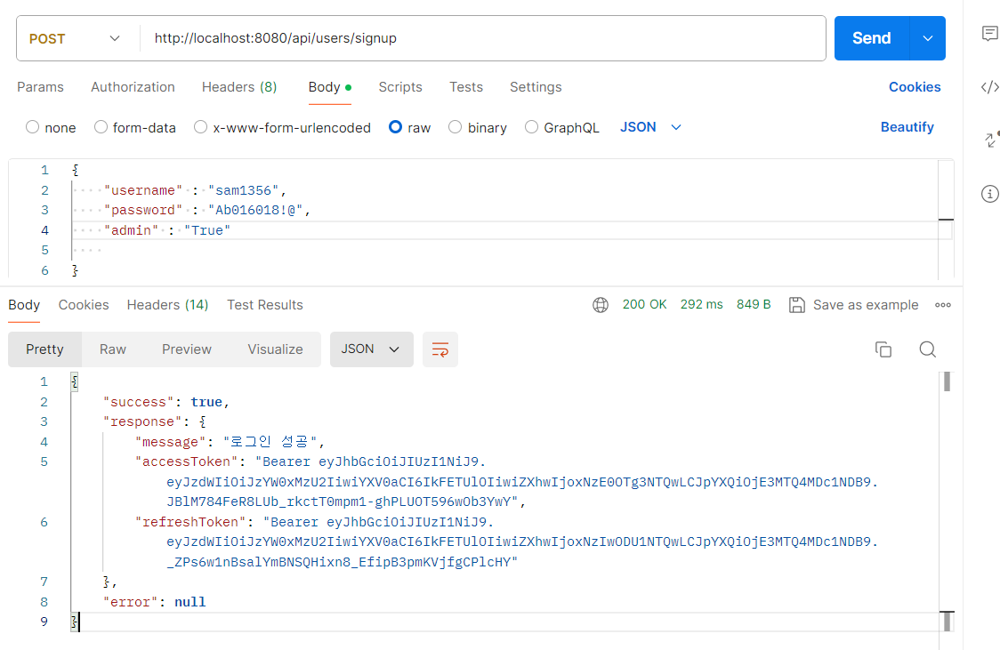

# 2주차 과제

## 에브리타임 

- 편리한 시간표 제작, 대학교 커뮤니티, 대학 관련 정보 공유를 목적으로 제작된 온라인 서비스

## 에브리타임 일부 기능 모델링 

### 전체적인 구조 

- 전체적인 구조를 위와 같이 잡았습니다.
1. 쪽지 기능을 위한 **_쪽지, 쪽지방(room) 엔티티_**
2. 게시판 생성을 위한 **_커뮤니티 엔티티_**
3. 게시글 생성 수정 삭제 조회 를 위한 **_게시글, 게시글 이미지 엔티티_**
4. 게시글에 첨가되는 부가 기능을 위한 **_게시글 좋아요, 댓글, 댓글 좋아요 엔티티_**
5. 회원가입, 다른 위 기능 등과의 상호작용 등을 위한 **_멤버 엔티티_**

---

- CRUD 학습 목적 특성으로 아래와 같은 기능은 임의로 제외했습니다 .ㅎ 
1. 대학교 관련 엔티티
2. 강의 관련 엔티티 
3. 시간표 관련 엔티티 등등 

### 세부 구조 

---

#### 게시판(커뮤니티) + 게시글 

- 멤버는 여러 커뮤니티를 생성 할 수 있습니다(ex: 자유게시판 등) 따라서 멤버와 커뮤니티를 1대 N 관계로 생각하고 커뮤니티 테이블에는 커뮤니티 생성자 아이디를 외래키 값으로 잡아주었습니다.
- 한 커뮤니티에는 여러 게시글이 존재합니다. 또한 한 게시글은 여러 커뮤니티에 속할 수 없기 때문에 커뮤니티와 게시글을 1대 N 관계로 생각하였습니다. 따라서 커뮤니티 아이디 값을 게시글 테이블에 외래키로 추가하였습니다.
- 멤버는 여러 게시글을 작성할 수 있고, 게시글은 여러 멤버를 작성자로 가질 수 없습니다. 따라서 멤버와 게시글을 1대 N 관계로 생각 -> 게시글 테이블에 멤버의 아이디를 외래키 값으로 잡아 주었습니다.

---

#### 멤버 + 게시글 + 게시글 이미지

- 한 멤버는 여러 게시글을 작성할 수 있고 한 게시글은 여러 멤버에 의해 작성될 수 없으므로 멤버와 게시글을 1대 N 관계라고 생각했기에 게시글에 멤버 아이디를 외래키 값으로 두었습니다.
- 또한 게시글에 질문글 여부를 나타내는 자바 입장의 boolean 을 표현할 수 있는 tinyint 를 추가해서 이 값이 설정되어 있으면 지우지 못하도록 합니다. 
- 한 게시글에는 여러 이미지를 가질 수 있고 한 이미지는 여러 게시글에 의해 소유될 수 없으므로 1대 N 관계라고 생각했기에 게시글 이미지에 게시글 아이디 값을 외래키로 추가하였습니다.
- 게시글에 작성자 이름의 필드를 두어 "익명" 으로 표시할지 닉네임으로 표시할지 결정합니다. 

---

#### 게시글 부가 기능 

- 한 멤버는 여러 게시글에 좋아요 를 누를 수 있고 한 게시글은 여러 멤버에 의해 좋아요가 눌러질 수 있습니다. 이에 따라 N:M 다대다 관계라고 생각을 하였기 때문에 그 중간테이블인 게시글 좋아요 테이블에 멤버아이디와 게시글 아이디 값을 외래키로 잡아주었습니다. 
- 게시글 좋아요 테이블을 통해 좋아요 수를 알 수 있지만 이 방법보다 더 성능이 좋은 좋아요 수 필드를 게시글에 잡아 다로 관리합니다. 
- 한 게시글에는 여러 댓글이 달릴 수 있고 한 댓글은 여러 게시글에 의해 사용될 수 없으므로 게시글과 댓글을 1대 N 관계라고 생각 하였기 때문에 댓글 테이블에 게시글 아이디 외래키를 두었습니다.
- 한 댓글에는 여러 대댓글이 달릴 수 있고 한 대댓글은 여러 댓글에 의해 사용될 수 없으므로 댓글과 대댓글을 1대 N 관계라고 생각 하였기 때문에 댓글 테이블에 부모 답글 아이디라는 외래키 값을 두어 따로 관리합니다.
- 한 멤버는 여러 댓글,대댓글을 작성할 수 있고 댓글, 대댓글은 여러 멤버에 의해 작성될 수 없으므로 멤버와 댓글,대댓글을 1대 N 관계라고 생각하였기 때문에 멤버와 댓글 테이블에 멤버 아이디라는 외래키 값을 두었습니다.
- 한 멤버는 여러 댓글에 좋아요 를 누를 수 있고 한 댓글은 여러 멤버에 의해 좋아요가 눌러질 수 있으므로 다대다 관계라고 생각을 하여 댓글 좋아요를 중간테이블로 설정하여 멤버아이디와 답글 아이디를 외래키 값으로 설정하였습니다. 

---

#### 쪽지 기능

가장 헷갈리고 확신 없는 부분입니다. 

- 처음에는 멤버와 쪽지를 1대다 관계로 설정하고, 쪽지에 sender 와 receiver를 받는 것으로 해야 되겠다고 생각했으나, 이렇게 하면 주고 받은 쪽지 리스트를 시간 순서대로 정렬할 때 구현하기가 복잡해 보였습니다. 따라서 쪽지방을 생성하는 것이 좋다고 생각했습니다. 
- 한 멤버는 여러 쪽지방을 생성할 수 있습니다. 이로써 1:N 관계는 확정이라고 생각했습니다. 처음 한 쪽지방은 여러 멤버 (2명) 가 들어올 수 있으므로 처음에는 다대다 관계를 생각했으나 그럼 ERD 테이블 상으로는 1대1 쪽지 인지 단체 톡방 같은 느낌인지 확신할 수 없을 것 같았습니다.
따라서 쪽지방에 first_sender_id 와 first_receiver_id 라는 외래키 필드를 둔 이후 각각의 필드의 입장에서 생각했습니다. 한 채팅방에서 first_sender 와 first_receiver 는 각각 한 명 뿐이기 때문에 멤버와 쪽지방을 1대 N 관계로 생각하였습니다. 단 1:N 관계를 두번 
- 한 쪽지방에는 여러 쪽지가 오갈 수 있고 한 쪽지는 여러 쪽지방에서 사용될 수 없으므로 쪽지방 과 쪽지가 1대 N 관계라고 생각하였습니다. 따라서 쪽지에는 쪽지방 아이디라는 외래키를 추가했습니다.
- 한 멤버는 여러개의 쪽지를 보낼 수 있고 한 쪽지는 여러 멤버에 의해 보내질 수 없으므로 멤버와 쪽지가 각각 1대 N 관계 라고 생각하였습니다. 따라서 쪽지에는 멤버 아이디라는 외래키 필드를 추가하였습니다. 

---

## JPA 관련 옵션 과제 

